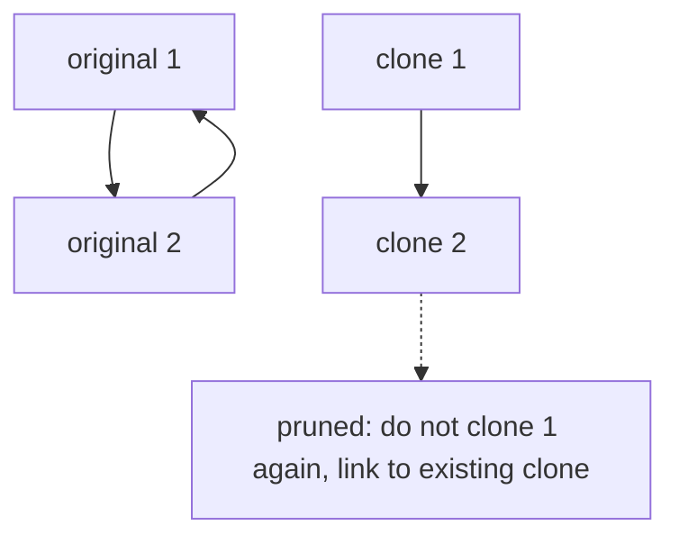

# 43. Clone Graph

LeetCode 133.

## Problem in my own words

You receive one node of an undirected graph whose nodes hold a value and a neighbor list, and the graph may contain cycles. Build a deep copy with new node objects, the same values, and neighbor links that mirror the original. The copy must not reuse any input node, and a null input stays null. A recursion that allocates a fresh node on every visit never finishes, because a cycle has no end.

## Easy analogy

Photocopying a subway map that loops. The first time you see a station, you draw a new station on the blank page and write down "original station 2 is this new dot." If a tunnel leads you back to a station you already drew, you do not draw it again. You look up the dot you already made and connect the tunnel to that. The lookup table is what keeps the circular line from becoming an infinite stack of paper.

## Diagram

Original edge `1 — 2`, plus the cycle back. The clone map already created `1'`. The dotted edge is the back-reference: DFS must not allocate a second clone of `1`. It reuses `1'`.



## Intuition

The visited structure is a map from original node to its clone, not a set of values. Values are unique in this problem (1 through n), but identity is what the links must preserve, and the map also hands you the clone to attach.

DFS (or BFS) from the given node:

1. If the original is already in the map, return the existing clone. This is the cycle prune.
2. Otherwise allocate the clone, store it in the map immediately, then recurse on each neighbor and append the returned clones.

Storing the clone before walking neighbors is the whole correctness argument. When a neighbor points back, the map already contains the node that is still being built, so the back edge attaches instead of allocating. If you filled the map only after the neighbor loop, the back edge would not find it and would recurse forever.

A null input returns null before any allocation. A single node with an empty neighbor list returns a new node with an empty list. The original graph is not modified. Neighbor lists in the copy are new lists; appending into the original list would mutate the input.

## Tiny walkthrough

One node, value 1, no neighbors. The map is empty. Allocate `1'`, store it, the neighbor loop does nothing. Return `1'`. `1'` is not the same object as `1`.

Two nodes, `1 — 2`, and each lists the other. Start at 1. Allocate `1'`, map `{1: 1'}`. Walk to 2. Allocate `2'`, map `{1: 1', 2: 2'}`. Walk 2's neighbor 1. The map hits and returns `1'` without allocating. `2'`'s neighbor list becomes `[1']`. Control returns to 1, whose neighbor list becomes `[2']`. The undirected edge exists on both sides of the copy, and each original produced exactly one clone.

A square `1-2-3-4-1` is the same rule. The second time any corner is reached through the cycle, the map returns the clone made on the first visit.

## Java

```java
import java.util.ArrayList;
import java.util.HashMap;
import java.util.Map;

class Node {
    public int val;
    public java.util.List<Node> neighbors;

    public Node(int val) {
        this.val = val;
        this.neighbors = new ArrayList<>();
    }
}

class Solution {
    public Node cloneGraph(Node node) {
        if (node == null) {
            return null;
        }
        Map<Node, Node> clones = new HashMap<>();
        return dfs(node, clones);
    }

    private Node dfs(Node node, Map<Node, Node> clones) {
        Node existing = clones.get(node);
        if (existing != null) {
            return existing;
        }
        Node copy = new Node(node.val);
        clones.put(node, copy); // publish before walking edges, or cycles recurse forever
        for (Node neighbor : node.neighbors) {
            copy.neighbors.add(dfs(neighbor, clones));
        }
        return copy;
    }
}
```

LeetCode already defines `Node`. The class above is included so the snippet stands alone. In the editor you only paste `Solution`.

## Python

```python
class Node:
    def __init__(self, val: int = 0, neighbors: list | None = None) -> None:
        self.val = val
        self.neighbors = neighbors if neighbors is not None else []


class Solution:
    def cloneGraph(self, node: "Node | None") -> "Node | None":
        if node is None:
            return None
        clones: dict[Node, Node] = {}

        def dfs(current: Node) -> Node:
            if current in clones:
                return clones[current]
            copy = Node(current.val)
            clones[current] = copy
            for neighbor in current.neighbors:
                copy.neighbors.append(dfs(neighbor))
            return copy

        return dfs(node)
```

The platform provides `Node`. Keeping the constructor here makes the deep-copy behavior readable: a new list is created only when `neighbors` is omitted, and this code always omits it and appends clones afterward. Passing the original neighbor list into the constructor would alias the input.

## Complexity

- Let `V` be the number of nodes and `E` the number of edges. Each node is cloned once and each edge is traversed a constant number of times (once from each endpoint in an undirected adjacency list). Time O(V + E).
- Space O(V) for the map, plus O(V) for the recursion stack in a path-shaped graph, plus the output graph which is another Θ(V + E). The map entries are the reason cycles terminate.
- BFS is the same bound. The queue holds original nodes, and the map is filled when a node is first discovered, before its neighbors are pushed.

## Pitfalls

- Keying the map by `node.val` is safe only while values are unique. Keying by object identity is the real rule and stays correct if the follow-up allows duplicate values. Prefer identity.
- Filling the map after the neighbor loop. The first cycle overflows the stack.
- Returning the original node when it is already "seen," instead of returning the clone. The copy then contains a pointer into the input graph.
- Sharing `node.neighbors` with the copy. Later edits to the copy corrupt the original. Build a new list.
- Forgetting the null input. The platform includes it.
- Trying to clone by serializing to an adjacency matrix of values and losing the "which object" relationship. It can work when values are 1..n, and it is more code than the map.

## Two-minute interview script

"I need a deep copy of an undirected graph that may contain cycles, starting from one node. I'll DFS, and I'll keep a hash map from each original node to the clone I allocated for it. If the node is already in the map I return that clone immediately. That is the prune that stops a cycle from cloning the same node twice and from recursing forever.

If it is not in the map, I allocate a new node with the same value, I put it in the map before I look at neighbors, and then I append the clone of each neighbor. Publishing the clone first is what makes the back edge find it. A null start returns null. A single node returns a new node with an empty neighbor list.

Time and extra search space are linear in vertices plus edges. The output is a second graph of the same size. I key the map by the node object, not by the integer, so the idea still works if values were not unique. I never copy the neighbor list reference itself. BFS is the same algorithm with a queue: create and store the clone when the node is first discovered, then push its neighbors."
