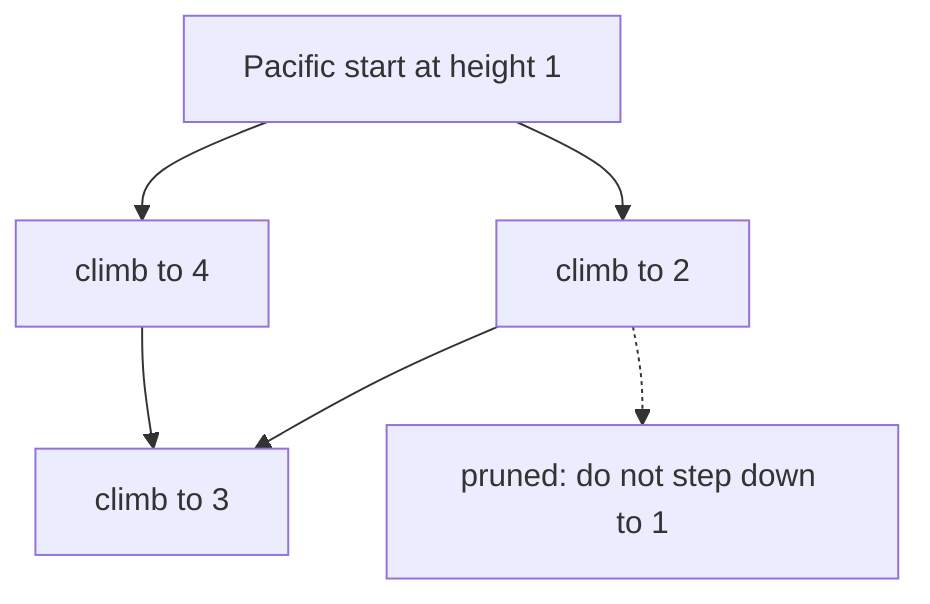

# 44. Pacific Atlantic Water Flow

LeetCode 417.

## Problem in my own words

Heights form an island whose top and left edges touch the Pacific and whose bottom and right edges touch the Atlantic. Water may move up, down, left, or right only onto an equal or lower neighbor, and it may keep moving. Return every cell that can reach both oceans this way. Corner cells touch both oceans immediately, and the order of the answer does not matter.

## Easy analogy

Asking "which trailheads can hike downhill to the beach?" is tedious, because every inland cell is a start and most walks die in a basin. Flip the question. Stand in the ocean and walk uphill onto the island. Any cell you can reach walking uphill can spill back downhill into the ocean you started from. Paint the cells reachable uphill from the Pacific, paint the cells reachable uphill from the Atlantic, and keep the cells that got both colors of paint.

## Diagram

Heights:

```
1 2
4 3
```

Reverse search from the Pacific (top and left) climbs any step whose height is at least the current height. From the Atlantic side, the step from `1` up to `2` is legal in the Pacific paint and is not a reason to start at `1` for the Atlantic. The dotted edge is a downhill step the reverse search refuses: from `2` you do not walk to `1`, because water could not have flowed from `1` up to `2`.



On this grid every cell reaches the Pacific by the uphill paint. The Atlantic paint starts at the bottom row and the right column (`4` and `3`, and the right column includes `2`). Cell `1` cannot be reached by an uphill walk from those starts, because both of its neighbors are taller and the search would have to step downhill to enter `1`. So `1` is Pacific-only. The answer is the other three cells.

## Intuition

Forward search from each cell asks "can I reach a Pacific border and an Atlantic border by moving to neighbors of height `<=` current?" That is correct and does a lot of repeated walking. Cells that flow into the same river are recomputed.

Reverse search exploits the fact that the oceans are the only terminals that matter. A cell can reach the Pacific if and only if the Pacific border can reach that cell by moving to neighbors of height `>=` current. Each ocean gets its own visited matrix. DFS or BFS from every border cell of that ocean fills the matrix. A cell is an answer when both matrices are true.

Border seeds:

- Pacific: every cell in row 0, and every cell in column 0.
- Atlantic: every cell in row `R - 1`, and every cell in column `C - 1`.

Corner cells are seeded into both oceans. That is correct, not double-counting. They really do touch both.

The comparison direction is the bug to narrate before writing code. Reverse steps use `heights[next] >= heights[current]`. Using `<=` walks downhill from the beach and paints the wrong set. Using `>` drops equal-height channels. Water is allowed to flow across a flat.

Visited is per ocean. A global visited set would block the second ocean from entering a cell the first ocean already painted, and you would miss double-reachable cells. Inside one ocean, visited is what keeps the uphill walk from cycling.

## Tiny walkthrough

Use the 2×2 grid above.

Pacific DFS from `(0,0)` height 1 marks `(0,0)`, climbs to `(0,1)` height 2, climbs to `(1,1)` height 3, and from the left seed `(1,0)` height 4 also marks that cell. All four Pacific flags are true.

Atlantic DFS from `(1,0)` height 4 marks only itself: neighbors 1 and 3 are both lower, so both steps are pruned. Atlantic from `(1,1)` height 3 marks itself and cannot climb. Atlantic from `(0,1)` height 2 marks itself and can climb to `(1,1)`, already marked. Cell `(0,0)` never receives an Atlantic mark.

Intersection: `(0,1)`, `(1,0)`, `(1,1)`.

The classic 5×5 example:

```
1 2 2 3 5
3 2 3 4 4
2 4 5 3 1
6 7 1 4 5
5 1 1 2 4
```

returns the cells `(0,4), (1,3), (1,4), (2,2), (3,0), (3,1), (4,0)`. The same two-paint procedure produces that set. A 1×1 grid returns that only cell, because it borders both oceans.

## Java

```java
import java.util.ArrayList;
import java.util.List;

class Solution {
    public List<List<Integer>> pacificAtlantic(int[][] heights) {
        int rows = heights.length;
        int cols = heights[0].length;
        boolean[][] pacific = new boolean[rows][cols];
        boolean[][] atlantic = new boolean[rows][cols];

        for (int c = 0; c < cols; c++) {
            flow(heights, 0, c, pacific);
            flow(heights, rows - 1, c, atlantic);
        }
        for (int r = 0; r < rows; r++) {
            flow(heights, r, 0, pacific);
            flow(heights, r, cols - 1, atlantic);
        }

        List<List<Integer>> both = new ArrayList<>();
        for (int r = 0; r < rows; r++) {
            for (int c = 0; c < cols; c++) {
                if (pacific[r][c] && atlantic[r][c]) {
                    both.add(List.of(r, c));
                }
            }
        }
        return both;
    }

    private void flow(int[][] heights, int r, int c, boolean[][] reach) {
        if (reach[r][c]) {
            return;
        }
        reach[r][c] = true;
        int[][] deltas = {{1, 0}, {-1, 0}, {0, 1}, {0, -1}};
        for (int[] d : deltas) {
            int nr = r + d[0];
            int nc = c + d[1];
            if (nr < 0 || nc < 0 || nr >= heights.length || nc >= heights[0].length) {
                continue;
            }
            if (reach[nr][nc]) {
                continue;
            }
            // Reverse step: only climb, or stay level. Downhill is pruned.
            if (heights[nr][nc] >= heights[r][c]) {
                flow(heights, nr, nc, reach);
            }
        }
    }
}
```

## Python

```python
from typing import List


class Solution:
    def pacificAtlantic(self, heights: List[List[int]]) -> List[List[int]]:
        if not heights or not heights[0]:
            return []
        rows, cols = len(heights), len(heights[0])
        pacific = [[False] * cols for _ in range(rows)]
        atlantic = [[False] * cols for _ in range(rows)]

        def flow(r: int, c: int, reach: List[List[bool]]) -> None:
            reach[r][c] = True
            for dr, dc in ((1, 0), (-1, 0), (0, 1), (0, -1)):
                nr, nc = r + dr, c + dc
                if not (0 <= nr < rows and 0 <= nc < cols):
                    continue
                if reach[nr][nc]:
                    continue
                if heights[nr][nc] >= heights[r][c]:
                    flow(nr, nc, reach)

        for c in range(cols):
            flow(0, c, pacific)
            flow(rows - 1, c, atlantic)
        for r in range(rows):
            flow(r, 0, pacific)
            flow(r, cols - 1, atlantic)

        return [
            [r, c]
            for r in range(rows)
            for c in range(cols)
            if pacific[r][c] and atlantic[r][c]
        ]
```

Calling `flow` on a corner twice is harmless. The second call sees `reach` already true and returns.

## Complexity

- Each ocean's search visits each cell at most once and looks at O(1) neighbors, so both searches together are O(`R * C`) time.
- Two boolean matrices are O(`R * C`) extra space. The recursion stack is O(`R * C`) on a snake of increasing height. BFS from the same seeds has the same bounds and a heap-allocated queue.
- The output can list every cell, which is another O(`R * C`) when the whole island drains to both oceans (a flat grid).
- The naive "DFS from every cell toward the oceans" is also O(`R * C`) only with memoization of the pair `(reachesPacific, reachesAtlantic)`. Without memoization it re-walks long slopes. The reverse search gets the linear bound without a subtle memo key.

## Pitfalls

- Walking downhill from the ocean (`next <= current`). You paint cells the ocean can flow into, which is the opposite set. On the 2×2 example you would still mark a lot of cells and might not notice.
- Using a strict `>` and dropping equal heights. A flat plateau touches an ocean only at the border, and every interior cell of that plateau should still qualify if the border does.
- One shared visited matrix for both oceans. The Atlantic search then refuses to enter anything the Pacific search already saw.
- Starting only from the four corners, or only from the top row and bottom row, and forgetting the side columns. A cell in the middle of the left edge touches the Pacific even when it is not in row 0.
- Forgetting that a cell can be in both seed sets. Corners, and a one-cell grid, must come out true for both. Do not "assign" a border cell to a single ocean.
- Returning early from the whole problem after the first ocean. You need the intersection, which exists only after both paints.

## Two-minute interview script

"Water flows from a cell to a neighbor of equal or lower height. I need cells that can reach the Pacific, which is the top and left border, and the Atlantic, which is the bottom and right border. Searching downhill from every cell repeats the same slopes. I search uphill from each ocean instead. If I can walk from the ocean to a cell by only stepping to equal or greater height, then water at that cell can walk the same path backward downhill into that ocean.

I keep two boolean grids. I DFS from every Pacific border cell into the first grid, and from every Atlantic border cell into the second. The neighbor test is `heights[next] >= heights[current]`. A smaller neighbor is a pruned branch. Visited is per ocean, marked when I enter the cell, so cycles stop and the two paints do not block each other. The answer is the cells that are true in both grids. Corners are seeded into both, which is correct because they touch both oceans.

Time and extra space are linear in the number of cells. A one-cell island is an answer. A flat island is entirely an answer. The bug I watch for is flipping the inequality or sharing one visited matrix between the oceans."
