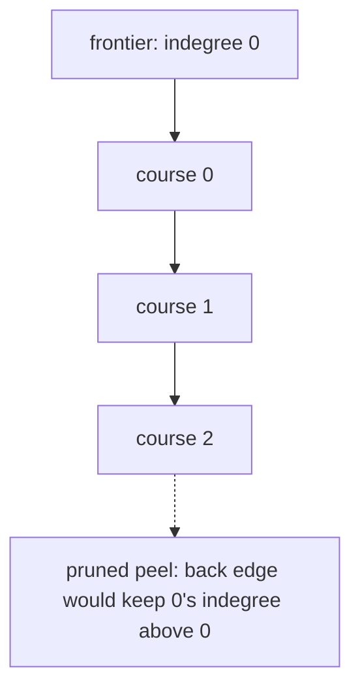

# 45. Course Schedule

LeetCode 207.

## Problem in my own words

There are `numCourses` courses labeled from 0, and each pair `[a, b]` means course `b` must be finished before course `a`. Return whether every course can be finished. A cycle in the prerequisites makes that impossible, while a course that appears in no pair is still allowed. You only return yes or no, not the order.

## Easy analogy

A stack of chores where some chores require another chore first. You look for a chore that nothing else is blocking. You do it, and you cross it off the "still blocked" tally of whatever was waiting on it. If that frees a chore, it becomes available. If you can clear the whole list this way, there was no circular dependency. If some chores remain and every one of them is still waiting, they are waiting on each other. That leftover pile is the cycle.

## Diagram

Edges mean "must be taken before." `0 → 1` and `1 → 2` are a chain. The dotted edge `2 → 0` is the back edge that would close a cycle. Kahn's frontier is the indegree-zero course, drawn as the queue. With the dotted edge present, no node stays at indegree zero forever and the peel cannot finish.



## Intuition

Build a directed edge `b → a` for every pair `[a, b]`, and increment `indegree[a]`. The edge points from the prerequisite toward the course it unlocks, which is the direction a topological order would travel.

**Kahn's algorithm (BFS).** Push every course whose indegree is 0. That queue is the frontier of courses you can take right now. Pop one, count it as taken, and decrement the indegree of each course it points to. If a decrement hits 0, push that course. When the queue empties, you could schedule a course for every pop. If the pop count equals `numCourses`, every course was scheduled and the graph is a DAG. If not, the remaining nodes all have indegree greater than 0, which means each is waiting on a remaining node. That is a cycle.

Isolated courses start at indegree 0 and are pushed immediately. They must be counted. Forgetting them makes a graph with no edges look unschedulable.

**DFS colors.** White means unseen, gray means on the current recursion stack, black means finished. A gray neighbor is a back edge and proves a cycle. A black neighbor is a cross edge or a forward edge and is legal. A plain boolean visited set cannot tell those apart. This problem only needs the boolean, so either algorithm is a complete answer. Kahn's version is what the code below runs. Course Schedule II, which asks for an actual order, is Kahn or DFS with the peel order recorded. Reversing every edge preserves the yes/no answer, because a cycle reversed is still a cycle, and it reverses the topological order. Get the direction right anyway so the follow-up does not silently emit the schedule backward.

## Tiny walkthrough

`numCourses = 2`, prerequisites `[[1, 0]]`. Edge `0 → 1`. Indegrees: 0 has 0, 1 has 1. Queue starts as `[0]`. Pop 0, decrement 1 to 0, push 1. Pop 1. Taken = 2. True.

Add `[0, 1]`. Edges `0 → 1` and `1 → 0`. Both indegrees are 1. The queue starts empty. Taken = 0. False.

`numCourses = 5` with no prerequisites. Every indegree is 0. The queue starts with all five. No edges to relax. Taken = 5. True.

A self-loop `[0, 0]` on one course: edge `0 → 0`, indegree 1, queue empty. False.

## Java

```java
import java.util.ArrayDeque;
import java.util.ArrayList;
import java.util.List;
import java.util.Queue;

class Solution {
    public boolean canFinish(int numCourses, int[][] prerequisites) {
        List<List<Integer>> graph = new ArrayList<>();
        for (int i = 0; i < numCourses; i++) {
            graph.add(new ArrayList<>());
        }
        int[] indegree = new int[numCourses];
        for (int[] edge : prerequisites) {
            int course = edge[0];
            int prereq = edge[1];
            graph.get(prereq).add(course);
            indegree[course]++;
        }

        Queue<Integer> ready = new ArrayDeque<>();
        for (int course = 0; course < numCourses; course++) {
            if (indegree[course] == 0) {
                ready.offer(course);
            }
        }

        int taken = 0;
        while (!ready.isEmpty()) {
            int course = ready.poll();
            taken++;
            for (int next : graph.get(course)) {
                indegree[next]--;
                if (indegree[next] == 0) {
                    ready.offer(next);
                }
            }
        }
        return taken == numCourses;
    }
}
```

## Python

```python
from collections import deque
from typing import List


class Solution:
    def canFinish(self, numCourses: int, prerequisites: List[List[int]]) -> bool:
        graph: List[List[int]] = [[] for _ in range(numCourses)]
        indegree = [0] * numCourses
        for course, prereq in prerequisites:
            graph[prereq].append(course)
            indegree[course] += 1

        ready = deque(c for c in range(numCourses) if indegree[c] == 0)
        taken = 0
        while ready:
            course = ready.popleft()
            taken += 1
            for nxt in graph[course]:
                indegree[nxt] -= 1
                if indegree[nxt] == 0:
                    ready.append(nxt)
        return taken == numCourses
```

DFS alternative, same answer: color each node 0, 1, or 2. Entering a node sets it to 1. A neighbor colored 1 means cycle. After all neighbors return, set the node to 2. Run this from every uncolored node so a cycle in a later component is not skipped.

## Complexity

- Building the graph is O(V + E) with V = `numCourses` and E = the number of prerequisite pairs.
- Kahn's scan pushes and pops each course at most once and relaxes each edge once. Time O(V + E). The queue and indegree array are O(V). The adjacency lists are O(V + E).
- DFS colors are the same O(V + E) time and O(V) color array, with O(V) recursion depth on a long chain.
- You do not need a distance or a parent array for the boolean question.

## Pitfalls

- Drawing the edge `a → b` for the pair `[a, b]`. That points from the course back at the prerequisite. The boolean cycle answer still happens to be right, and the topological order is backward. Point prerequisite to course.
- Ignoring courses that are not mentioned in any pair. If the queue is seeded only from nodes that appear in edges, isolated courses are never counted and a trivial schedule returns false.
- Decrementing indegree and pushing whenever the result is non-negative, instead of only when it hits 0. A course gets scheduled before its other prerequisites are done, and it can be queued twice.
- Using a boolean visited set as a cycle detector on this directed graph. A node reached by two different prerequisites is not a cycle. See the pattern notes on gray versus black.
- Self-loops and two-node loops. Both are cycles. Kahn handles them because the indegree never clears. Do not special-case only length 2.
- For Course Schedule II, returning `taken == n` is not enough. Record the pop order. If you must return an empty list on a cycle, check the length at the end and do not return a partial peel.

## Two-minute interview script

"I model courses as nodes and a prerequisite as a directed edge from the required course to the course it unlocks. I also store each course's indegree. A cycle in that graph is exactly the case where I cannot finish everything.

I'll use Kahn's algorithm. The queue starts with every indegree-zero course, including courses that no pair mentions. Those are the frontier I can take immediately. When I pop a course I count it, and I decrement each successor. A successor that falls to indegree zero joins the queue. If I pop once per course, the graph is a DAG and the answer is true. If the queue dies early, whatever remains has a positive indegree and sits on a cycle, so the answer is false.

The same fact can be computed with DFS colors: gray means on the stack, and an edge into a gray node is a back edge. I mention that because a single visited bit is not cycle detection on a directed graph. Time is linear in courses plus prerequisites. If the follow-up asks for one valid order, I emit the pop sequence, and I return an empty list when the pop count is short. Edge direction matters for that order even though reversing every edge would not change today's boolean."
