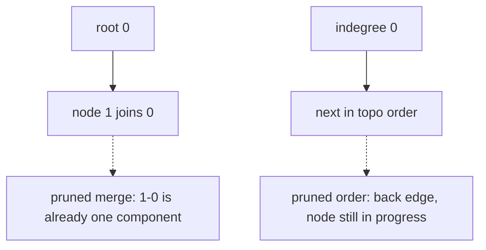

# Advanced graphs: topological order and union-find

## Problem in my own words

A topological order lists a directed graph so every edge points forward, and that list exists only when there is no cycle. Union-find tracks undirected connectivity: which nodes share a component, and whether a new edge actually merges two components. Ordering questions use the first tool. Connectivity questions use the second.

## Easy analogy

Topological order is a course list written so that every required class appears earlier on the page than the class that needs it. If two classes require each other, there is no honest way to write the page. Union-find is labeling friend circles with a single captain. When two people become friends, you ask each for their captain. If the captains differ, one captain starts reporting to the other and two circles become one. If the captains are already the same, the new friendship stays inside the circle and the number of circles does not change. That redundant friendship is the dotted edge.

## Diagram

Four nodes. A solid union merges `0` and `1`. The dotted edge is a second link between them: `find` returns the same root, so the component count stays put. On the right, a directed edge into a node that is still on the stack is the cycle that blocks a topological order.



## Intuition

**Union-find.** Each node begins as its own parent, and the component count begins at `n`. `find(x)` walks parent pointers to the root and compresses the path so the next walk is shorter. `union(a, b)` finds both roots. Equal roots mean the edge is redundant: return false and do not change the count. Different roots mean you link the shallower tree under the deeper one (union by rank, or by size) and decrement the component count. After all edges, the count is the number of connected components. A graph is a tree when it has `n` nodes, exactly `n - 1` undirected edges, and one component. Any of these equivalent checks works: `n - 1` edges and one component, or `n - 1` edges and no redundant edge, or one component and no redundant edge. The `n - 1` check is what rejects both "too sparse, disconnected" and "too dense, has a spare edge" in one comparison, together with the union results.

**Topological order.** Kahn's algorithm is the BFS form. Indegree counts incoming constraints. The queue starts as every indegree-zero node (the frontier). Pop a node into the order, and decrement each successor. A successor that hits zero joins the frontier. If the order contains every node, it is a valid topological order. If not, the leftovers form a cycle. DFS does the same job with colors: an edge into a gray node, meaning a node still on the stack, is the cycle. Alien dictionary is this algorithm after a parsing step that turns adjacent words into directed letter edges.

Use union-find for undirected connectivity questions. Use topological order for directed "A must come before B" questions. A tree check is undirected, so it is union-find plus an edge count, not a topological sort.

## Tiny walkthrough

Nodes `0..4`, undirected edges `[0-1, 1-2, 3-4]`. Start with 5 components. Union `0` and `1` → 4. Union `1` and `2` → 3. Union `3` and `4` → 2. A repeated `[0, 1]` finds one root and stays at 2. The answer for "number of components" is 2.

Same node count with edges `[0-1, 0-2, 0-3, 1-4]`. There are 4 edges, which is `5 - 1`, and every union succeeds, leaving 1 component. That graph is a tree. Add `[1-2]` and you have 5 edges. The edge-count test fails. Even if you ignored the count, that union would see one root and report a redundant edge.

Directed letters `w → e → r → t → f`, each indegree 1 except `w`. Kahn emits `w, e, r, t, f`. An extra edge `f → w` leaves a cycle and the output is short.

## Java

```java
import java.util.ArrayDeque;
import java.util.ArrayList;
import java.util.List;
import java.util.Queue;

class UnionFind {
    private final int[] parent;
    private final int[] rank;
    private int components;

    UnionFind(int n) {
        parent = new int[n];
        rank = new int[n];
        components = n;
        for (int i = 0; i < n; i++) {
            parent[i] = i;
        }
    }

    int find(int x) {
        if (parent[x] != x) {
            parent[x] = find(parent[x]);
        }
        return parent[x];
    }

    /** @return false when a and b were already connected. */
    boolean union(int a, int b) {
        int ra = find(a);
        int rb = find(b);
        if (ra == rb) {
            return false;
        }
        if (rank[ra] < rank[rb]) {
            parent[ra] = rb;
        } else if (rank[ra] > rank[rb]) {
            parent[rb] = ra;
        } else {
            parent[rb] = ra;
            rank[ra]++;
        }
        components--;
        return true;
    }

    int components() {
        return components;
    }
}

class TopoSort {
    /** Empty list means the directed graph has a cycle. */
    public List<Integer> order(int n, int[][] edges) {
        List<List<Integer>> graph = new ArrayList<>();
        for (int i = 0; i < n; i++) {
            graph.add(new ArrayList<>());
        }
        int[] indegree = new int[n];
        for (int[] edge : edges) {
            graph.get(edge[0]).add(edge[1]);
            indegree[edge[1]]++;
        }
        Queue<Integer> ready = new ArrayDeque<>();
        for (int i = 0; i < n; i++) {
            if (indegree[i] == 0) {
                ready.offer(i);
            }
        }
        List<Integer> order = new ArrayList<>();
        while (!ready.isEmpty()) {
            int node = ready.poll();
            order.add(node);
            for (int next : graph.get(node)) {
                indegree[next]--;
                if (indegree[next] == 0) {
                    ready.offer(next);
                }
            }
        }
        if (order.size() != n) {
            return List.of();
        }
        return order;
    }
}
```

## Python

```python
from collections import deque
from typing import List


class UnionFind:
    def __init__(self, n: int) -> None:
        self.parent = list(range(n))
        self.rank = [0] * n
        self.components = n

    def find(self, x: int) -> int:
        while self.parent[x] != x:
            self.parent[x] = self.parent[self.parent[x]]
            x = self.parent[x]
        return x

    def union(self, a: int, b: int) -> bool:
        ra, rb = self.find(a), self.find(b)
        if ra == rb:
            return False
        if self.rank[ra] < self.rank[rb]:
            self.parent[ra] = rb
        elif self.rank[ra] > self.rank[rb]:
            self.parent[rb] = ra
        else:
            self.parent[rb] = ra
            self.rank[ra] += 1
        self.components -= 1
        return True


def topo_order(n: int, edges: List[List[int]]) -> List[int]:
    """Return a topological order, or [] if edges contain a cycle."""
    graph: List[List[int]] = [[] for _ in range(n)]
    indegree = [0] * n
    for src, dst in edges:
        graph[src].append(dst)
        indegree[dst] += 1
    ready = deque(i for i in range(n) if indegree[i] == 0)
    order: List[int] = []
    while ready:
        node = ready.popleft()
        order.append(node)
        for nxt in graph[node]:
            indegree[nxt] -= 1
            if indegree[nxt] == 0:
                ready.append(nxt)
    if len(order) != n:
        return []
    return order
```

`UnionFind.union` returns false for the dotted redundant edge. `topo_order` returns an empty list when a back edge keeps some indegree above zero until the frontier dies.

## Complexity

- Union-find with path compression and union by rank: each `find` or `union` is essentially O(1), more precisely O(α(n)) where α is the inverse Ackermann function. Processing E edges is O(E α(n)). Space is O(n) for parent and rank.
- Kahn's algorithm: O(V + E) time and space, the same as the course-schedule peel. DFS topological sort is the same bound with a color array and a recursion stack.
- Building letter constraints for an alien dictionary scans each character of each word a constant number of times, then runs Kahn on at most 26 letters. The scan dominates when the words are long. The graph phase is O(1) relative to a 26-letter alphabet, and the same code is O(V + E) if the alphabet is not bounded.

## Pitfalls

- Using union-find on a directed prerequisite graph. "Same component" does not encode "must come before."
- Using topological sort to test an undirected tree. Undirected edges do not have a before/after.
- Forgetting path compression and writing a recursive `find` that is still correct but slower. Correctness survives. The almost-constant bound needs the compression (and rank or size to stay balanced).
- Decrementing the component count when `union` finds the same root. That redundant edge did not merge anything.
- Treating a short topological list as a usable partial order. If any node is missing, the graph is cyclic and the safe answer is "no order," not the prefix you managed to emit.
- Double-counting a repeated directed edge in the indegree. One logical precedence must increment indegree once, or Kahn will wait for a decrement that never comes.

## Two-minute interview script

"I split advanced graph questions into undirected connectivity and directed ordering. For connectivity I use union-find. Every node starts as its own parent, so there are n components. Find walks to the root and compresses the path. Union links two roots by rank only when they differ, and that is the only time I decrement the component count. A same-root edge is redundant. That gives me connected components directly. A tree is the special case of n nodes, n minus 1 edges, and one component. The redundant-edge test and the edge-count test are the same fact said two ways.

For ordering I use Kahn's algorithm. Edge u → v means u comes first. I queue every indegree-zero node and peel. Each peel decrements successors and frees the ones that hit zero. A full peel is a topological order. A short peel means a cycle, and I throw the partial list away. DFS with gray and black colors finds the same cycle: a gray neighbor is a back edge. Alien dictionary is the ordering problem after I turn adjacent word pairs into letter edges, including the invalid case where a longer word comes before its own prefix. I do not run union-find on those letter edges. They are directed."
