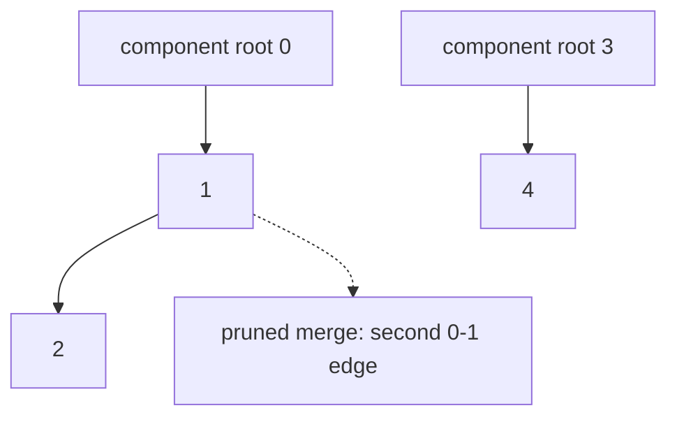

# 46. Number of Connected Components in an Undirected Graph

LeetCode 323.

## Problem in my own words

You are given `n` nodes labeled `0` through `n - 1` and a list of undirected edges. The graph may contain cycles, and a node that never appears in an edge is a component by itself. Return how many connected components there are: maximal sets of nodes that can reach each other. This is the undirected counting problem usually solved with union-find.

## Easy analogy

A handful of people, some of whom shake hands. A handshake puts two people in the same group, and groups merge when a handshake crosses between them. A second handshake inside a group does not create a new group and does not destroy one. Anyone who shakes no hands stands as a group of one. You want the number of groups at the end, not the size of the largest one.

## Diagram

Edges `0-1`, `1-2`, and `3-4`, plus a repeated `0-1`. The repeated edge is dotted: union-find sees one root and does not change the component count. Two components remain, and a missing node `5` would be a third.



## Intuition

Start with `n` components, each node its own parent. For every edge, union its endpoints. A union that links two different roots decrements the count. A union that finds the same root is a cycle edge (or a duplicate) and the count stays. After the edge list, the count is the answer.

Path compression and union by rank keep the parent chains short. They do not change the count. DFS or BFS also counts components: loop over every node, and each time you find an unvisited one, increment and flood its component. That is O(n + E) and is a good solution. Union-find is the version this folder is practicing, and it matches the "edges arrive as a list" shape. The flood version needs an adjacency list first. Both must visit isolated nodes. Building the adjacency list and forgetting to loop over all `n` ids drops the isolates.

## Tiny walkthrough

`n = 5`, edges `[[0,1],[1,2],[3,4]]`.

- Start: 5 components, parents identity.
- Union 0 and 1. Different roots. Count 4.
- Union 1 and 2. 1's root is 0, 2's root is 2. Count 3.
- Union 3 and 4. Count 2.
- Node labels that were merged: `{0,1,2}` and `{3,4}`. Answer 2.

`n = 1`, no edges. The loop does nothing. Answer 1.

`n = 4`, edges `[[0,1],[1,2],[2,3],[3,0]]`. Four successful-looking links, but the last one closes the square. Three unions decrement, the fourth finds one root. Count ends at 1. The cycle did not split or add a component.

## Java

```java
class Solution {
    public int countComponents(int n, int[][] edges) {
        int[] parent = new int[n];
        int[] rank = new int[n];
        for (int i = 0; i < n; i++) {
            parent[i] = i;
        }
        int components = n;
        for (int[] edge : edges) {
            if (union(parent, rank, edge[0], edge[1])) {
                components--;
            }
        }
        return components;
    }

    private boolean union(int[] parent, int[] rank, int a, int b) {
        int ra = find(parent, a);
        int rb = find(parent, b);
        if (ra == rb) {
            return false;
        }
        if (rank[ra] < rank[rb]) {
            parent[ra] = rb;
        } else if (rank[ra] > rank[rb]) {
            parent[rb] = ra;
        } else {
            parent[rb] = ra;
            rank[ra]++;
        }
        return true;
    }

    private int find(int[] parent, int x) {
        if (parent[x] != x) {
            parent[x] = find(parent, parent[x]);
        }
        return parent[x];
    }
}
```

## Python

```python
from typing import List


class Solution:
    def countComponents(self, n: int, edges: List[List[int]]) -> int:
        parent = list(range(n))
        rank = [0] * n

        def find(x: int) -> int:
            while parent[x] != x:
                parent[x] = parent[parent[x]]
                x = parent[x]
            return x

        def union(a: int, b: int) -> bool:
            ra, rb = find(a), find(b)
            if ra == rb:
                return False
            if rank[ra] < rank[rb]:
                parent[ra] = rb
            elif rank[ra] > rank[rb]:
                parent[rb] = ra
            else:
                parent[rb] = ra
                rank[ra] += 1
            return True

        components = n
        for a, b in edges:
            if union(a, b):
                components -= 1
        return components
```

## Complexity

- Time O(E α(n)) with path compression and rank. Building nothing else. In interview speech: nearly O(E), more precisely O(E α(n)), plus O(n) to initialize parents.
- Space O(n) for parent and rank. The edge list is input.
- The DFS alternative is O(n + E) time and O(n + E) space once the adjacency list exists. Same answer. Prefer it when you already have the graph built for another traversal.

## Pitfalls

- Initializing the count to 0 and incrementing on each union. Unions reduce components. The start value is `n`.
- Decrementing when the two endpoints already share a root. A cycle would under-count.
- Forgetting isolated nodes because they never appear in `edges`. They are in the initial `n`.
- Assuming the graph is a forest and crashing on a repeated edge. This problem allows cycles. `union` returning false is normal.
- Off-by-one node labels. Labels are `0..n-1`. A parent array of size `n` matches. Size `n + 1` leaves a fake extra component if you also initialize the count wrong.
- Using a directed topological count. The edges have no direction.

## Two-minute interview script

"I count undirected components with union-find. I make each of the n nodes its own parent and set the component count to n. For each edge I find the two roots, compressing paths on the way. If the roots differ I link the lower rank under the higher rank and decrement the count. If the roots are the same, the edge stays inside a component and I leave the count alone. That redundant edge is a cycle or a duplicate, and this problem allows both.

Isolated nodes never show up in the edge list and they are already in the count, so I do not add a special pass for them. At the end the count is the answer. A single node with no edges returns 1. A cycle that touches everyone returns 1. Two separate edges on five nodes return 3, because three nodes never merged.

The time is linear in the number of edges times the inverse Ackermann factor from path compression and rank, which I describe as nearly constant per operation. Space is the parent array. DFS or BFS, looping over every node id and flooding unvisited ones, is an equally correct O(n + E) solution. I reach for it when the graph is already an adjacency list. Here the input is an edge list, so union-find maps onto it directly."
