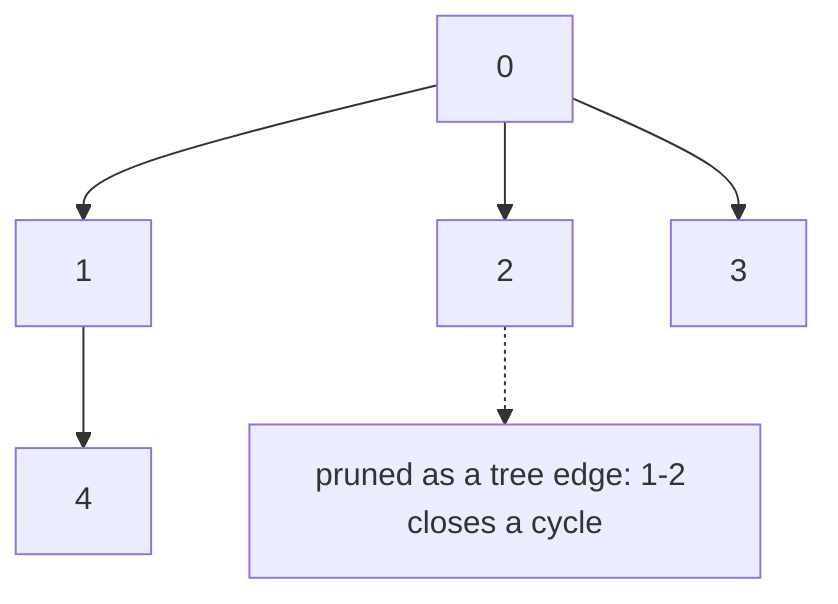

# 47. Graph Valid Tree

LeetCode 261.

## Problem in my own words

Decide whether an undirected graph on `n` labeled nodes is a tree. A tree reaches every node, has no cycle, and therefore contains exactly `n - 1` edges. A disconnected forest is not a tree, and neither is a connected graph with one extra edge. A single node with no edges is a tree.

## Easy analogy

Building a road network between towns. You want exactly one road between the towns in the sense that there is one way to travel once you ignore which road you drive, and no loops. If you have too few roads, some town is cut off. If you have one road too many, you have created a loop somewhere, even if the map looks almost like a tree. Counting the roads is the first glance. Checking that they actually join into one network is the second. Either failure means it is not a tree.

## Diagram

Five nodes and four edges can be a tree: one component, no spare edge. The dotted edge is the extra road that closes a cycle. After that edge the graph is still one component, and it is no longer a tree. A missing edge somewhere else would leave two components even if the total stayed at four, because the spare edge was spent inside the left cluster.



## Intuition

For an undirected graph these statements are equivalent:

- The graph is a tree.
- It has `n - 1` edges, and it is connected (one component).
- It has `n - 1` edges, and none of them is redundant (no cycle).
- It is connected, and none of its edges is redundant.

Any one of those pairs is a full test. The code uses the first: if the edge list length is not `n - 1`, return false immediately. Otherwise run union-find. Every union must be a real merge, which is automatic if you check the final component count is 1. With exactly `n - 1` successful merges you would go from `n` components to 1. So a same-root union inside that budget means some merge was wasted on a cycle and some other node was never reached. Checking "no redundant edge" and checking "one component" are the same check once the length is `n - 1`. Doing both in the code is fine and reads clearly. Doing only the length check is wrong, as the diagram's disconnected-plus-cycle case shows.

This is not a topological-sort problem. The edges are undirected. Orienting them and looking for a DAG will call a simple 2-cycle (both directions of one undirected edge, if you naively add both) a cycle, or will accept a disconnected forest if you are not careful. Stay with union-find.

`n = 1` and no edges: length `0 == 1 - 1`, components stay 1, true. Two nodes and no edges: length 0, which is not 1, false. A self-loop is an edge from a node to itself. `union` finds the same root. If that self-loop is the only edge on two nodes, the length may equal `n - 1` and the component check still fails.

## Tiny walkthrough

`n = 5`, edges `[[0,1],[0,2],[0,3],[1,4]]`. Length 4 equals `5 - 1`. Each union merges different roots. Components go 5 → 4 → 3 → 2 → 1. True. The picture is a star with node 4 hanging off node 1.

`n = 5`, edges `[[0,1],[1,2],[2,3],[1,3],[1,4]]`. Length 5 is not 4. False immediately. The square `0-1-2-3-1` is a cycle and node 4 is attached. Connected, not a tree.

`n = 4`, edges `[[0,1],[2,3]]`. Length 2 is not 3. False. Even if you skipped the length check, union-find would finish at 2 components.

`n = 4`, edges `[[0,1],[1,2],[2,0]]`. Length 3 equals `4 - 1`. The third union finds one root and does not merge. Components stay 2 (the triangle, plus isolated 3). False.

## Java

```java
class Solution {
    public boolean validTree(int n, int[][] edges) {
        if (edges.length != n - 1) {
            return false;
        }
        int[] parent = new int[n];
        int[] rank = new int[n];
        for (int i = 0; i < n; i++) {
            parent[i] = i;
        }
        int components = n;
        for (int[] edge : edges) {
            int ra = find(parent, edge[0]);
            int rb = find(parent, edge[1]);
            if (ra == rb) {
                return false;
            }
            if (rank[ra] < rank[rb]) {
                parent[ra] = rb;
            } else if (rank[ra] > rank[rb]) {
                parent[rb] = ra;
            } else {
                parent[rb] = ra;
                rank[ra]++;
            }
            components--;
        }
        return components == 1;
    }

    private int find(int[] parent, int x) {
        if (parent[x] != x) {
            parent[x] = find(parent, parent[x]);
        }
        return parent[x];
    }
}
```

## Python

```python
from typing import List


class Solution:
    def validTree(self, n: int, edges: List[List[int]]) -> bool:
        if len(edges) != n - 1:
            return False
        parent = list(range(n))
        rank = [0] * n

        def find(x: int) -> int:
            while parent[x] != x:
                parent[x] = parent[parent[x]]
                x = parent[x]
            return x

        components = n
        for a, b in edges:
            ra, rb = find(a), find(b)
            if ra == rb:
                return False
            if rank[ra] < rank[rb]:
                parent[ra] = rb
            elif rank[ra] > rank[rb]:
                parent[rb] = ra
            else:
                parent[rb] = ra
                rank[ra] += 1
            components -= 1
        return components == 1
```

With the length check in place, `return components == 1` is equivalent to "every union merged." Returning false at the same-root edge already covers it. The final check documents the connectivity claim.

## Complexity

- The length check is O(1).
- Each edge runs `find` with path compression and a rank link: O(E α(n)) time, and E is at most n − 1 after the length check rejects longer lists. So the union phase is O(n α(n)) on the inputs that proceed.
- Space O(n) for parent and rank.
- A DFS connectivity check is also fine: build the adjacency list, reject when `edges.length != n - 1`, then confirm one DFS visits n distinct nodes and that you never see a visited neighbor other than the parent. That parent exception is the detail union-find does not make you write. Time O(n) after the adjacency list is built, since E is O(n) in the non-rejected case.

## Pitfalls

- Checking only `edges.length == n - 1`. A triangle plus an isolated node has the right count and is not a tree.
- Checking only "one component." A triangle on 3 nodes is one component and is not a tree. The extra edge is the cycle.
- Treating the graph as directed and running Kahn. An undirected edge has no prerequisite direction.
- Forgetting the parent exception in a DFS cycle check. The node you just came from is visited and is not a cycle. Union-find never sees that false cycle because the undirected edge is stored once in the edge list.
- Decrementing components on a same-root edge instead of returning false. You can then finish at "1" by arithmetic even though a node was skipped. The code above returns false before the decrement.
- `n = 1` with a self-loop. Length is 1, not 0, so it returns false. If a self-loop were ignored in the length and then unioned, `find` would see the same root. Either way it is not a tree.

## Two-minute interview script

"An undirected graph is a tree when it is connected and has no cycle. On n nodes that is the same as having exactly n minus 1 edges and exactly one component. I check the edge count first and return false if it is anything else. Then I union-find the edges. Each node starts as its own component. If an edge's endpoints already share a root, that edge is a cycle, and I return false. Otherwise I link the roots and decrement the component count. After n minus 1 successful links the count is 1, which I assert before returning true.

The count check and the redundant-edge check are equivalent once the length is fixed, and I still say both so the connectivity claim is visible. A triangle plus an isolated node is the case that makes the length check alone wrong: four nodes, three edges, two components. A connected graph with one extra edge is the case that makes a pure connectivity check wrong.

I do not topological-sort this. The edges are undirected. DFS works if I prefer it: same length check, then one traversal must see every node, and a visited neighbor is a cycle only when it is not the parent I just walked from. Union-find avoids that parent special case because each undirected edge is processed once. A single node with no edges is a tree. Two nodes with no edges are not."
