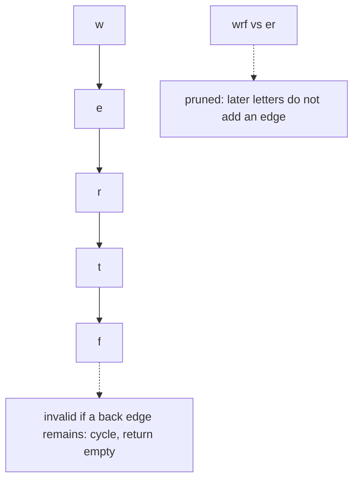

# 48. Alien Dictionary

LeetCode 269.

## Problem in my own words

The words are already sorted in the dictionary order of an unknown lowercase alphabet. Recover any order of the letters that actually appear so that every precedence implied by that sorted list is respected. If the list contains a contradiction or a cycle, return an empty string. Letters with no constraint still have to show up somewhere in a valid answer.

## Easy analogy

A stack of flashcards is supposedly in alphabetical order, but you do not know the alphabet. You compare each card only with the next card, the way you would check whether a bookshelf is sorted. The first position where two neighboring cards differ is a rule: that letter on the left card comes before that letter on the right card. You write those rules as arrows and look for an order that respects every arrow. If a longer card is filed before the shorter card that is its own prefix, the bookshelf is not sorted in any alphabet. If the arrows loop, same conclusion. You hand back one reading of the letters that satisfies the arrows you actually found.

## Diagram

From `wrt` before `wrf` you learn `t → f` (t comes first). From `wrf` before `er` you learn `w → e`. The second letter of that pair is not a new rule, because the first difference already decided the order. That ignored comparison is the dotted edge. A cycle such as `f → t` added later would make Kahn's frontier die early.



## Intuition

Only adjacent words can create a new precedence, and only their first differing character matters. If word `i` is sorted before word `i + 1`, scan both from the left. At the first mismatch, the character in the earlier word must come before the character in the later word. Add a directed edge `earlierChar → laterChar`, and increment the later character's indegree once. If that edge already exists, do not increment again. Characters after the mismatch are not ordered by this pair. `abc` before `abd` says `c` before `d`. It does not say anything about letters that would have followed `c`.

If the scan finds no mismatch and the earlier word is longer than the later word, the later word is a proper prefix of the earlier one. In every dictionary order the shorter prefix comes first (`ab` before `abc`). Seeing `abc` before `ab` is invalid. Return `""`. The other way, `ab` before `abc`, is valid and adds no letter edge.

Every letter that appears in any word is a node, even if it never touches an edge. Kahn's algorithm then produces a topological order. The queue starts with every present letter of indegree 0. Pop a letter into the answer, decrement each successor, and enqueue a successor when its indegree hits 0. If you emit fewer letters than you saw, a cycle remains. Return `""`. If you emit all of them, the string you built is one valid alphabet.

This implementation scans letters `a` through `z` when it seeds the queue and when it relaxes edges, so ties break in alphabetical order among letters that become free together. That is one valid answer, not the only one. The famous input `wrt, wrf, er, ett, rftt` has a unique order, `wertf`, so the tie-break does not matter there. A single word `zba` has no pair and therefore no edges. All three letters are free immediately, and this scan returns `abz`. `zba`, `baz`, and the other permutations are also correct. Do not "debug" a judge that expected a different valid string.

## Tiny walkthrough

Words `["wrt", "wrf", "er", "ett", "rftt"]`.

- `wrt` vs `wrf`. Shared `wr`, then `t` vs `f`. Edge `t → f`.
- `wrf` vs `er`. First letters `w` vs `e`. Edge `w → e`. The remaining characters are not compared.
- `er` vs `ett`. First letters match, then `r` vs `t`. Edge `r → t`.
- `ett` vs `rftt`. First letters `e` vs `r`. Edge `e → r`.

Edges: `t → f`, `w → e`, `r → t`, `e → r`. Letters present: `w, e, r, t, f`. Indegrees: `w` is 0, and each of the others is 1. Kahn emits `w`, which frees `e`, which frees `r`, which frees `t`, which frees `f`. Result `wertf`.

Invalid prefix: `["abc", "ab"]`. The first two letters match, the first word still has `c`, and the second word ended. Return `""`. The swap `["ab", "abc"]` adds no edge and returns the three letters in the tie-break order `abc`.

Cycle: `["z", "x", "z"]`. Edges `z → x` and `x → z`. Both indegrees stay positive. The order is empty, so return `""`.

Repeated precedence: `ac` before `ab` and later `zc` before `zb` both say `c` before `b`. The boolean edge matrix records the edge once, so `b`'s indegree is 1, not 2. Kahn can still finish.

## Java

```java
import java.util.ArrayDeque;
import java.util.Queue;

class Solution {
    public String alienOrder(String[] words) {
        boolean[][] edge = new boolean[26][26];
        boolean[] present = new boolean[26];
        int[] indegree = new int[26];
        int letters = 0;
        for (String word : words) {
            for (int i = 0; i < word.length(); i++) {
                int idx = word.charAt(i) - 'a';
                if (!present[idx]) {
                    present[idx] = true;
                    letters++;
                }
            }
        }
        for (int i = 0; i + 1 < words.length; i++) {
            String left = words[i];
            String right = words[i + 1];
            int minLen = Math.min(left.length(), right.length());
            boolean foundDifference = false;
            for (int j = 0; j < minLen; j++) {
                int a = left.charAt(j) - 'a';
                int b = right.charAt(j) - 'a';
                if (a != b) {
                    if (!edge[a][b]) {
                        edge[a][b] = true;
                        indegree[b]++;
                    }
                    foundDifference = true;
                    break;
                }
            }
            if (!foundDifference && left.length() > right.length()) {
                return "";
            }
        }

        Queue<Integer> ready = new ArrayDeque<>();
        for (int i = 0; i < 26; i++) {
            if (present[i] && indegree[i] == 0) {
                ready.offer(i);
            }
        }
        StringBuilder order = new StringBuilder();
        while (!ready.isEmpty()) {
            int letter = ready.poll();
            order.append((char) ('a' + letter));
            for (int next = 0; next < 26; next++) {
                if (!edge[letter][next]) {
                    continue;
                }
                indegree[next]--;
                if (indegree[next] == 0) {
                    ready.offer(next);
                }
            }
        }
        if (order.length() != letters) {
            return "";
        }
        return order.toString();
    }
}
```

## Python

```python
from collections import deque
from typing import List


class Solution:
    def alienOrder(self, words: List[str]) -> str:
        edge = [[False] * 26 for _ in range(26)]
        present = [False] * 26
        indegree = [0] * 26
        letters = 0
        for word in words:
            for ch in word:
                idx = ord(ch) - 97
                if not present[idx]:
                    present[idx] = True
                    letters += 1

        for i in range(len(words) - 1):
            left, right = words[i], words[i + 1]
            found_difference = False
            for a, b in zip(left, right):
                if a != b:
                    ia, ib = ord(a) - 97, ord(b) - 97
                    if not edge[ia][ib]:
                        edge[ia][ib] = True
                        indegree[ib] += 1
                    found_difference = True
                    break
            if not found_difference and len(left) > len(right):
                return ""

        ready = deque(i for i in range(26) if present[i] and indegree[i] == 0)
        order = []
        while ready:
            letter = ready.popleft()
            order.append(chr(letter + 97))
            for nxt in range(26):
                if not edge[letter][nxt]:
                    continue
                indegree[nxt] -= 1
                if indegree[nxt] == 0:
                    ready.append(nxt)
        if len(order) != letters:
            return ""
        return "".join(order)
```

`zip` stops at the shorter word, which is the mismatch scan. The length test after the loop is the prefix rule. The `if not edge` guard is what keeps a repeated precedence from inflating indegree.

## Complexity

- Let `C` be the total number of characters across all words, and let `U` be the number of distinct letters. `U ≤ 26` for lowercase English.
- Comparing adjacent words looks at each character a constant number of times: O(`C`).
- Kahn's algorithm on the letter graph is O(`U + E`). `E` is at most `U²` distinct precedences. With the boolean matrix, relaxing a node scans 26 possible successors, so the peel is O(`U · 26`), which is O(1) under this alphabet and O(`U²`) if you write it that way.
- Overall time O(`C + U²`). Space O(`U²`) for the matrix, or O(1) cells since 26 is fixed, plus the output of length `U`.
- Comparing every pair of words instead of adjacent pairs is unnecessary and costs more. Adjacent pairs are sufficient in a sorted list.

## Pitfalls

- Deriving an edge from a later character after the first mismatch. That invents a precedence the order does not require and can create a fake cycle.
- Forgetting the prefix rule. `["abc","ab"]` has no mismatched character. It is still invalid. `["ab","abc"]` is valid and adds no edge.
- Incrementing indegree every time the same letter pair appears. The second copy of `c → b` never gets a second decrement if you stored one edge, and a valid alphabet looks cyclic.
- Dropping letters that have no edges. A one-word dictionary must still return each of its distinct letters. The `present` array is the node set, not the set of endpoints of edges.
- Returning a partial Kahn order when a cycle remains. The caller needs `""`, not the letters you managed to place.
- Assuming the answer is unique. State that any topological order is correct. This code's `a` through `z` scan makes one deterministic choice. Another implementation may validly emit a different string.
- Building an undirected edge and running union-find. `t` before `f` is not "t and f are in the same component." Direction is the entire problem.
- Comparing non-adjacent words only, or sorting the words again with a normal alphabet. The input order is the evidence. Do not re-sort it.

## Two-minute interview script

"The words are sorted in an unknown alphabet. I compare each word with the next one. I walk until the first character that differs, and that pair is a directed edge: the character in the earlier word comes before the character in the later word. I record the edge once, so a repeated rule does not bump indegree twice. Characters after that first difference do not create edges. If I finish the shorter word with no difference and the earlier word is longer, the earlier word has its own prefix listed after it, which no alphabet allows, and I return an empty string. The opposite order, short prefix first, is fine and adds no edge.

Every distinct letter is a node, including letters that never appear in a rule. I topological-sort that graph with Kahn's algorithm, seeding the queue with indegree-zero letters in alphabetical order. Each pop appends a letter and frees successors whose indegree hits zero. If I cannot emit every letter, there is a cycle and I return empty. Otherwise the string I emitted is one valid order. On the standard example the unique order is w-e-r-t-f. On a single word every permutation is valid, and this scan happens to emit letters alphabetically. I do not use union-find. The constraints are directed."
