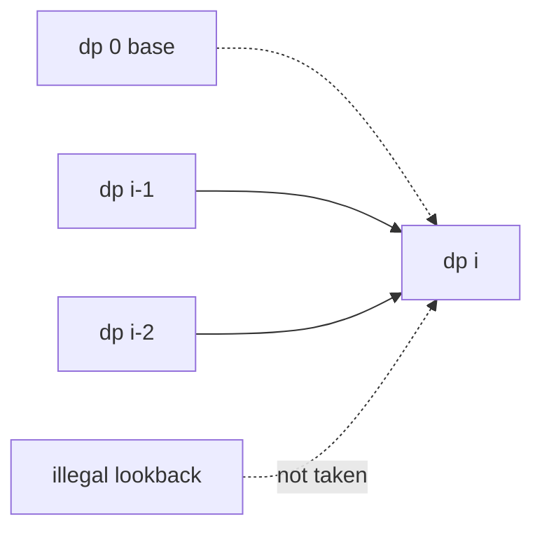

# 1D Dynamic Programming — Pattern Study

https://neetcode.io/practice (NeetCode 150 / Blind 75, 1D DP block)

## Problem in your own words

A one-dimensional DP problem asks for a number, a yes/no, or a best score on a sequence, where the answer for a prefix (or for a budget) is built from a few smaller prefixes. You do not enumerate every subset or every way of climbing. You store one answer per index, fill those answers from left to right, and read the result from the last cell or from the best cell. The “1D” part means the state is a single integer: an index into the array or string, or an amount of money.

## Easy analogy

Think of a row of stepping stones across a creek. On each stone you only need the best way to have arrived there, not a diary of every previous hop. The stone’s label is the state. The hop from the previous stone, or the one before that, is the recurrence. Stones you are not allowed to use (a house you must skip, a jump that falls short, a decode that starts with zero) are hops you mark and then ignore.

## DP diagram

The shape that shows up again and again is “this cell looks back a constant distance, and one of those looks is illegal or a base case.”



```text
index:     0      1      2      3      4
meaning:   base   ...    ...    ...    answer often lives here
depends:          on 0   on 0,1 on 1,2 on 2,3
                  ^ base edge is drawn dotted when it only seeds the row
```

## Checklist before you write code

1. **Name the index out loud.** “`dp[i]` is the answer for the first `i` items” or “for the subarray that ends at `i`.” These are different. A prefix answer is read at `dp[n]`. An “ending here” answer is the max (or the or) over the whole row.
2. **Write the decision.** Last step is 1 or 2 (stairs, decode). Take or skip this house. Place one more coin or stop. Cut a dictionary word here or not. Extend the product or restart. Extend an increasing run or start a new one.
3. **Base case.** `dp[0]` is the empty prefix: one way to decode or climb nothing, zero coins to make amount 0, true for an empty word-break string, zero loot from zero houses. A single element is its own LIS and its own product.
4. **Loop direction.** Prefix recurrences increase `i`. Unbounded coin change increases the amount so the same coin can be reused. A 0/1 choice would decrease the amount. Do not fill a cell before the cells it reads.
5. **Impossible cells.** Use a sentinel (`amount + 1`, or `false`) and translate it at the end (`-1` for coin change). Do not use `Integer.MAX_VALUE` if you will add 1 to it.
6. **Where is the answer?** Last cell for stairs, robber, decode, word break, coin amount. Max over cells for LIS and maximum product. A boolean frontier for jump game.
7. **Compress space only after the table is correct.** If the recurrence reads `dp[i-1]` and `dp[i-2]`, two variables replace the array. If it reads every smaller amount, you still need an array of size `amount + 1`.
8. **Circular and negative twists are not new states.** A circle is two linear ranges. A negative multiplier means you must keep both the min and the max ending here.
9. **Not every “DP-looking” string problem wants a table.** Palindromes in this folder expand around a center. Jump game’s reachable set is always a prefix, so a running farthest index replaces the boolean row. Still be able to write the DP recurrence if the interviewer asks why the shortcut is safe.

## Intuition

### Brute force

The slow version tries every decision at every index: every way to split the staircase, every subset of non-adjacent houses, every combination of coins, every substring. That tree is exponential. Many branches recompute the same suffix or the same remaining amount.

### Overlapping subproblems

Once the future only depends on “what is the best answer for everything before `i`?”, two paths that reach the same `i` with the same summary are the same subproblem. The summary has to be small. For these problems it is one integer, or a pair of integers (min product and max product).

### State

Pick the smallest label that makes the decision local.

| If the question is… | State that is enough |
| --- | --- |
| number of ways to build a prefix | `dp[i]` = ways to build length `i` |
| best score on a prefix with a local constraint | `dp[i]` = best on the first `i` items |
| best score of a subarray that must end here | `dp[i]` = best ending at `i`, then max over `i` |
| fewest coins for a capacity | `dp[a]` = fewest coins that sum to `a` |
| can you segment a prefix | `dp[i]` = true if `s[0:i]` splits into dictionary words |

If two different histories need different futures, the state is too small. If you are storing the whole subset, the state is too big.

## Recurrence

Linear lookback (stairs, decode, robber), written as a formula:

\[
dp[i] = \mathrm{combine}\big(dp[i-1],\; dp[i-2],\; \text{choice at } i\big)
\]

Unbounded knapsack (coin change), one row after dropping the “which coin index” dimension:

\[
dp[a] = \min_{c \in coins,\; c \le a} dp[a-c] + 1, \qquad dp[0] = 0
\]

The combine step is `+` for counting ways, `max` for scores, `min` for fewest coins, and boolean `or` for reachability. The empty combine (no legal choice) is 0 ways, a sentinel, or `false`.

## Tiny walkthrough

Climbing 4 stairs, one or two at a time. `dp[i]` = ways to stand on step `i`. `dp[0] = 1` is the base (you are already on the ground). The dotted edges in the diagram are that base feeding a cell, not a real hop you recount later.

| i | skip the illegal negative | from i-1 | from i-2 | dp[i] |
| --- | --- | --- | --- | --- |
| 0 | base | — | — | 1 |
| 1 | no i-2 | 1 | — | 1 |
| 2 | — | 1 | 1 | 2 |
| 3 | — | 2 | 1 | 3 |
| 4 | — | 3 | 2 | 5 |

Same numbers as the Fibonacci shift. House robber, decode ways, and word break use this same left-to-right fill; only the combine function changes.

## Java solution (complete, correct, commented)

The pattern in code is the rolling form of the table above. Problem files specialize `combine`.

```java
class Solution {
    // Ways to climb n stairs taking 1 or 2 steps. The template for "dp[i] from i-1 and i-2".
    public int climbStairs(int n) {
        if (n <= 2) {
            return n;
        }
        int prev2 = 1; // dp[1]
        int prev1 = 2; // dp[2]
        for (int i = 3; i <= n; i++) {
            int cur = prev1 + prev2;
            prev2 = prev1;
            prev1 = cur;
        }
        return prev1;
    }
}
```

## Python solution (complete, correct, commented)

```python
class Solution:
    def climbStairs(self, n: int) -> int:
        # dp[i] = dp[i - 1] + dp[i - 2], kept in two variables.
        if n <= 2:
            return n
        prev2, prev1 = 1, 2
        for _ in range(3, n + 1):
            prev2, prev1 = prev1, prev1 + prev2
        return prev1
```

## Complexity

A 1D row of length `n` (or `amount`) is `O(n)` time when each cell does `O(1)` work, and `O(n · k)` when each cell tries `k` options (coins, word lengths, earlier LIS indices). Space is `O(n)` for the row, or `O(1)` after rolling a constant lookback. Palindrome expansion is `O(n^2)` time and `O(1)` extra memory because each center grows at most `n` steps and nothing is stored. Patience sorting for LIS is `O(n log n)` time and still `O(n)` memory; it is a follow-up, not a replacement for the `O(n^2)` row in the LIS note.

## Pitfalls

- Off-by-one on the meaning of `i`: “first `i` houses” uses `nums[i - 1]`, “ending at `i`” uses `nums[i]`.
- A zero digit, a zero jump, or an unreachable amount is a transition you must not take. Leaving it as if it were a one is a wrong answer, not a style issue.
- `Integer.MAX_VALUE + 1` overflows. Sentinel for coin change is `amount + 1`.
- Circular houses are two ranges, not one row with a special last cell. The ranges overlap in the middle on purpose; you take the max of the two answers, not the sum.
- Negatives flip min and max. One running product is not enough.
- Space-optimizing before the recurrence is right hides index bugs. Roll only a finished recurrence that looks back a fixed distance.

## How to derive the state in an interview

Say the brute force in one sentence, then the repeated work: “I keep recomputing the same prefix.” Name `dp[i]` so that the decision at `i` only reads smaller `i`. Write the base case, then one line of recurrence, then point at the cell that is the answer. Only after that, mention two variables, a circle split into two ranges, or a greedy farthest index. If you cannot point at which cell is the answer, the state is still fuzzy.
