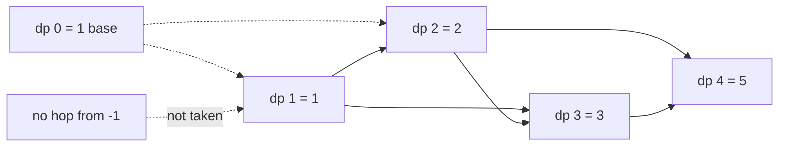

# 49. Climbing Stairs

https://leetcode.com/problems/climbing-stairs/

## Problem in your own words

There is a staircase of `n` steps. From any step you may climb either one step or two steps, and you want the number of different orders of climbs that land exactly on the top. Order matters: a single two-step followed by a one-step is different from a one-step followed by a two-step. You are not asked for the minimum number of climbs, only for how many sequences exist.

## Easy analogy

You are hopping up a playground ladder. Each hop is short or slightly longer. The number of hop-sequences that finish on rung `n` is the sequences that finished on rung `n - 1` (then one short hop) plus the sequences that finished on rung `n - 2` (then one longer hop). You do not care which sequence got you to those rungs, only how many did.

## DP diagram

Ways to reach step 4. Dotted arrows are the base case seeding the row, not a second hop you add again inside the loop.



## Intuition

### Brute force

From step 0, try a 1-step and a 2-step, and recurse until you pass `n` or land on it. The recursion tree branches by two at every level and recomputes “ways from step `k`” once per path that reaches `k`.

### Overlapping subproblems

“Ways to finish starting from step `k`” depends only on `k`. Paths that arrive at `k` by different histories share that call. A memo map on `k`, or a table filled upward, evaluates each step once.

### State

`dp[i]` = number of ways to climb exactly `i` steps (equivalently, number of ways to stand on step `i`). The last hop is either 1 or 2, so the state does not need to remember the whole sequence.

## Recurrence

\[
dp[i] = dp[i-1] + dp[i-2] \quad (i \ge 2)
\]

with \(dp[0] = 1\) (one way to stand on the ground before any hop) and \(dp[1] = 1\). Equivalently \(dp[1] = 1\), \(dp[2] = 2\), and the same relation for \(i \ge 3\). The answer is \(dp[n]\).

## Tiny walkthrough

`n = 5`. Fill left to right.

| i | from i-1 | from i-2 | taken? | dp[i] |
| --- | --- | --- | --- | --- |
| 0 | — | — | base | 1 |
| 1 | dp[0] = 1 | none | one-step only | 1 |
| 2 | 1 | 1 | both | 2 |
| 3 | 2 | 1 | both | 3 |
| 4 | 3 | 2 | both | 5 |
| 5 | 5 | 3 | both | 8 |

The three ways for `n = 3` are `1+1+1`, `1+2`, and `2+1`. The cell `dp[3] = 3` matches that list without storing it.

## Java solution (complete, correct, commented)

```java
class Solution {
    public int climbStairs(int n) {
        // dp[1] = 1, dp[2] = 2, dp[i] = dp[i - 1] + dp[i - 2]
        if (n <= 2) {
            return n;
        }
        int prev2 = 1;
        int prev1 = 2;
        for (int i = 3; i <= n; i++) {
            int cur = prev1 + prev2;
            prev2 = prev1;
            prev1 = cur;
        }
        return prev1;
    }
}
```

## Python solution (complete, correct, commented)

```python
class Solution:
    def climbStairs(self, n: int) -> int:
        # Two rolling cells replace the full row. Answer is dp[n].
        if n <= 2:
            return n
        prev2, prev1 = 1, 2
        for _ in range(3, n + 1):
            prev2, prev1 = prev1, prev1 + prev2
        return prev1
```

## Complexity

Time is `O(n)`: one addition per step. Extra space is `O(1)` after rolling. The explicit table is `O(n)` memory and the same arithmetic. A naive recursion without memo is `O(fib(n))` calls, which is exponential.

## Pitfalls

- Returning `n` for the minimum number of steps. The question is a count. Minimum steps would be `ceil(n / 2)` if a 2-step is allowed, and that is a different problem.
- Off-by-one on the base. `dp[2]` is 2, not 1: `1+1` and `2` are distinct.
- Using a closed Fibonacci formula and rounding wrong. The loop is exact and short.
- Integer overflow if `n` is large and the language has fixed-width ints. The classic constraint keeps `n` small enough for a 32-bit signed int (`n ≤ 45`). Say so if they raise `n`.

## How to derive the state in an interview

“The last hop is 1 or 2, so ways to reach `i` is ways to reach `i-1` plus ways to reach `i-2`. I only need that count, not the list of hops. Seed `dp[1]` and `dp[2]`, iterate to `n`, return the last value. Two variables are enough because nothing farther back is read.”
