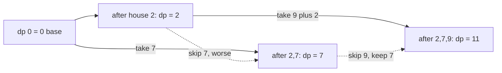

# 50. House Robber

https://leetcode.com/problems/house-robber/

## Problem in your own words

Houses stand in a line, and each house holds a non-negative amount of money. You choose a subset of houses to rob. If you rob two houses that share a wall, an alarm goes off, so chosen houses cannot be neighbors. The score of a plan is the sum of the chosen amounts. Return the best score, not the list of houses. Robbing nothing is allowed and scores 0.

## Easy analogy

You walk past a row of tip jars. Taking a jar means you must walk past the next one with your hands down. At each jar you compare two plans you already know: the best plan that skipped this jar, and the best plan that skipped the previous jar and then takes this one. You keep the richer plan and forget the route.

## DP diagram

Input `[2, 7, 9]`. Solid edges are the choice that wins at that house. Dotted edges are the choice you compute and reject.



## Intuition

### Brute force

Every house is take or skip, except a take forbids the next house. That is still an exponential family of subsets. Many subsets share the same “best loot on the first `i` houses.”

### Overlapping subproblems

Once you know the best loot on a prefix, every longer plan that starts from that prefix reuses it. You never need the set of robbed indices, because the only constraint that leaks forward is whether the last house was robbed, and the recurrence encodes that by offering an explicit skip.

### State

`dp[i]` = maximum money you can rob from the first `i` houses (a prefix of length `i`). At house `i - 1` you either skip it (`dp[i - 1]`) or take it and add it to the best prefix that did not include the previous house (`dp[i - 2] + nums[i - 1]`).

## Recurrence

\[
dp[i] = \max(dp[i-1],\; dp[i-2] + nums[i-1]) \quad (i \ge 2)
\]

\[
dp[0] = 0, \qquad dp[1] = nums[0]
\]

The answer is \(dp[n]\), where \(n\) is the number of houses. A running form with the same meaning: let `prev2` be `dp[i-2]` and `prev1` be `dp[i-1]`, and set `cur = max(prev1, prev2 + x)` for each house value `x`.

## Tiny walkthrough

`nums = [2, 7, 9, 3, 1]`.

| i | prefix ends with | skip = dp[i-1] | take = dp[i-2] + value | winner | dp[i] |
| --- | --- | --- | --- | --- | --- |
| 0 | nothing | — | — | base | 0 |
| 1 | 2 | — | 2 | take | 2 |
| 2 | 7 | 2 | 0 + 7 = 7 | take | 7 |
| 3 | 9 | 7 | 2 + 9 = 11 | take | 11 |
| 4 | 3 | 11 | 7 + 3 = 10 | skip (dotted) | 11 |
| 5 | 1 | 11 | 11 + 1 = 12 | take | 12 |

Best plan: houses `2`, `9`, and `1`. The rejected cell at `i = 4` is “rob 7 and 3,” which is legal and worse.

## Java solution (complete, correct, commented)

```java
class Solution {
    public int rob(int[] nums) {
        // prev2 = dp[i - 2], prev1 = dp[i - 1], both start as dp[0] = 0
        int prev2 = 0;
        int prev1 = 0;
        for (int money : nums) {
            int take = prev2 + money;
            int skip = prev1;
            int cur = Math.max(skip, take);
            prev2 = prev1;
            prev1 = cur;
        }
        return prev1;
    }
}
```

## Python solution (complete, correct, commented)

```python
class Solution:
    def rob(self, nums: list[int]) -> int:
        # dp[i] = max(dp[i - 1], dp[i - 2] + nums[i - 1])
        prev2 = prev1 = 0
        for money in nums:
            prev2, prev1 = prev1, max(prev1, prev2 + money)
        return prev1
```

## Complexity

One pass, `O(n)` time. Two integers, `O(1)` extra memory. The explicit table is the same time and `O(n)` memory. You cannot answer from a single running max of values, because adjacency deletes neighbors and the best subset is not “the largest numbers.”

## Pitfalls

- Updating `prev2` after you have already overwritten `prev1`, so both slots hold the new value. The take option then sees the wrong prefix.
- Treating the row as circular. This problem is a line. The circle is house robber II.
- Indexing `nums[i]` while `dp[i]` means “first `i` houses.” In the loop-over-values form you never touch an index, which avoids that bug.
- Assuming values are positive so you always take a house when you can. Zeros do not break the recurrence, but a forced take would.

## How to derive the state in an interview

“On a prefix, the current house is either in the plan or not. If it is out, the answer is the previous prefix. If it is in, the answer is this house plus the prefix that ends two houses back. That case split is the recurrence. I only keep two prefixes.” Then give the `[2, 7, 9, 3, 1] → 12` check so they hear a concrete cell.
