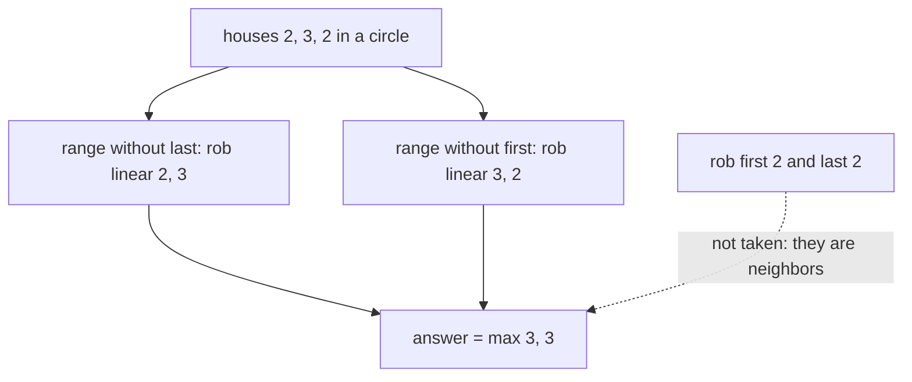

# 51. House Robber II

https://leetcode.com/problems/house-robber-ii/

## Problem in your own words

The houses now form a circle: the first house and the last house are neighbors, in addition to the usual rule that you cannot rob two adjacent houses. Each house still holds a non-negative amount. Return the maximum sum of a valid subset. A circle means a plan that robs both endpoints is illegal even though they are far apart in the array layout. With one house, the circle does not create a second neighbor; that house may be robbed.

## Easy analogy

The jars sit around a round table. If you pocket the first jar, the last jar is the one touching your elbow, so it is already spent. If you pocket the last jar, the first one is spent. You solve the straight-table problem twice: once with the first jar removed from the menu, once with the last jar removed. The better of those two dinners is the best legal dinner. You never add the two dinners together.

## DP diagram

`nums = [2, 3, 2]`. The two ranges are separate linear problems. The dotted edge is the illegal plan that robs both endpoints, which neither range allows.



## Intuition

### Brute force

The linear robber already searches subsets. On a circle you add one extra forbidden pair. Enumerating subsets is still exponential, and “run linear DP on the whole array” is simply wrong because `dp[n]` can include both ends.

### Overlapping subproblems

Inside each range the same prefix subproblems as house robber appear. The circle does not create a new overlap pattern; it creates two independent linear instances.

### State

There is no circular state. Let `rob(lo, hi)` be the linear house-robber answer on the inclusive index range `[lo, hi]`. The first house is included only in `[0, n - 2]`. The last house is included only in `[1, n - 1]`. The answer is the max of those two. If `n = 1`, return `nums[0]` before slicing, because both ranges would be empty.

## Recurrence

On a linear range the same formula as house robber applies, restricted to indices `lo..hi`:

\[
dp[i] = \max(dp[i-1],\; dp[i-2] + nums[i]) \quad (lo \le i \le hi)
\]

with `dp` meaning “best on this range up through index `i`,” seeded by 0 before `lo`. The circular answer is

\[
\mathrm{answer} = \max\big(\mathrm{linear}(0, n-2),\; \mathrm{linear}(1, n-1)\big) \quad (n \ge 2)
\]

Why this covers every legal plan: any non-empty legal plan omits at least one of the two endpoints, because it cannot contain both. Plans that omit both are considered in both ranges; taking the max still returns them once. Plans that use the first house are only feasible inside the first range. Plans that use the last house are only feasible inside the second.

## Tiny walkthrough

`nums = [1, 2, 3, 1]`, indices `0..3`.

Range `[0, 2]` which is values `[1, 2, 3]` (last house dropped):

| step | value | skip | take | dp running |
| --- | --- | --- | --- | --- |
| start | — | — | — | prev = 0, 0 |
| i = 0 | 1 | 0 | 1 | 1 |
| i = 1 | 2 | 1 | 2 | 2 |
| i = 2 | 3 | 2 | 1 + 3 = 4 | 4 |

Range `[1, 3]` which is values `[2, 3, 1]` (first house dropped):

| step | value | skip | take | dp running |
| --- | --- | --- | --- | --- |
| i = 1 | 2 | 0 | 2 | 2 |
| i = 2 | 3 | 2 | 3 | 3 |
| i = 3 | 1 | 3 | 2 + 1 = 3 | 3 |

Answer `max(4, 3) = 4` (houses `1` and `3`). The dotted plan “first 1 plus last 1” sums to 2 and is illegal; it never appears as a take inside either range.

Check `[2, 3, 2]`: ranges `[2, 3]` → 3 and `[3, 2]` → 3, answer 3. Robbing both 2s is the dotted illegal plan.

## Java solution (complete, correct, commented)

```java
class Solution {
    public int rob(int[] nums) {
        int n = nums.length;
        if (n == 1) {
            return nums[0];
        }
        // Endpoints are neighbors. Each call drops one of them.
        return Math.max(robRange(nums, 0, n - 2), robRange(nums, 1, n - 1));
    }

    private int robRange(int[] nums, int lo, int hi) {
        int prev2 = 0;
        int prev1 = 0;
        for (int i = lo; i <= hi; i++) {
            int cur = Math.max(prev1, prev2 + nums[i]);
            prev2 = prev1;
            prev1 = cur;
        }
        return prev1;
    }
}
```

## Python solution (complete, correct, commented)

```python
class Solution:
    def rob(self, nums: list[int]) -> int:
        n = len(nums)
        if n == 1:
            return nums[0]

        def rob_range(lo: int, hi: int) -> int:
            prev2 = prev1 = 0
            for i in range(lo, hi + 1):
                prev2, prev1 = prev1, max(prev1, prev2 + nums[i])
            return prev1

        # Two linear problems. Do not add them.
        return max(rob_range(0, n - 2), rob_range(1, n - 1))
```

## Complexity

Two linear passes, so time is `O(n)`. Extra memory is `O(1)`. You do not build a circular table. A single linear pass on all `n` houses is the wrong algorithm, not a faster one.

## Pitfalls

- Forgetting `n == 1`. The ranges `[0, -1]` and `[1, 0]` are empty and would return 0.
- Adding the two range answers. They are alternatives. Houses in the middle are eligible for both, and summing double-counts them.
- Including index `n - 1` in the first range or index `0` in the second. The whole point of the split is that each range misses one endpoint.
- Applying a special “if I rob house 0, zero out house n-1” mutation on one shared DP row without resetting. Two clean calls are harder to get wrong.

## How to derive the state in an interview

“The linear state is still the right one. The circle only adds a constraint between index 0 and index `n - 1`. Any optimal plan omits at least one of those two houses. So I compute the linear answer on each range that omits one endpoint, and I return the larger. One house is not a circle of neighbors.” Then walk `[1, 2, 3, 1]` to 4.
