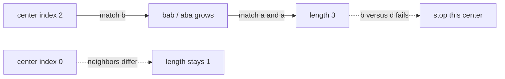

# 52. Longest Palindromic Substring

https://leetcode.com/problems/longest-palindromic-substring/

## Problem in your own words

You are given a string. A substring is a contiguous slice. The slice is a palindrome when it reads the same forward and backward. Return any one longest palindromic slice, not every one of them, and not a subsequence that skips characters. A single character is always a palindrome, so the answer is never empty for a non-empty string.

## Easy analogy

Stand between two letters, or on top of one letter, and walk outward one step at a time as long as the letters under your left and right feet match. Each starting stance is a center. The longest walk you complete is the answer. You do not need a notebook of every slice, because a failed step stops that walk immediately.

## DP diagram

Centers of `"babad"`. Solid edges are successful expansions. Dotted edges are the next comparison that fails and is not taken.



```text
s:        b a b a d
index:    0 1 2 3 4
center 2 walks: [2,2] -> [1,3] -> [0,4] stops
slice [1,3] = "aba"
```

## Intuition

### Brute force

Every pair `(i, j)` is a slice. Checking it against its reverse costs `O(n)` and there are `O(n^2)` slices, so `O(n^3)` total. Most long slices are doomed as soon as the outer characters differ.

### Overlapping subproblems

Slice `[L, R]` is a palindrome only if `s[L] == s[R]` and the inside slice `[L+1, R-1]` is a palindrome (or the inside is empty). That is a real recurrence on intervals. A boolean table `dp[L][R]` stores it. Many centers share the same inner slices, which is the overlap.

### State

The clear solution does not store the table. The state you actually iterate is the center: either one index `(i, i)` for an odd length, or two neighboring indices `(i, i+1)` for an even length. Expanding while the ends match evaluates the recurrence along one diagonal and throws the booleans away. There are `2n - 1` centers.

The table state, if you prefer it as a check, is `dp[L][R]` = whether `s[L..R]` is a palindrome.

## Recurrence

Expansion, which is what the code does:

\[
\mathrm{pal}(L, R) = \big(s[L] = s[R]\big) \land \big(R - L \le 1 \lor \mathrm{pal}(L+1, R-1)\big)
\]

The loop maintains the invariant that the open interval inside `(L, R)` is already a palindrome, and it stops at the first failing ends. Length of a successful window that last matched at `L+1, R-1` is `R - L - 1` after `L` and `R` have stepped one past the palindrome.

Interval DP, same fact, filled by increasing length:

\[
dp[L][R] = \big(s[L] = s[R]\big) \land \big(R - L \le 2 \lor dp[L+1][R-1]\big)
\]

Track the maximum `R - L + 1` and the start index. Either formulation is correct. Expansion uses `O(1)` extra memory and is the solution to write first.

## Tiny walkthrough

`s = "cbbd"`.

| center | first window | expansion | length | best slice |
| --- | --- | --- | --- | --- |
| (0, 0) | `"c"` | right neighbor `b` differs | 1 | `"c"` |
| (0, 1) | `c` vs `b` | not taken | 0 | `"c"` |
| (1, 1) | `"b"` | (0, 2) is `c` vs `b`, stop | 1 | `"c"` |
| (1, 2) | `b` vs `b` | (0, 3) is `c` vs `d`, stop | 2 | `"bb"` |
| (2, 2) | `"b"` | neighbors differ | 1 | `"bb"` |
| (3, 3) | `"d"` | — | 1 | `"bb"` |

Answer `"bb"`. For `"babad"`, center 2 grows to `"aba"` (length 3) and center 1 also grows to `"bab"` (length 3). Either string is a correct return value. The implementation below keeps the latest window when lengths tie, because it updates when `len > end - start` and `end - start` is one less than the current best length, so an equal length still replaces.

## Java solution (complete, correct, commented)

```java
class Solution {
    public String longestPalindrome(String s) {
        int n = s.length();
        if (n == 0) {
            return "";
        }
        int start = 0;
        int end = 0; // inclusive; best length is end - start + 1
        for (int i = 0; i < n; i++) {
            int odd = expand(s, i, i);
            int even = expand(s, i, i + 1);
            int len = Math.max(odd, even);
            // end - start == currentBestLength - 1, so len >= current best updates
            if (len > end - start) {
                start = i - (len - 1) / 2;
                end = i + len / 2;
            }
        }
        return s.substring(start, end + 1);
    }

    private int expand(String s, int left, int right) {
        while (left >= 0 && right < s.length() && s.charAt(left) == s.charAt(right)) {
            left--;
            right++;
        }
        // left and right are one step outside the palindrome
        return right - left - 1;
    }
}
```

## Python solution (complete, correct, commented)

```python
class Solution:
    def longestPalindrome(self, s: str) -> str:
        n = len(s)
        if n == 0:
            return ""
        start = end = 0

        def expand(left: int, right: int) -> int:
            while left >= 0 and right < n and s[left] == s[right]:
                left -= 1
                right += 1
            return right - left - 1

        for i in range(n):
            length = max(expand(i, i), expand(i, i + 1))
            if length > end - start:
                start = i - (length - 1) // 2
                end = i + length // 2
        return s[start:end + 1]
```

### Interval DP as a check, not the primary code

Fill `dp[L][R]` by substring length. Base: length 1 is true, length 2 is true when the two characters match. For longer slices use the recurrence above, and remember the best `(L, length)`. Time `O(n^2)`, extra memory `O(n^2)`. Expansion is the same comparisons with the table erased. Manacher finds the same answer in linear time; it is outside this note.

## Complexity

Expansion: `2n - 1` centers, each walks at most `O(n)` steps, so time is `O(n^2)`. Extra memory is `O(1)` besides the output string. The interval table is `O(n^2)` time and `O(n^2)` memory. Brute-force checking every slice is `O(n^3)`.

## Pitfalls

- Treating this as a subsequence. Skipping characters is a different problem (longest palindromic subsequence) and wants a real interval DP on the string paired with its reverse, or on two ends moving independently.
- Forgetting even centers. `"aa"` never appears if you only expand `(i, i)`.
- Off-by-one in the length. After the while loop, `left` and `right` have already moved past the matching window, so the length is `right - left - 1`, not `right - left + 1`.
- Building the answer with the wrong start. For a window of length `len` whose left-center is `i`, the start is `i - (len - 1) / 2`. Integer division matters; check it on `"abba"` (even) and `"aba"` (odd).
- Assuming the first longest slice must be returned. Any longest slice is accepted.

## How to derive the state in an interview

“A palindrome is determined by its center and its radius. I try every odd and even center, walk outward while the ends match, and keep the best window. That walk is the recurrence ‘ends match and the inside already matched,’ evaluated without a table. If you want the table, `dp[L][R]` depends on `dp[L+1][R-1]`, filled by length, same answer, quadratic memory.”
