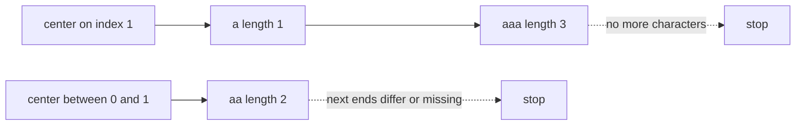

# 53. Palindromic Substrings

https://leetcode.com/problems/palindromic-substrings/

## Problem in your own words

You are given a string. Count how many contiguous slices read the same forward and backward. Every single character counts. A longer slice counts once for the whole slice, and its palindromic pieces count separately. You return an integer, not the slices themselves. Overlapping slices all count: in `"aaa"` the two different length-2 slices are two answers, and the whole string is a third, on top of the three letters.

## Easy analogy

Use the same outward walk as the longest-palindrome problem, but score every step that still matches, not only the farthest one. Each successful step is one palindromic slice centered where you started. When the next letters differ, that walk stops and you move your feet to the next center.

## DP diagram

Centers of `"aaa"`. Solid edges are counted palindromes. The dotted edge is an expansion that would leave the string and is not taken.



## Intuition

### Brute force

Check all `O(n^2)` slices for equality with their reverse, `O(n)` per check, `O(n^3)` total. Every palindrome is discovered many times from the outside in.

### Overlapping subproblems

The interval recurrence is the same as for the longest palindromic substring: `[L, R]` is a palindrome when the ends match and the inside is a palindrome. A boolean table would mark each true cell and count them. Expansion counts those true cells along each center without writing the table.

### State

The loop state is the center `(left, right)`, odd or even. The stored state is a single integer, the count. You do not need the best window, so you do not track start and end.

## Recurrence

\[
\mathrm{pal}(L, R) = \big(s[L] = s[R]\big) \land \big(R - L \le 1 \lor \mathrm{pal}(L+1, R-1)\big)
\]

\[
\mathrm{answer} = \big|\{\,(L, R) : 0 \le L \le R < n \land \mathrm{pal}(L, R)\,\}\big|
\]

Around a fixed center the inner check is free: you only extend a window that just matched. Each extension adds exactly one new pair `(L, R)`.

If you fill a table instead:

\[
dp[L][R] = \big(s[L] = s[R]\big) \land \big(R - L < 2 \lor dp[L+1][R-1]\big)
\]

and the answer is the number of true cells. Same count, `O(n^2)` memory.

## Tiny walkthrough

`s = "aaa"`.

| center (L, R) start | windows counted | running total |
| --- | --- | --- |
| (0, 0) | `"a"` at [0,0] | 1 |
| (0, 1) | `"aa"` at [0,1]; next would be out of range | 2 |
| (1, 1) | `"a"` at [1,1], then `"aaa"` at [0,2] | 4 |
| (1, 2) | `"aa"` at [1,2] | 5 |
| (2, 2) | `"a"` at [2,2] | 6 |

The length-3 expansion’s first step is the single middle character; the second step is the whole string. Both are added. `"abc"` only has the three odd centers of length 1, because every even start mismatches and every odd expansion stops immediately. Answer 3.

## Java solution (complete, correct, commented)

```java
class Solution {
    public int countSubstrings(String s) {
        int n = s.length();
        int count = 0;
        for (int i = 0; i < n; i++) {
            count += expand(s, i, i);     // odd length
            count += expand(s, i, i + 1); // even length
        }
        return count;
    }

    private int expand(String s, int left, int right) {
        int count = 0;
        while (left >= 0 && right < s.length() && s.charAt(left) == s.charAt(right)) {
            count++;
            left--;
            right++;
        }
        return count;
    }
}
```

## Python solution (complete, correct, commented)

```python
class Solution:
    def countSubstrings(self, s: str) -> int:
        n = len(s)
        count = 0

        def expand(left: int, right: int) -> int:
            found = 0
            while left >= 0 and right < n and s[left] == s[right]:
                found += 1
                left -= 1
                right += 1
            return found

        for i in range(n):
            count += expand(i, i)
            count += expand(i, i + 1)
        return count
```

## Complexity

Time is `O(n^2)`: each of the `O(n)` centers walks at most `O(n)` matching steps, and every palindrome is charged to exactly one center so the total number of successful steps equals the answer, which is `O(n^2)` in the worst case (`"aaaa..."`). Extra memory is `O(1)`. The boolean table is `O(n^2)` time and `O(n^2)` memory.

## Pitfalls

- Counting only the longest palindrome around each center. That returns something closer to a center count, not a substring count. `"aaa"` would look like a handful of centers instead of 6.
- Forgetting even centers. `"aa"` has 3 palindromic substrings (two letters and one pair). Odd-only code returns 2.
- Counting characters while the mismatch is still inside the loop. Increment only after the equality test succeeds.
- Confusing this with longest palindromic subsequence. Non-contiguous picks are not substrings and are not found by expansion.

## How to derive the state in an interview

“Every palindromic substring has one center. I expand odd and even centers while the ends match, and each match is one substring. I add those matches into an integer. The recurrence is the same end-and-inside test as the longest-slice problem; I am counting true results instead of keeping a max length.”
