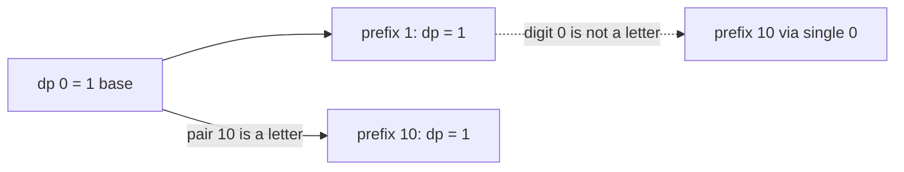

# 54. Decode Ways

https://leetcode.com/problems/decode-ways/

## Problem in your own words

Digits are a coded message. `"1"` means A, `"2"` means B, and so on through `"26"` which means Z. You are given a digit string and you want the number of ways to split it into numbers that all fall in 1..26. A piece may be one digit or two digits. A zero is not a letter by itself, and a two-digit piece cannot start with zero, so `"10"` is only the single letter J, while `"01"` is not a letter at all. The answer is a count of splits, not the letters.

## Easy analogy

You read a ticket tape from the left. At each position you may tear off one digit, if it is 1..9, or two digits, if those two form 10..26. The number of readings of the whole tape is the readings that leave you one digit back (then a legal single tear) plus the readings that leave you two digits back (then a legal double tear). A tear you are not allowed to make contributes nothing.

## DP diagram

Decoding `"10"`. The single-zero tear is dotted because it is illegal. The only solid path is the two-digit letter 10, taken from the empty prefix.



## Intuition

### Brute force

At index `i`, if `s[i]` is not zero, recurse on `i + 1`. If `s[i:i+2]` is between 10 and 26, recurse on `i + 2`. Sum the successful leaves. The tree recomputes “ways to decode the suffix starting at `i`” once per path.

### Overlapping subproblems

The suffix from `i` does not depend on how you decoded the prefix, only on the fact that the prefix was valid and on the count of ways to reach `i`. Memoize by start index, or fill a prefix table.

### State

`dp[i]` = number of ways to decode the prefix `s[0:i]` (length `i`). The decision is only about the last piece: it is the single digit ending at `i - 1`, or the two digits ending at `i - 1`. Zeros make some of those pieces illegal; an illegal piece adds 0, it does not add 1.

## Recurrence

\[
dp[0] = 1
\]

\[
dp[i] = [s[i-1] \neq \mathtt{0}]\cdot dp[i-1] \;+\; [10 \le \mathrm{int}(s[i-2:i]) \le 26]\cdot dp[i-2]
\]

for `i ≥ 1`, and the two-digit term exists only for `i ≥ 2`. The bracket is 1 when the condition holds and 0 otherwise. If `s[0]` is `'0'`, then `dp[1]` is 0 and every later cell stays 0, so you may return 0 immediately.

The answer is `dp[n]`. Two rolling variables match `dp[i-1]` and `dp[i-2]`.

## Tiny walkthrough

`"226"`.

| i | prefix | single digit | two digits | dp[i] |
| --- | --- | --- | --- | --- |
| 0 | empty | — | — | 1 |
| 1 | `2` | `'2'` uses dp[0] → 1 | none | 1 |
| 2 | `22` | `'2'` uses dp[1] → 1 | `22` uses dp[0] → 1 | 2 |
| 3 | `226` | `'6'` uses dp[2] → 2 | `26` uses dp[1] → 1 | 3 |

The three splits are `2|2|6`, `22|6`, and `2|26`.

`"10"`:

| i | prefix | single | two | dp[i] |
| --- | --- | --- | --- | --- |
| 0 | empty | — | — | 1 |
| 1 | `1` | `'1'` → 1 | none | 1 |
| 2 | `10` | `'0'` not taken | `10` uses dp[0] → 1 | 1 |

`"11106"` finishes at 2: the zero must pair with the preceding `1` to make `10`, and the digits before that `10` are `"11"` (2 ways) or, in the other grouping that still works, you cannot leave a trailing `0` or a `06`. The table gives 2 without listing them: `1|1|10|6` and `11|10|6`.

`"06"` returns 0 at the first character. `"27"` is 1, because `27` is not a letter and `'7'` is. `"100"` becomes 0 when the last `0` has neither a legal single nor a legal pair (`00`).

## Java solution (complete, correct, commented)

```java
class Solution {
    public int numDecodings(String s) {
        int n = s.length();
        if (n == 0 || s.charAt(0) == '0') {
            return 0;
        }
        // prev2 = dp[i - 2], prev1 = dp[i - 1], seeded as dp[0] and dp[1]
        int prev2 = 1;
        int prev1 = 1;
        for (int i = 1; i < n; i++) {
            int cur = 0;
            if (s.charAt(i) != '0') {
                cur += prev1;
            }
            int tens = s.charAt(i - 1) - '0';
            int ones = s.charAt(i) - '0';
            int two = tens * 10 + ones;
            if (two >= 10 && two <= 26) {
                cur += prev2;
            }
            prev2 = prev1;
            prev1 = cur;
        }
        return prev1;
    }
}
```

## Python solution (complete, correct, commented)

```python
class Solution:
    def numDecodings(self, s: str) -> int:
        n = len(s)
        if n == 0 or s[0] == "0":
            return 0
        prev2 = prev1 = 1  # dp[0], dp[1]
        for i in range(1, n):
            cur = 0
            if s[i] != "0":
                cur += prev1
            two = int(s[i - 1:i + 1])
            if 10 <= two <= 26:
                cur += prev2
            prev2, prev1 = prev1, cur
        return prev1
```

## Complexity

One pass, `O(n)` time, `O(1)` extra memory. Each position tries at most two cuts. The explicit `dp` array is `O(n)` memory. Naive recursion is exponential. Under the usual constraint the numeric answer fits in a 32-bit signed integer; if `n` can be 100 with no zeros, the Fibonacci-sized count needs a bigger integer type even though the loop structure stays the same.

## Pitfalls

- Treating `'0'` as a one-digit letter. It is never legal alone. `"10"` is legal only as a pair. `"30"` is illegal because 30 is outside 1..26 and the 0 cannot stand alone.
- Accepting a pair that starts with 0. `int("01")` is 1, which is inside 1..26 if you forget the lower bound of 10. The condition is `10..26`, not `1..26`.
- Mapping `'0'` to a code by doing `s.charAt(i) - '0'` and then checking `> 0` only for the pair. The single-digit test is a separate character test.
- Carrying a non-zero `dp` across an impossible prefix. Once `cur` is 0, later cells can only come back if a later pair reaches a still-positive `prev2`. `"100"` dies. `"101"` lives, because the `0` is consumed by `"10"` and the final `'1'` is a single on top of that one way.
- Rolling variables in the wrong order, so the two-digit term sees the value you just wrote for the one-digit term.

## How to derive the state in an interview

“`dp[i]` is the number of decodings of the first `i` digits. The last letter is either one digit, if it is 1..9, or two digits, if the last two characters form 10..26. Add the corresponding earlier cell, or add nothing if that cut is illegal. `dp[0] = 1`. If the string starts with 0, return 0. The answer is `dp[n]`.” Then fill `"226"` and `"10"` so the zero rule is visible.
