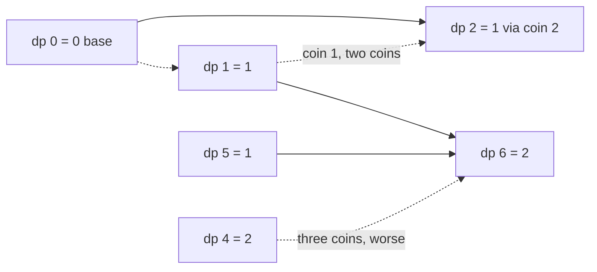

# 55. Coin Change

https://leetcode.com/problems/coin-change/

## Problem in your own words

You have coin denominations and a target amount. You may use as many copies of each denomination as you want, including zero. The order of coins does not matter; `1+2` and `2+1` are the same combination for this problem because you are counting coins, not listings. Return the fewest coins that sum to the amount. If no combination sums to the amount, return `-1`. Making amount 0 takes 0 coins.

## Easy analogy

The amount is a jar you fill with scoops. Each scoop size is a denomination, and you may scoop the same size again. On the side of the jar you write, for every fill line from 0 up to the target, the fewest scoops that hit that line. To label line `a`, you look at each scoop `c` and read the label already written on line `a - c`, then add one scoop. If a line can never be hit, you leave it marked impossible and, at the target, you report that as `-1`.

## DP diagram

Coins `[1, 2, 5]`, amount `6`. Solid edges are the min that wins. Dotted edges are legal but worse, or the base fill of 0.



## Intuition

### Brute force

Try every coin as the next scoop and recurse on the remaining amount, with a depth limit so you do not loop forever. The same remaining amount is reached by many orders. That tree is exponential in the amount.

### Overlapping subproblems

“Fewest extra coins to make the remaining amount `a`” depends only on `a`, because every denomination is still available (unbounded). Memoize on `a`. Order of coins is irrelevant to the min count, so you must not add an extra “last coin index” unless you are counting combinations and need to avoid permutations.

### State

`dp[a]` = fewest coins that sum to exactly `a`, or a sentinel if impossible. This is unbounded knapsack where the weight and the value are the coin, and you minimize the number of items. `dp[0] = 0`.

## Recurrence

\[
dp[0] = 0
\]

\[
dp[a] = \min_{\substack{c \in coins \\ c \le a \\ dp[a-c]\ \mathrm{known}}} \big(dp[a-c] + 1\big)
\]

If the min is over an empty set, `dp[a]` stays at the sentinel. Use sentinel `amount + 1`, which is strictly worse than any real combination (even all 1s would take `amount` coins). The answer is `dp[amount]` when that value is `≤ amount`, and `-1` otherwise.

Loop `a` from 1 upward so `dp[a - c]` is already the best way to make the smaller amount, including with the same coin `c`. That upward scan is what makes the knapsack unbounded. A downward scan would allow each coin at most once.

## Tiny walkthrough

Coins `[1, 2, 5]`, amount `6`. Sentinel starts at 7 and is omitted once a real value exists.

| a | via 1 | via 2 | via 5 | dp[a] |
| --- | --- | --- | --- | --- |
| 0 | — | — | — | 0 |
| 1 | 0+1 | — | — | 1 |
| 2 | 1+1 = 2 | 0+1 = 1 | — | 1 |
| 3 | 1+1 = 2 | 1+1 = 2 | — | 2 |
| 4 | 2+1 = 3 | 1+1 = 2 | — | 2 |
| 5 | 2+1 = 3 | 2+1 = 3 | 0+1 = 1 | 1 |
| 6 | 1+1 = 2 | 2+1 = 3 | 1+1 = 2 | 2 |

Answer 2, for example `1+5` or `1+1+...` no, two coins: `1+5`. `5+1` is the same combination. Three `2`s also make 6 but cost 3, which is the dotted loss at the coin-2 edge.

Coins `[2]`, amount `3`:

| a | via 2 | dp[a] |
| --- | --- | --- |
| 0 | — | 0 |
| 1 | — | impossible |
| 2 | 0+1 | 1 |
| 3 | needs dp[1], not taken | impossible |

Return `-1`.

## Java solution (complete, correct, commented)

```java
import java.util.Arrays;

class Solution {
    public int coinChange(int[] coins, int amount) {
        // amount + 1 is impossible and does not overflow when we add 1
        int impossible = amount + 1;
        int[] dp = new int[amount + 1];
        Arrays.fill(dp, impossible);
        dp[0] = 0;
        for (int a = 1; a <= amount; a++) {
            for (int coin : coins) {
                if (coin <= a && dp[a - coin] != impossible) {
                    dp[a] = Math.min(dp[a], dp[a - coin] + 1);
                }
            }
        }
        return dp[amount] > amount ? -1 : dp[amount];
    }
}
```

## Python solution (complete, correct, commented)

```python
class Solution:
    def coinChange(self, coins: list[int], amount: int) -> int:
        impossible = amount + 1
        dp = [impossible] * (amount + 1)
        dp[0] = 0
        for a in range(1, amount + 1):
            for coin in coins:
                if coin <= a:
                    dp[a] = min(dp[a], dp[a - coin] + 1)
        return dp[amount] if dp[amount] <= amount else -1
```

The inner `!= impossible` guard is optional in Python because `impossible + 1` is still worse than any real answer and the final comparison rejects it. In Java, prefer the guard or the `amount + 1` sentinel so you never compute `Integer.MAX_VALUE + 1`.

## Complexity

Time is `O(amount · |coins|)`: each amount tries each coin once. Space is `O(amount)` for the row. You cannot compress below that row if arbitrary smaller amounts are inputs to the min. The 2D table “first `i` denominations by amount” is `O(|coins| · amount)` memory before this classic compression to one array. Greedy “always take the largest coin” is not correct for arbitrary denominations (`[1, 3, 4]` amount `6` is two `3`s, not `4+1+1`).

## Pitfalls

- Returning 0 when the amount is impossible. The impossible answer is `-1`. Amount 0 is the only case that returns 0.
- Sentinel `Integer.MAX_VALUE`. Then `dp[a - coin] + 1` overflows to a negative number and the min becomes nonsense. `amount + 1` is a safe impossible count.
- Looping the amount downward. That is 0/1 knapsack: each denomination would be used at most once, so `[1, 2, 5]` might fail to make `6` with two `1`s from the same denomination if `1` appears only once in the array. The problem allows unlimited copies.
- Treating this as the combination-count problem. That one adds ways (`dp[a] += dp[a - coin]`) and cares about loop order so permutations are not counted twice. Here you minimize a count.
- Forgetting `dp[0] = 0` before the loops, so every later cell stays impossible.

## How to derive the state in an interview

“I want the fewest coins for each amount from 0 to the target. Amount 0 costs 0. For amount `a`, I try each coin `c ≤ a` and take one plus the answer for `a - c`. Fill increasing `a` so the same coin can be used again. If the target cell never improved on `amount + 1`, return `-1`.” Mention greedy’s failure on `[1, 3, 4]` and amount `6` if they suggest it.
