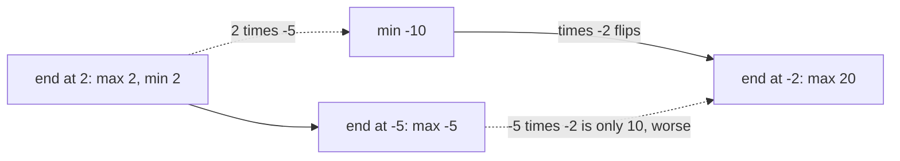

# 56. Maximum Product Subarray

https://leetcode.com/problems/maximum-product-subarray/

## Problem in your own words

You are given an array of integers. A subarray is a contiguous block, and its score is the product of its values. Return the largest score. The block may be a single element. Values may be negative or zero, so the largest product is not the product of the largest numbers, and it is not always the product of the whole array. Two negatives multiply to a positive, which means a very small (very negative) product can become the best product as soon as one more negative appears.

## Easy analogy

You are walking a row of dials, and each dial multiplies the running total. A negative dial flips the sign. The worst total you are carrying might become the best total after that flip, so you carry both the best and the worst product that end at the previous dial. A zero snaps both of them: the next dial starts a fresh product equal to itself.

## DP diagram

`[2, -5, -2]`. Solid edges build the best product. The dotted edge is the minimum product, which is not the answer at that index but is the value that later flips into 20.



## Intuition

### Brute force

Compute the product of every pair `(i, j)`. That is `O(n^2)` windows and `O(n)` work each if you multiply naively, or `O(n^2)` if you extend a running product. It is correct and it hides the sign flip until you have finished the window.

### Overlapping subproblems

The best product of a window that ends at `i` is either `nums[i]` itself (start over) or `nums[i]` times a product that ended at `i - 1`. Because of the sign, “a product that ended at `i - 1`” must include both the maximum and the minimum such product. Every longer window reuses those two numbers.

### State

`maxEnd[i]` = largest product of a subarray that ends at `i`. `minEnd[i]` = smallest product of a subarray that ends at `i`. The answer is the maximum of `maxEnd[i]` over all `i`, not `maxEnd[n - 1]` alone. A subarray may end earlier, before a later zero or a damaging factor.

## Recurrence

\[
maxEnd[i] = \max\big(nums[i],\; maxEnd[i-1]\cdot nums[i],\; minEnd[i-1]\cdot nums[i]\big)
\]

\[
minEnd[i] = \min\big(nums[i],\; maxEnd[i-1]\cdot nums[i],\; minEnd[i-1]\cdot nums[i]\big)
\]

\[
\mathrm{answer} = \max_i maxEnd[i]
\]

with `maxEnd[0] = minEnd[0] = nums[0]`. Including `nums[i]` in the max and the min is the restart: it covers a negative current value, a zero, and a previous product whose sign makes the extension worse.

Kadane’s algorithm for a maximum sum is the same shape with `+` and without a `min` companion, because adding a negative never turns a small sum into a large one. Multiplication does.

## Tiny walkthrough

`nums = [2, -5, -2]`.

| i | value | candidates for max and min | maxEnd | minEnd | best |
| --- | --- | --- | --- | --- | --- |
| 0 | 2 | — | 2 | 2 | 2 |
| 1 | -5 | value -5; 2·-5 = -10 | -5 | -10 | -5 |
| 2 | -2 | value -2; -5·-2 = 10; -10·-2 = 20 | 20 | -2 | 20 |

The winning subarray is the whole array, `2 · -5 · -2 = 20`. At index 1 the answer is still -5, which is `nums[1]` alone; the running min -10 is kept only so index 2 can flip it. If you had tracked only the max, index 2 would compute `max(-2, -5 · -2) = 10` and miss 20.

Check `[2, 3, -2, 4]`: the best is `2 · 3 = 6`. The later `4` restarts. `maxEnd` values are `2, 6, -2, 4`, and the answer is 6, not 4. Check `[-2, 0, -1]`: the zero resets both ends to 0, the answer is 0, and the final `-1` does not beat it.

## Java solution (complete, correct, commented)

```java
class Solution {
    public int maxProduct(int[] nums) {
        int best = nums[0];
        int curMax = nums[0];
        int curMin = nums[0];
        for (int i = 1; i < nums.length; i++) {
            int x = nums[i];
            // Both products must use the old curMax and curMin.
            int nextMax = Math.max(x, Math.max(curMax * x, curMin * x));
            int nextMin = Math.min(x, Math.min(curMax * x, curMin * x));
            curMax = nextMax;
            curMin = nextMin;
            best = Math.max(best, curMax);
        }
        return best;
    }
}
```

## Python solution (complete, correct, commented)

```python
class Solution:
    def maxProduct(self, nums: list[int]) -> int:
        best = cur_max = cur_min = nums[0]
        for x in nums[1:]:
            # Restart at x, or extend the previous max, or extend the previous min.
            nxt_max = max(x, cur_max * x, cur_min * x)
            nxt_min = min(x, cur_max * x, cur_min * x)
            cur_max, cur_min = nxt_max, nxt_min
            best = max(best, cur_max)
        return best
```

## Complexity

One pass, `O(n)` time, `O(1)` extra memory. The two arrays `maxEnd` and `minEnd` would be `O(n)` memory and the same arithmetic. Brute force over all windows is `O(n^2)`. The prefix-product trick (product from the left, product from the right, reset at zeros) is also `O(n)` time and is a different way to see the same sign flips; the min/max recurrence is the one that matches the state above.

## Pitfalls

- Keeping only a running maximum. On `[-2, 3, -4]` the min ending after `[-2, 3]` is `-6`. Multiplying that min by the final `-4` yields 24. A max-only scan sees `max(-4, 3 · -4) = -4` and returns 3.
- Overwriting `curMax` before `curMin` is computed. Both formulas need the previous pair. Use two temporaries, or a simultaneous assignment.
- Returning `curMax` at the end instead of the best value seen. After a trailing negative or a zero, `curMax` can be smaller than an earlier window.
- Assuming the answer is at least 0. If every value is negative, the answer is the largest negative number, which is the max single element. Seeding `best` at 0 would be wrong on `[-2]`.
- Integer overflow in languages with fixed-width ints. The usual constraint keeps intermediate products inside 32-bit range. If it does not, use a wider type for the running min and max.

## How to derive the state in an interview

“The subarray ends at some index. Ending here, I either start at this value or multiply it onto a product that ended one step earlier. Multiplication by a negative swaps order, so I need the min and the max ending at the previous index. The answer is the best max I ever saw, because the global best might end before the last index.” Walk `[2, -5, -2]` to 20 before you write the loop.
