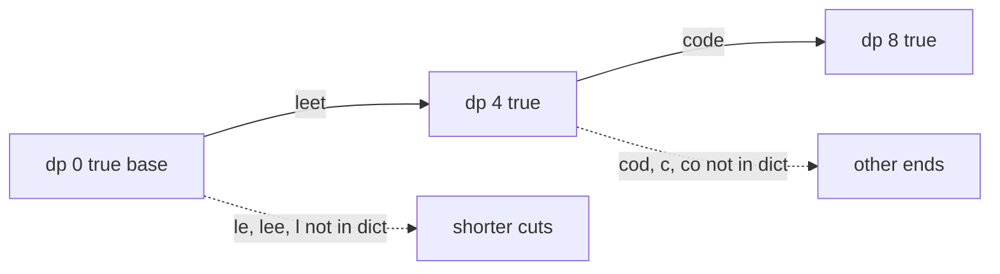

# 57. Word Break

https://leetcode.com/problems/word-break/

## Problem in your own words

You are given a string and a dictionary of words. Decide whether the string can be cut into a sequence of dictionary words, placed end to end, with no characters left over and no overlaps. Words may be reused. You return true or false, not the list of sentences. `"leetcode"` with `{"leet", "code"}` is true. `"catsandog"` with `{"cats", "dog", "sand", "and", "cat"}` is false, even though several dictionary words are prefixes of it.

## Easy analogy

The string is a road of stones, one stone per character. A dictionary word is a plank that covers a fixed run of stones. You may lay a plank only if its letters match the stones and the stone where the plank starts is already reachable. `dp[i]` means “I can cover the road up through stone `i`.” The end of the road is reachable or it is not.

## DP diagram

`"leetcode"` with words `leet` and `code`. Solid edges are planks that land on a reachable start. Dotted edges are cuts whose start is unreachable or whose text is not a word.



## Intuition

### Brute force

At the start of the remaining suffix, try every dictionary word that matches there, and recurse on the rest. A failing suffix is retried once per way to reach it. With a small alphabet and many matching prefixes, that tree is exponential.

### Overlapping subproblems

“Can the suffix starting at `i` be segmented?” depends only on `i`. Alternatively, “can the prefix of length `i` be segmented?” depends only on `i`. Both are the same boolean subproblem. Memoize one of them.

### State

`dp[i]` is true when `s[0:i]` is a concatenation of dictionary words. `dp[0]` is true: the empty prefix is a concatenation of zero words, which is what lets the first word have somewhere to start. A later index `i` is true when some earlier true index `j` exists and `s[j:i]` is in the dictionary.

## Recurrence

\[
dp[0] = \mathrm{true}
\]

\[
dp[i] = \bigvee_{0 \le j < i} \Big(dp[j] \land s[j:i] \in dict\Big)
\]

The answer is \(dp[n]\). In code, bound the distance `i - j` by the longest word so you do not slice the whole prefix when every word is short.

## Tiny walkthrough

`s = "leetcode"`, dict `{"leet", "code"}`. Longest word has length 4.

| i | prefix | cut that works | other cuts | dp[i] |
| --- | --- | --- | --- | --- |
| 0 | empty | base | — | true |
| 1 | `l` | none | length 1 not a word | false |
| 2 | `le` | none | — | false |
| 3 | `lee` | none | — | false |
| 4 | `leet` | j = 0, `"leet"` | shorter words miss | true |
| 5 | `leetc` | starts at 0 or 4, neither slice is a word | dotted | false |
| 6 | `leetco` | — | dotted | false |
| 7 | `leetcod` | — | dotted | false |
| 8 | `leetcode` | j = 4, `"code"` | j = 0 is the whole string, not a word | true |

`"catsandog"` reaches true prefixes for `"cat"` and `"cats"`, and `"sand"` can extend `"cat"`, but the final `"og"` never matches a word that starts at a true index. `dp[n]` stays false. `"applepenapple"` is true, and the second `"apple"` reuses the word; the set, not a multiset, is the right dictionary.

## Java solution (complete, correct, commented)

```java
import java.util.HashSet;
import java.util.List;
import java.util.Set;

class Solution {
    public boolean wordBreak(String s, List<String> wordDict) {
        Set<String> words = new HashSet<>(wordDict);
        int n = s.length();
        int maxLen = 0;
        for (String word : wordDict) {
            maxLen = Math.max(maxLen, word.length());
        }
        boolean[] dp = new boolean[n + 1];
        dp[0] = true;
        for (int i = 1; i <= n; i++) {
            int shortest = Math.max(0, i - maxLen);
            for (int j = i - 1; j >= shortest; j--) {
                if (dp[j] && words.contains(s.substring(j, i))) {
                    dp[i] = true;
                    break;
                }
            }
        }
        return dp[n];
    }
}
```

## Python solution (complete, correct, commented)

```python
class Solution:
    def wordBreak(self, s: str, wordDict: list[str]) -> bool:
        words = set(wordDict)
        n = len(s)
        max_len = max((len(w) for w in words), default=0)
        dp = [False] * (n + 1)
        dp[0] = True
        for i in range(1, n + 1):
            # Only cuts short enough to be some dictionary word.
            start = max(0, i - max_len)
            for j in range(i - 1, start - 1, -1):
                if dp[j] and s[j:i] in words:
                    dp[i] = True
                    break
        return dp[n]
```

## Complexity

Let `n` be the string length and `M` the longest word. There are `O(n)` ends and `O(M)` candidate starts, and hashing a slice of length up to `M` costs `O(M)` character work. Time is `O(n · M^2)`. Space is `O(n)` for `dp` plus the dictionary. Without the `M` cap, `M` becomes `n` and the same algorithm is `O(n^3)` character work, which is the right bound to quote if you do not mention the cap. Building the set is linear in the total number of dictionary characters.

## Pitfalls

- `dp[0] = false`. Then the first word has no legal start, and a string that is itself one dictionary word returns false.
- Checking the word before checking `dp[j]`. It is still correct, but it slices and hashes on unreachable starts. The bug to avoid is the opposite shortcut: skipping the hash and setting `dp[i] = dp[j]` for every `j`, which ignores the letters.
- Forgetting reuse. The dictionary is a set of types, not a set of tokens you consume. `"applepenapple"` must be true with a single `"apple"` entry.
- Using a list scan for every slice instead of a set. That adds a factor of dictionary size and is the usual source of a time limit failure when both `n` and the dictionary are large.
- Word Break II, which asks for every sentence. The boolean row still tells you which prefixes work, but the output can be exponential. Do not build all sentences inside this decision problem.

## How to derive the state in an interview

“`dp[i]` means the first `i` characters can be segmented. Empty string, true. For each end `i`, I look at a start `j` that is at most the longest word away. If `dp[j]` is true and the slice is in a hash set, then `dp[i]` is true. The answer is the last cell.” Mention the false example `"catsandog"` so they hear that a reachable middle is not a reachable end.
