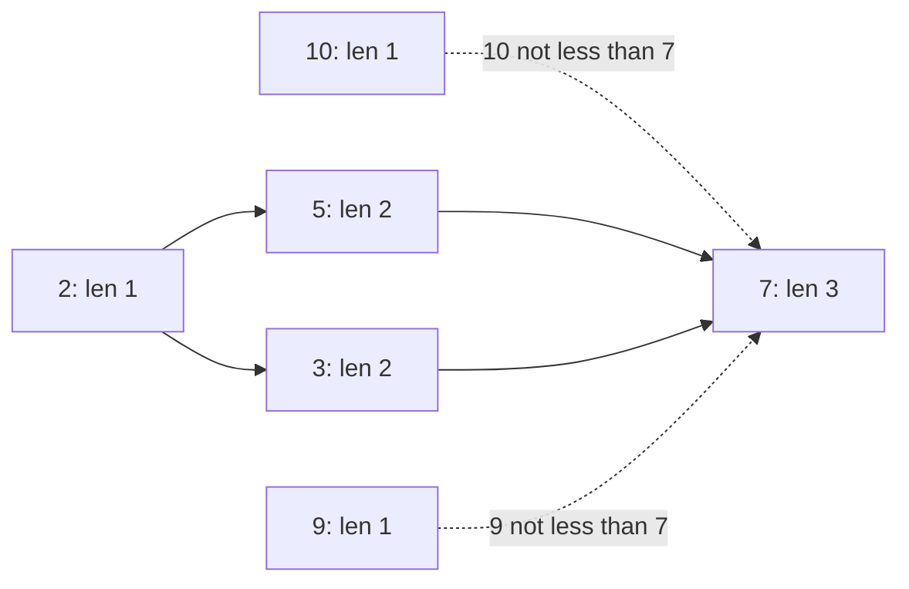

# 58. Longest Increasing Subsequence

https://leetcode.com/problems/longest-increasing-subsequence/

## Problem in your own words

You are given an array of integers. A subsequence keeps relative order but may skip elements. It is strictly increasing when each chosen value is greater than the one before it. Return the length of the longest such subsequence, not the subsequence itself. Equal values do not count as increasing. The array is not sorted, and the best subsequence need not be contiguous.

## Easy analogy

Each number is a person in a line who can only stand behind someone shorter. `dp[i]` is the longest chain of shorter people that can end with person `i`. Person `i` looks back at everyone shorter who stands earlier, takes that person’s chain length, and adds one. The longest chain in the whole line might end at any person, so you keep a global max.

## DP diagram

`nums = [10, 9, 2, 5, 3, 7]`. Solid edges are links that extend a chain. Dotted edges are earlier values that are not strictly smaller, so they are not taken.



## Intuition

### Brute force

Try to include or skip each index, and keep a last-taken value. The search is exponential. Many partial chains end at the same index with the same length.

### Overlapping subproblems

The longest increasing subsequence that ends at index `i` depends on the answers that end at earlier indices, not on which chain produced those answers. Once `dp[j]` is known for all `j < i`, index `i` is done forever.

### State

`dp[i]` = length of the longest strictly increasing subsequence that ends at `i` and includes `nums[i]`. The “includes `nums[i]`” part matters. Because every non-empty subsequence has an end index, the answer is the max of `dp[i]`, not `dp[n - 1]`.

This is the required solution: `O(n^2)` time. Patience sorting, below, is the follow-up when someone asks for `O(n log n)`. It computes the same length and does not replace this DP in the code you should be ready to write first.

## Recurrence

\[
dp[i] = 1 + \max\{ dp[j] : j < i \land nums[j] < nums[i] \}
\]

If no such `j` exists, the max over the empty set is 0, so `dp[i] = 1`. Then

\[
\mathrm{answer} = \max_i dp[i]
\]

## Tiny walkthrough

`nums = [10, 9, 2, 5, 3, 7]`.

| i | nums[i] | earlier j with nums[j] < nums[i] | dp[i] |
| --- | --- | --- | --- |
| 0 | 10 | none | 1 |
| 1 | 9 | none (10 is not smaller) | 1 |
| 2 | 2 | none | 1 |
| 3 | 5 | j = 2 (2) | 2 |
| 4 | 3 | j = 2 (2); 10 and 9 are not smaller; 5 is later | 2 |
| 5 | 7 | j = 2, 3, 4 → lengths 1, 2, 2 | 3 |

Answer 3. One subsequence is `2, 5, 7`. Another is `2, 3, 7`. The dotted non-links are `10` and `9` into `7`: they are larger, so they cannot precede `7`.

The classic check `[10, 9, 2, 5, 3, 7, 101, 18]` continues the same way: `101` and `18` both extend a length-2 chain, and `101` extends `2, 5, 7` to length 4. Answer 4. All equal values `[7, 7, 7, 7]` stay at 1 because the comparison is strict.

## Java solution (complete, correct, commented)

```java
class Solution {
    public int lengthOfLIS(int[] nums) {
        int n = nums.length;
        int[] dp = new int[n];
        int best = 0;
        for (int i = 0; i < n; i++) {
            dp[i] = 1; // a subsequence of just nums[i]
            for (int j = 0; j < i; j++) {
                if (nums[j] < nums[i]) {
                    dp[i] = Math.max(dp[i], dp[j] + 1);
                }
            }
            best = Math.max(best, dp[i]);
        }
        return best;
    }
}
```

## Python solution (complete, correct, commented)

```python
class Solution:
    def lengthOfLIS(self, nums: list[int]) -> int:
        n = len(nums)
        dp = [1] * n
        best = 0
        for i in range(n):
            for j in range(i):
                if nums[j] < nums[i]:
                    dp[i] = max(dp[i], dp[j] + 1)
            best = max(best, dp[i])
        return best
```

### Follow-up: patience sorting, `O(n log n)` length only

This does not replace the DP above. It is the version to mention after the quadratic solution is correct.

Keep `tails`, where `tails[k]` is the smallest tail value of any increasing subsequence of length `k + 1` seen so far. `tails` stays sorted. For each new value, binary-search the first tail that is greater than or equal to it (lower bound, because the sequence is strict: an equal value must not extend). Replace that tail, or append if the value is larger than every tail. The length of `tails` is the answer. The array is not the subsequence itself; replacements throw away elements that a real subsequence would still need. Reconstructing one subsequence from patience sorting needs extra predecessor bookkeeping. The `O(n^2)` DP reconstructs with an explicit `prev[i]` in a few extra lines.

```java
// Follow-up only. The class Solution above is the O(n^2) DP you should write first.
class LisNLogN {
    public int lengthOfLIS(int[] nums) {
        int[] tails = new int[nums.length];
        int len = 0;
        for (int x : nums) {
            int lo = 0;
            int hi = len;
            while (lo < hi) {
                int mid = (lo + hi) >>> 1;
                if (tails[mid] < x) {
                    lo = mid + 1;
                } else {
                    hi = mid;
                }
            }
            tails[lo] = x;
            if (lo == len) {
                len++;
            }
        }
        return len;
    }
}
```

```python
# Follow-up only. lengthOfLIS above is the DP solution.
import bisect

def length_of_lis_nlogn(nums: list[int]) -> int:
    tails: list[int] = []
    for x in nums:
        i = bisect.bisect_left(tails, x)  # strict LIS: replace the first tail >= x
        if i == len(tails):
            tails.append(x)
        else:
            tails[i] = x
    return len(tails)
```

## Complexity

The required DP is `O(n^2)` time and `O(n)` memory. The inner loop really does look at every earlier index; you cannot charge it as `O(n)` in the worst case (`[1, 2, 3, ...]` still updates, and a decreasing array still scans). Patience sorting is `O(n log n)` time and `O(n)` memory for the tails. Outputting one subsequence is still linear extra work after either algorithm has parent pointers.

## Pitfalls

- Using `≤` instead of `<`. Equals would allow a non-decreasing subsequence. `[7, 7, 7]` must return 1.
- Returning `dp[n - 1]`. The longest chain may end in the middle. `[1, 3, 2]` has `dp = [1, 2, 2]`, which happens to match, but `[3, 1, 2]` is fine too; `[1, 0, 2, -1]` has the best chain `1, 2` ending before the last index if you consider `dp` values `[1, 1, 2, 1]`, and the last cell is 1.
- Confusing subsequence with subarray. A subarray cannot skip. The DP for a contiguous increasing run is a different, simpler scan.
- Thinking `tails` in the follow-up is the subsequence. After processing `[10, 9, 2, 5, 3, 7]`, tails look like `[2, 3, 7]`, which is one valid subsequence here, but on other inputs a replaced tail is not the element you would actually chain. Report the length, or keep predecessors.
- Binary search direction. For a strict increase, the search is lower bound (`first >= x`). Upper bound (`first > x`) solves the non-decreasing variant.

## How to derive the state in an interview

“Every subsequence ends somewhere. Let `dp[i]` be the best length of an increasing subsequence that ends by taking `nums[i]`. It is one plus the best `dp[j]` among earlier smaller values, or 1 if none. The answer is the max over `i`, because I do not know the end. That is `O(n^2)`. If you want `O(n log n)`, I can switch to tails plus binary search, and I will not pretend tails is the subsequence.”
