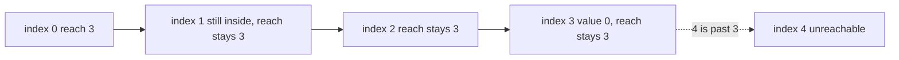

# 59. Jump Game

https://leetcode.com/problems/jump-game/

## Problem in your own words

You stand on index 0 of an array of non-negative integers. The value at your index is the farthest forward jump you are allowed to take from there: from `i` you may land on any index `i + 1`, `i + 2`, …, up through `i + nums[i]`, as long as it stays inside the array. You may also think of a 0 as a dead end if you land on it with nothing beyond already reached. Return true when some sequence of jumps lands on the last index. You do not need the sequence, and you do not need the minimum number of jumps.

## Easy analogy

Each index is a lantern that lights a stretch of path in front of it, ending at `i + nums[i]`. You can only light a lantern if you can already walk to it. Because a lantern lights every stone up to its end, not just the last stone, the set of stones you can walk to is always a prefix of the path: `0, 1, 2, …, farthest`. One integer, the end of that prefix, is the whole reachable set.

## DP diagram

`[3, 2, 1, 0, 4]`. Solid edges extend the farthest reach. The dotted edge is index 4, which is never inside the prefix, so it is not taken.



```text
index:     0   1   2   3   4
value:     3   2   1   0   4
farthest:  3   3   3   3   (stop: 4 > 3)
```

## Intuition

### Brute force

From the current index, try every legal landing spot and recurse. Many paths revisit the same index. A boolean memo “can I reach the end from `i`?” fixes the exponential blow-up and is a correct DP.

### Overlapping subproblems

`reach[i]`, meaning “can any jump land on `i`?”, depends on earlier indices only. Once an index is reachable, every later attempt to reach it is the same subproblem. The boolean row is:

\[
reach[0] = \mathrm{true}
\]

\[
reach[i] = \bigvee_{j < i} \big(reach[j] \land j + nums[j] \ge i\big)
\]

That row is `O(n^2)` if you scan all `j` for each `i`. It is correct. It also has more structure than a general boolean DP row.

### State

The greedy state is a single integer `farthest`: the largest index you can land on using any jump that starts inside `0..i`, while `i` itself is still `≤ farthest`. You walk `i` from left to right. If `i` ever exceeds `farthest`, you have stepped off the reachable prefix and the last index is impossible. If `farthest` ever reaches `n - 1`, you are done.

## Recurrence

Greedy update, which is what the code runs:

\[
\mathrm{farthest}_i = \max(\mathrm{farthest}_{i-1},\; i + nums[i]) \quad \text{provided } i \le \mathrm{farthest}_{i-1}
\]

If the provided-clause fails, stop and return false. If `farthest` becomes at least `n - 1`, return true.

Why the reachable set is always a prefix: suppose the farthest index you can reach is `F`, and some index `k` with `0 < k < F` were unreachable. Let `j` be a reachable index with `j + nums[j] ≥ F` and `j` as small as you like among indices that reach past `k`. From `j` the problem allows every landing in `j, j+1, …, j+nums[j]`, not only the far end. So `k` is a legal landing whenever `F` is. That contradiction means there is no hole. Therefore “max end of a jump that starts at a reachable index” describes the entire set, and the left-to-right scan maintains it: when you stand at `i ≤ farthest`, `i` is reachable, so `i + nums[i]` is a legal extension.

The boolean recurrence above is the same fact expanded. The greedy algorithm evaluates it in one pass because the or over `j` collapses to “is `i` inside the current max?”

## Tiny walkthrough

`nums = [2, 3, 1, 1, 4]`.

| i | nums[i] | i ≤ farthest before update? | new farthest | note |
| --- | --- | --- | --- | --- |
| 0 | 2 | yes, farthest starts 0 | max(0, 2) = 2 | — |
| 1 | 3 | 1 ≤ 2 | max(2, 4) = 4 | 4 is the last index, true |

`nums = [3, 2, 1, 0, 4]`.

| i | nums[i] | i ≤ farthest? | new farthest | note |
| --- | --- | --- | --- | --- |
| 0 | 3 | yes | 3 | — |
| 1 | 2 | 1 ≤ 3 | max(3, 3) = 3 | extension `1+2` does not pass 3 |
| 2 | 1 | 2 ≤ 3 | max(3, 3) = 3 | — |
| 3 | 0 | 3 ≤ 3 | max(3, 3) = 3 | zero adds nothing |
| 4 | 4 | 4 ≤ 3 fails | — | dotted, return false |

`[0]` is true: you are already on the last index, and the loop’s update sees `farthest >= 0`. `[0, 1]` is false: from 0 you cannot move, and index 1 is past `farthest`.

## Java solution (complete, correct, commented)

```java
class Solution {
    public boolean canJump(int[] nums) {
        int farthest = 0;
        int last = nums.length - 1;
        for (int i = 0; i <= last; i++) {
            if (i > farthest) {
                return false; // hole in the reachable prefix
            }
            farthest = Math.max(farthest, i + nums[i]);
            if (farthest >= last) {
                return true;
            }
        }
        return true;
    }
}
```

## Python solution (complete, correct, commented)

```python
class Solution:
    def canJump(self, nums: list[int]) -> bool:
        farthest = 0
        last = len(nums) - 1
        for i, jump in enumerate(nums):
            if i > farthest:
                return False
            farthest = max(farthest, i + jump)
            if farthest >= last:
                return True
        return True
```

### The DP row, if you are asked to show it

`reach[i]` as in the recurrence, filled left to right, is correct and slower. A linear DP that matches the greedy scan stores the farthest reach in `reach[i] = max(reach[i - 1], i + nums[i])` only while `i <= reach[i - 1]`. That array is just the history of the integer `farthest`. The greedy code keeps the current value only.

Another linear formulation walks from the right: `goal` starts at `n - 1`, and if `i + nums[i] >= goal` you move `goal` to `i`. At the end, `goal == 0`. Same answer, same reason: you only move the goal onto an index that can cover it, and the prefix argument says the leftmost goal is 0 exactly when the end is reachable.

## Complexity

Time is `O(n)`, one visit per index. Extra memory is `O(1)`. The boolean DP that scans every earlier `j` is `O(n^2)` time and `O(n)` memory. BFS over the jump graph is `O(n)` as well if each index is enqueued once, with more bookkeeping than the farthest integer. Minimum jumps (Jump Game II) is a different greedy, on layers of the BFS, and is not required to decide reachability.

## Pitfalls

- Treating `nums[i]` as the only landing spot, `i + nums[i]`, instead of every index up to that spot. If only the far spot were allowed, the reachable set could have holes and the single farthest integer would be wrong.
- Jumping backward. The problem moves forward only. You do not need a visited set to avoid cycles.
- Off-by-one on the last index. Success is `farthest >= n - 1`, not `farthest >= n`. From a cell that can jump exactly onto the last index, you are done even if the jump length is larger than the remaining gap; extra length past the end still counts as reaching the end in the comparison above, and the loop returns as soon as `farthest` covers `last`.
- Returning false when `nums[0]` is 0 and `n` is 1. You begin on the last index. The check `i > farthest` is false at `i = 0`, and `farthest >= last` becomes true immediately.
- Writing a minimum-jump counter here. This question is boolean.

## How to derive the state in an interview

“From `i` I can reach every index up to `i + nums[i]`, so reachable indices never have a hole. I store the right end of that prefix. I walk left to right; if my cursor passes the right end, I fail; if the right end passes the last index, I succeed. The boolean DP is the same or-over-earlier-jumps, and this integer is that or, summarized.”
