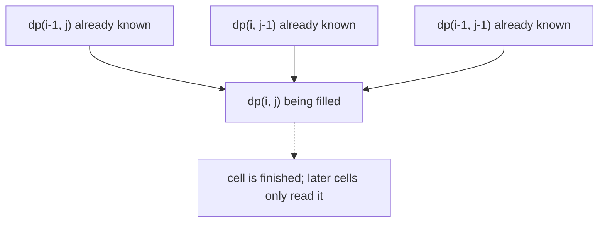

# Two-Dimensional Dynamic Programming

## Pattern in my own words

Two-dimensional DP answers a question about a grid or a pair of sequences by storing the answer for every smaller row/column or every shorter prefix pair. A cell (or table entry) is defined only from cells that are already finished: usually the cell above, the cell to the left, or the diagonal. You never search the whole grid again; you fill the table in an order that respects those dependencies, then read the corner that represents the full input.

## Easy analogy

Think of a spreadsheet where each cell’s formula only looks up and left. Once a cell is calculated you leave it alone. The bottom-right number is the report you actually wanted, and every other cell is a sub-report for a smaller rectangle or a shorter pair of prefixes.

## Diagram

Filled cells are dependencies. The dotted arrow marks a cell that is already solved, so the walk does not recompute it.



## Intuition

Use this pattern when the answer for a bigger instance is a small combination of answers for strictly smaller instances, and those instances share a lot of repeated work.

- Grid paths and grid min-costs: `dp[i][j]` depends on the cell above and/or the cell to the left.
- Two strings (LCS, edit distance, interleaving): `dp[i][j]` is the answer for the first `i` characters of one string and the first `j` of the other. Equal characters take the diagonal; otherwise you try dropping one side or the other.
- Fill order is part of the algorithm. For grids that only look up and left, row-major order is safe. For two strings, increasing `i` and `j` is safe because both recurrences look at smaller indexes.
- The first row and first column (or the zero row/column that means “empty prefix”) are base cases. Get those right before the loops, or the loops will read garbage.
- If a cell only needs the previous row, you can roll the table down to one array. Do that after the 2D version is correct. Update the rolling array from the side that does not overwrite a value you still need.

## Tiny walkthrough

Count paths on a 2×3 grid, right and down only. Let `dp[i][j]` be ways to reach that cell.

```
row 0:  1  1  1
row 1:  1  2  3
```

`dp[1][1] = 1 + 1 = 2`, then `dp[1][2] = 2 + 1 = 3`. The same table shape shows up in LCS: rows are prefixes of the first string, columns are prefixes of the second, and the bottom-right entry is the full answer.

## Java

```java
public final class TwoDPatterns {
    /** Right/down paths on an m x n grid. */
    public static int uniquePaths(int m, int n) {
        int[][] dp = new int[m][n];
        for (int i = 0; i < m; i++) {
            dp[i][0] = 1;
        }
        for (int j = 0; j < n; j++) {
            dp[0][j] = 1;
        }
        for (int i = 1; i < m; i++) {
            for (int j = 1; j < n; j++) {
                dp[i][j] = dp[i - 1][j] + dp[i][j - 1];
            }
        }
        return dp[m - 1][n - 1];
    }

    /** Length of the longest common subsequence. */
    public static int lcs(String a, String b) {
        int m = a.length();
        int n = b.length();
        int[][] dp = new int[m + 1][n + 1];
        for (int i = 1; i <= m; i++) {
            for (int j = 1; j <= n; j++) {
                if (a.charAt(i - 1) == b.charAt(j - 1)) {
                    dp[i][j] = dp[i - 1][j - 1] + 1;
                } else {
                    dp[i][j] = Math.max(dp[i - 1][j], dp[i][j - 1]);
                }
            }
        }
        return dp[m][n];
    }
}
```

## Python

```python
def unique_paths(m: int, n: int) -> int:
    dp = [[1] * n for _ in range(m)]
    for i in range(1, m):
        for j in range(1, n):
            dp[i][j] = dp[i - 1][j] + dp[i][j - 1]
    return dp[m - 1][n - 1]


def lcs(a: str, b: str) -> int:
    m, n = len(a), len(b)
    dp = [[0] * (n + 1) for _ in range(m + 1)]
    for i in range(1, m + 1):
        for j in range(1, n + 1):
            if a[i - 1] == b[j - 1]:
                dp[i][j] = dp[i - 1][j - 1] + 1
            else:
                dp[i][j] = max(dp[i - 1][j], dp[i][j - 1])
    return dp[m][n]
```

## Complexity

A table with `R` rows and `C` columns costs `O(R * C)` time and `O(R * C)` memory if you keep every cell. A rolling row drops memory to `O(min(R, C))` when the recurrence only needs the previous row (or previous column). The zero-filled border on string DP adds one extra row and column, which does not change the asymptotic cost.

## Pitfalls

- Filling a cell before its dependencies, or iterating a rolling array in the direction that destroys the previous value.
- Off-by-one on string indexes: `dp` is sized `len + 1`, but characters live at `i - 1`.
- Forgetting that a 1-row or 1-column grid is already finished by the base case.
- Treating LCS as a substring. A subsequence may skip characters, so the “no match” case must consider both `dp[i-1][j]` and `dp[i][j-1]`.
- Using a 32-bit `int` when the problem statement does not promise the answer fits. On these two Blind 75 problems the official signatures return `int` and the grids/strings stay inside that contract.

## Interview script

“This is a 2D DP. I’ll define the state as the answer on a smaller grid or on a pair of prefixes, write the recurrence from the cells above, left, and diagonal, and fill the base row and column first. The full answer sits in the last cell. If they push on memory, I’ll collapse to one row after the recurrence is correct.”
