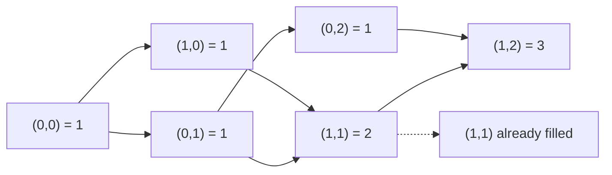

# 62. Unique Paths

## Problem in my own words

A robot sits on the top-left cell of a grid with `m` rows and `n` columns. Every move is one step right or one step down, and it wants the bottom-right cell. The task is to count how many different routes exist. Obstacles are not part of this problem; every cell is open, and two routes are different when their sequences of moves differ.

## Easy analogy

You are walking city blocks from the northwest corner of a neighborhood to the southeast corner, and you refuse to walk north or west. Every intersection remembers how many legal walks can arrive there: everyone who came from the north plus everyone who came from the west.

## Diagram

Arrows are the only legal moves into a cell. The dotted edge marks a cell whose value is already final, so it is only read, never recomputed.



## Intuition

Any route to `(i, j)` arrives from `(i-1, j)` by a down move or from `(i, j-1)` by a right move, and those two sets of routes are disjoint. So

`dp[i][j] = dp[i-1][j] + dp[i][j-1]`.

The top row can only be reached by moving right, so every cell there is 1. The left column can only be reached by moving down, so every cell there is 1. Fill the rest row by row. The answer is `dp[m-1][n-1]`.

There is a closed form, `C(m+n-2, m-1)`, because every route is a sequence of `m-1` downs and `n-1` rights. The DP is what you should code first; the binomial coefficient is a follow-up if you are careful about overflow.

## Tiny walkthrough

`m = 3`, `n = 2`.

```
1  1
1  2
1  3
```

Only three routes: down-down-right, down-right-down, right-down-down. The bottom-right cell sums the 2 above it and the 1 to its left.

## Java

```java
class Solution {
    public int uniquePaths(int m, int n) {
        int[][] dp = new int[m][n];
        for (int i = 0; i < m; i++) {
            dp[i][0] = 1;
        }
        for (int j = 0; j < n; j++) {
            dp[0][j] = 1;
        }
        for (int i = 1; i < m; i++) {
            for (int j = 1; j < n; j++) {
                dp[i][j] = dp[i - 1][j] + dp[i][j - 1];
            }
        }
        return dp[m - 1][n - 1];
    }
}
```

## Python

```python
def uniquePaths(m: int, n: int) -> int:
    dp = [[1] * n for _ in range(m)]
    for i in range(1, m):
        for j in range(1, n):
            dp[i][j] = dp[i - 1][j] + dp[i][j - 1]
    return dp[m - 1][n - 1]
```

## Complexity

Time is `O(m * n)` and extra memory is `O(m * n)`. A rolling array of length `n` keeps the same time and drops memory to `O(n)`: each new cell is `row[j] + row[j-1]` if you sweep left to right, because `row[j]` still holds the value from the previous row (above) and `row[j-1]` is already the new left neighbor.

## Pitfalls

- Initializing the whole table to 0 and then forgetting to set the first row and first column to 1. The loops that start at 1 never repair that.
- Writing `dp[i][j] = dp[i-1][j-1]` and counting only one diagonal route. Both neighbors are required.
- Off-by-one on a 1×n or m×1 board. The answer is 1, and the inner loops correctly do not run.
- In Java, quoting a huge binomial coefficient while still returning `int`. Stay with the DP and the problem’s 32-bit contract unless you move the return type to a wider integer.

## Interview script

“Every cell is the sum of the cell above and the cell to the left, because those are the only ways in. The first row and first column are all ones. I fill the rectangle and return the bottom-right value. That is `O(mn)` time. If we need less memory I keep a single row and overwrite it from left to right.”
