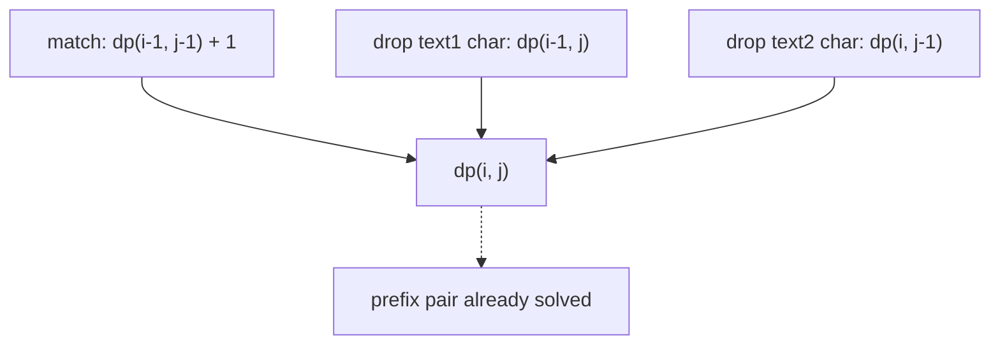

# 1143. Longest Common Subsequence

## Problem in my own words

You are given two strings. A subsequence is formed by deleting zero or more characters without reordering what remains. The goal is the length of the longest subsequence that can be formed from both strings. The characters do not have to sit next to each other in the original strings, and you do not need to return the subsequence itself, only how long the best one is.

## Easy analogy

Two people tell the same story with extra words mixed in. You highlight the longest sequence of words that appears in both tellings in the same order, skipping anything that does not help. The highlight on the left pointer and the highlight on the right pointer only move forward.

## Diagram

Rows are prefixes of `text1`, columns are prefixes of `text2`. A match steps diagonally. A mismatch takes the better of “drop from text1” and “drop from text2.” The dotted arrow marks a cell that is already finished.



## Intuition

Let `dp[i][j]` be the LCS length of `text1[0..i)` and `text2[0..j)`.

- If `text1[i-1] == text2[j-1]`, that character can end an LCS, so `dp[i][j] = dp[i-1][j-1] + 1`. Using this character in any other way cannot be longer.
- If they differ, the current characters cannot both be in the subsequence. Discard one of them: `dp[i][j] = max(dp[i-1][j], dp[i][j-1])`.

`dp[0][*]` and `dp[*][0]` stay 0 because an empty prefix has an empty LCS. Fill by increasing `i` and `j`. The answer is `dp[m][n]`.

## Tiny walkthrough

`text1 = "abcde"`, `text2 = "ace"`.

The matching characters are `a`, `c`, `e`. The table’s last row grows `1, 1, 2, 2, 3` across the columns for `a`, `c`, `e` as `abcde` is consumed. Bottom-right is 3, which is `"ace"`. `"ab"` against `"ac"` gives 1: after matching `a`, `b` vs `c` takes `max(1, 1) = 1` rather than a false second match.

## Java

```java
class Solution {
    public int longestCommonSubsequence(String text1, String text2) {
        int m = text1.length();
        int n = text2.length();
        int[][] dp = new int[m + 1][n + 1];
        for (int i = 1; i <= m; i++) {
            for (int j = 1; j <= n; j++) {
                if (text1.charAt(i - 1) == text2.charAt(j - 1)) {
                    dp[i][j] = dp[i - 1][j - 1] + 1;
                } else {
                    dp[i][j] = Math.max(dp[i - 1][j], dp[i][j - 1]);
                }
            }
        }
        return dp[m][n];
    }
}
```

## Python

```python
def longestCommonSubsequence(text1: str, text2: str) -> int:
    m, n = len(text1), len(text2)
    dp = [[0] * (n + 1) for _ in range(m + 1)]
    for i in range(1, m + 1):
        for j in range(1, n + 1):
            if text1[i - 1] == text2[j - 1]:
                dp[i][j] = dp[i - 1][j - 1] + 1
            else:
                dp[i][j] = max(dp[i - 1][j], dp[i][j - 1])
    return dp[m][n]
```

## Complexity

Time is `O(m * n)` and the table is `O(m * n)` extra memory. Each cell does a constant amount of work. If you only need the length, two rows (or one row plus a saved diagonal) reduce memory to `O(min(m, n))` after you orient the shorter string along the row.

## Pitfalls

- Indexing characters at `i` inside a table whose row `i` means “prefix length i.” The character is at `i - 1`.
- On a mismatch, assigning only one neighbor. Both discards are legal, so you need the max.
- On a match, also taking a max with the neighbors. The diagonal-plus-one is always at least as good, and mixing in the neighbors makes the recurrence harder to justify. The standard match branch is just the diagonal.
- Confusing subsequence with substring. A substring DP would reset to 0 when characters stop being contiguous. LCS does not reset.
- Building the string with string concatenation inside the inner loop if the interviewer only asked for the length. That turns an `O(mn)` solution into something slower and allocates a lot of garbage.

## Interview script

“`dp[i][j]` is the LCS of the first i characters of the first string and the first j of the second. Matching characters extend the diagonal by one. Different characters take the better of skipping one side or the other. Empty prefixes are zero. I fill the table in order and return the corner. Time and space are both `O(mn)`.”
