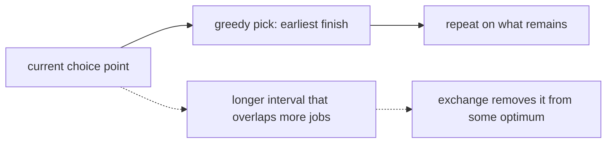

# Greedy Algorithms

## Pattern in my own words

A greedy algorithm commits to a locally best choice and never takes it back. That is safe only when you can argue that some optimal solution makes the same choice, or that swapping in the greedy choice never makes an optimal solution worse. The argument is usually an exchange: take any optimal answer that disagrees with you, rewrite it to agree, and show the score does not drop. If you cannot tell that story, the local choice can trap you and you want DP or search instead.

## Easy analogy

You are packing a suitcase and you always grab the next item with the best value per pound. That works for some price lists and fails for others. The algorithm is the grabbing rule. The proof is showing that leaving that item on the table cannot help the final packing.

## Diagram

The solid path is the choice we keep. The dotted edge is a candidate we discard because an exchange shows it cannot improve the best answer.



## Intuition

Reach for greedy when the problem has one of these shapes:

- Interval scheduling: among meetings that are still legal, take the one that ends first. Sorting by finish time is the key. Sorting by start time is not the same rule and is not safe.
- A scan that decides whether to extend a running total or restart, when a negative prefix can never help a later sum (Kadane). That one is DP written as a one-pass choice.
- A resource you assign in sorted order of a deadline, a ratio, or an endpoint, and you can swap two adjacent decisions that violate the order without hurting the objective.

Greedy is not safe just because the input is sorted. Canonical coin systems (US coins) let you take the largest coin; arbitrary coin denominations do not, and that problem is DP. A “pick the locally longest activity” rule leaves gaps that a few short activities would have filled.

Before you code, say the choice out loud and the exchange in one sentence. If you cannot, label the solution DP.

## Tiny walkthrough

Meetings `[1, 10]`, `[2, 3]`, `[4, 5]`. Sorting by end puts `[2, 3]` first, then `[4, 5]`, then `[1, 10]`. Keep `[2, 3]`, keep `[4, 5]` because it starts when the previous one has finished, and drop `[1, 10]` because it overlaps. Two meetings, which is optimal. The locally “longest” first pick would have kept only `[1, 10]`.

Kadane on `[-2, 1, -3, 4, -1, 2, 1, -5, 4]` resets when the running sum becomes a burden. The kept window is `[4, -1, 2, 1]` with sum 6. The dotted choice is the negative prefix `[-2, 1, -3]`, which cannot sit in front of 4 inside an optimal window.

## Java

```java
import java.util.Arrays;

public final class GreedyPatterns {
    /** Maximum sum of a contiguous subarray (Kadane). */
    public static int maxSubArray(int[] nums) {
        int best = nums[0];
        int cur = nums[0];
        for (int i = 1; i < nums.length; i++) {
            cur = Math.max(nums[i], cur + nums[i]);
            best = Math.max(best, cur);
        }
        return best;
    }

    /**
     * Minimum removals so the remaining intervals do not overlap.
     * Touching at an endpoint is allowed. Safe because we sort by end.
     */
    public static int eraseOverlapIntervals(int[][] intervals) {
        if (intervals.length == 0) {
            return 0;
        }
        Arrays.sort(intervals, (a, b) -> Integer.compare(a[1], b[1]));
        int end = intervals[0][1];
        int kept = 1;
        for (int i = 1; i < intervals.length; i++) {
            if (intervals[i][0] >= end) {
                kept++;
                end = intervals[i][1];
            }
        }
        return intervals.length - kept;
    }
}
```

## Python

```python
def max_sub_array(nums: list[int]) -> int:
    best = cur = nums[0]
    for x in nums[1:]:
        cur = max(x, cur + x)
        best = max(best, cur)
    return best


def erase_overlap_intervals(intervals: list[list[int]]) -> int:
    if not intervals:
        return 0
    intervals.sort(key=lambda iv: iv[1])
    end = intervals[0][1]
    kept = 1
    for start, finish in intervals[1:]:
        if start >= end:
            kept += 1
            end = finish
    return len(intervals) - kept
```

## Complexity

A greedy scan after sorting is `O(n log n)` time from the sort and `O(1)` extra memory besides the sort’s workspace. A pure scan such as Kadane is `O(n)` time and `O(1)` extra memory. The proof does not change the complexity; it is what makes those bounds meaningful.

## Pitfalls

- Sorting by the wrong endpoint. Earliest start is the wrong exchange for “keep as many non-overlapping meetings as possible.”
- Treating “no overlap” and “touching endpoints conflict” as the same rule. On these interval problems, `[1, 2]` and `[2, 3]` do not overlap.
- Resetting Kadane with `if cur < 0: cur = 0` and then adding the next value. That reports 0 on an all-negative array, which is wrong when the array is non-empty.
- Assuming every problem that looks like coins, knapsack, or “take the largest first” is greedy. If a counterexample fits on a whiteboard in ten seconds, switch to DP.

## Interview script

“I’ll name the local choice and why an optimal answer can be rewritten to match it. For interval scheduling that choice is the meeting that ends soonest, so I sort by end time. For the maximum subarray I keep a running sum and restart whenever extending it is worse than starting fresh, which is safe because a negative running sum only hurts the suffix. If I can’t defend the choice, I won’t call it greedy.”
