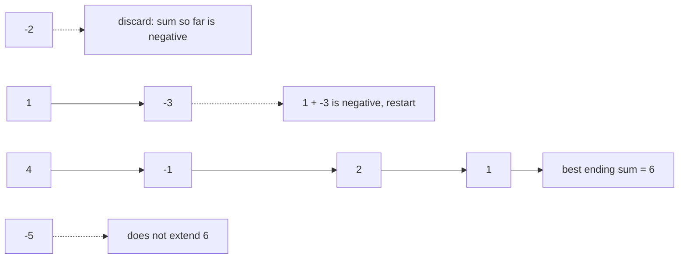

# 53. Maximum Subarray

## Problem in my own words

You get an array of integers that may contain negatives. Find a contiguous segment whose sum is as large as possible, and return that sum. The segment must contain at least one element. If every number is negative, the answer is the largest single element, not zero, because the empty segment is not allowed.

## Easy analogy

You walk along a path collecting coins and paying tolls. As long as your pocket is helping, you keep walking. The moment your pocket total is a burden — it is negative — you empty it and start a new walk at the current spot. You also write down the best pocket total you have ever seen.

## Diagram

The solid chain is the window we keep. The dotted edge is a negative prefix we refuse to carry forward.



## Intuition

Let `cur` be the best sum of a subarray that ends at the current index. That subarray is either the element alone, or the element glued onto the best subarray that ended at the previous index:

`cur = max(nums[i], cur + nums[i])`.

A running sum that is already negative is never worth gluing, because `cur + nums[i] < nums[i]`. The answer is the largest `cur` seen anywhere, since the optimal subarray has some rightmost index.

This is the same as “if `cur < 0` before adding, restart at `nums[i]`, otherwise add `nums[i]`.” Implement the `max` form so an all-negative array stays correct without a special case.

## Tiny walkthrough

`[-2, 1, -3, 4, -1, 2, 1, -5, 4]`

| i | nums[i] | cur after the choice | best |
|---|---------|----------------------|------|
| 0 | -2 | -2 | -2 |
| 1 | 1 | 1 (restart) | 1 |
| 2 | -3 | -2 (extend 1) | 1 |
| 3 | 4 | 4 (restart) | 4 |
| 4 | -1 | 3 | 4 |
| 5 | 2 | 5 | 5 |
| 6 | 1 | 6 | 6 |
| 7 | -5 | 1 | 6 |
| 8 | 4 | 5 | 6 |

The winning segment is `[4, -1, 2, 1]`.

## Java

```java
class Solution {
    public int maxSubArray(int[] nums) {
        int best = nums[0];
        int cur = nums[0];
        for (int i = 1; i < nums.length; i++) {
            cur = Math.max(nums[i], cur + nums[i]);
            best = Math.max(best, cur);
        }
        return best;
    }
}
```

## Python

```python
def maxSubArray(nums: list[int]) -> int:
    best = cur = nums[0]
    for x in nums[1:]:
        cur = max(x, cur + x)
        best = max(best, cur)
    return best
```

## Complexity

One pass, `O(n)` time, `O(1)` extra memory. The divide-and-conquer version that computes the best crossing sum at the midpoint is `O(n log n)` and is only worth mentioning if the interviewer asks for that formulation.

## Pitfalls

- Initializing `best` and `cur` to 0. On `[-3, -1]` that returns 0, but the required answer is `-1`.
- The restart test `if cur < 0: cur = 0` followed by `cur += nums[i]` has the same bug unless you separately track the maximum element.
- Updating `best` before `cur`, or forgetting to update `best` on the first element. Seeding both from `nums[0]` and looping from index 1 avoids that.
- Returning the subarray when the signature asks for the sum. If they do want the bounds, store the start index whenever you restart and the best start/end whenever `best` improves.

## Interview script

“The best window that ends here either starts here or extends the best window that ended one step earlier. I keep that ending-here sum and the best sum overall. Extending a negative running sum is always worse than restarting, which is why this is safe. I seed both variables with the first element so an all-negative array still returns the largest number. Time is linear, extra memory is constant.”
