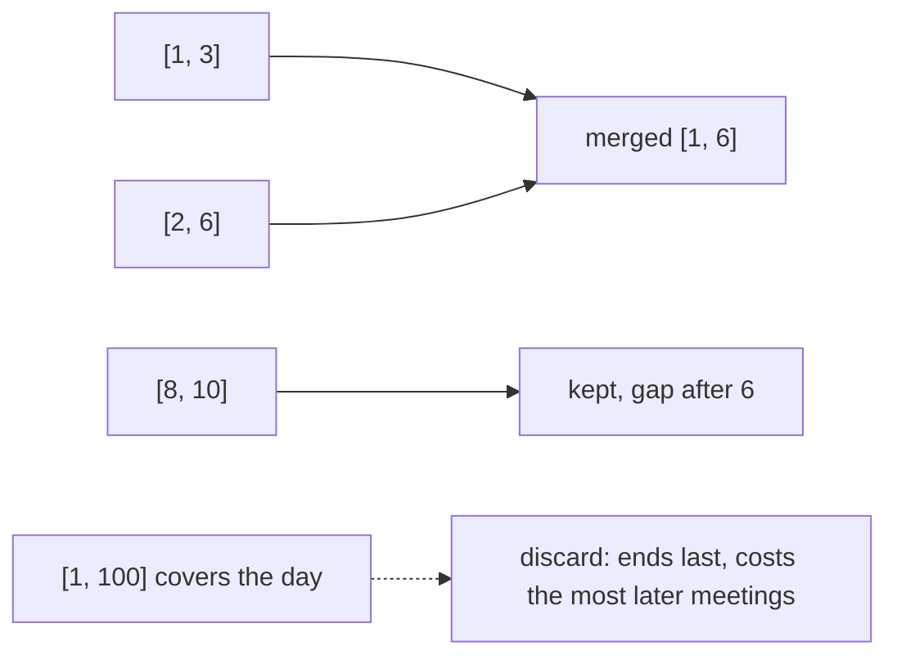

# Interval Patterns

## Pattern in my own words

An interval is a closed range `[start, end]`. Almost every problem in this family becomes easy after you sort, and the sort key is the whole question: sort by start when you are merging or inserting, sort by end when you are deciding which overlapping interval to throw away. Once the intervals are ordered, one left-to-right scan compares each interval only to the one you just kept, or turns starts and ends into events on a line.

## Easy analogy

A calendar day is a number line. Meetings are strips of tape on that line. If you lay the strips down from the one that starts earliest, overlapping tape sticks together into one longer strip (merge). If you are throwing away as few strips as possible so nothing overlaps, you keep the strip that ends soonest so the rest of the day stays open. If you are counting rooms, you walk the day and +1 when a strip starts, −1 when it ends.

## Diagram

Sorted by start on a line. Solid brackets merge. The dotted bracket is an overlap we drop when the goal is to erase the minimum number of intervals (that rule actually sorts by end; the picture shows the discarded one).



## Intuition

Decide the sort from the question:

- **Sort by start.** Merge, insert, and “can one person attend everything?” all look ahead to the next interval that begins earliest. After the sort, overlap with the last kept interval is `current.start <= last.end`. Touching endpoints overlap for merge (`[1, 4]` and `[4, 5]` become `[1, 5]`) and also count as a conflict for a single attendee only when the next start is strictly before the previous end. For “attend all,” `[1, 2]` then `[2, 3]` is legal: the first meeting has ended when the second starts. Use `next.start < prev.end` there.
- **Sort by end.** “Delete the fewest intervals so the rest do not overlap” keeps the interval that frees the line soonest. A later interval is compatible when `start >= lastKeptEnd`. Touching is compatible. Count the ones you did not keep.
- **Sweep line.** When the question is “what is the maximum depth?” (minimum meeting rooms), emit `(start, +1)` and `(end, -1)`, sort by time, and break ties by processing the end before the start. The running sum is how many meetings are open; its maximum is the answer.
- **Heap of end times.** Same rooms question: sort by start, and reuse a room when the earliest finishing meeting has already ended (`earliestEnd <= start`).

Do not merge first and then ask about minimum deletions. Merging destroys the count of original intervals.

## Tiny walkthrough

Merge `[[1,3],[2,6],[8,10],[15,18]]` after sorting by start. `[1,3]` overlaps `[2,6]` because `2 <= 3`, so the kept end becomes 6. `[8,10]` starts after 6, so it is a new piece. `[15,18]` is another. Result `[[1,6],[8,10],[15,18]]`.

Erase on `[[1,100],[11,12],[10,13]]` sorted by end: keep `[11,12]`? Ends are 12, 13, 100 so order is `[11,12]`, `[10,13]`, `[1,100]`. `[11,12]` is kept, `[10,13]` starts before 12 so it is erased, `[1,100]` overlaps too. One kept, two erased. Sorting by start would have been a different algorithm and is easier to get wrong.

## Java

```java
import java.util.ArrayList;
import java.util.Arrays;
import java.util.List;

public final class IntervalPatterns {
    /** Sort by start, merge overlaps, touching endpoints included. */
    public static int[][] merge(int[][] intervals) {
        if (intervals.length == 0) {
            return new int[0][];
        }
        Arrays.sort(intervals, (a, b) -> Integer.compare(a[0], b[0]));
        List<int[]> merged = new ArrayList<>();
        int start = intervals[0][0];
        int end = intervals[0][1];
        for (int i = 1; i < intervals.length; i++) {
            if (intervals[i][0] <= end) {
                end = Math.max(end, intervals[i][1]);
            } else {
                merged.add(new int[]{start, end});
                start = intervals[i][0];
                end = intervals[i][1];
            }
        }
        merged.add(new int[]{start, end});
        return merged.toArray(new int[merged.size()][]);
    }

    /** Sort by end. Return how many intervals must be removed. */
    public static int eraseOverlapIntervals(int[][] intervals) {
        if (intervals.length == 0) {
            return 0;
        }
        Arrays.sort(intervals, (a, b) -> Integer.compare(a[1], b[1]));
        int end = intervals[0][1];
        int kept = 1;
        for (int i = 1; i < intervals.length; i++) {
            if (intervals[i][0] >= end) {
                kept++;
                end = intervals[i][1];
            }
        }
        return intervals.length - kept;
    }
}
```

## Python

```python
def merge(intervals: list[list[int]]) -> list[list[int]]:
    if not intervals:
        return []
    intervals.sort(key=lambda iv: iv[0])
    merged = [intervals[0][:]]
    for start, end in intervals[1:]:
        if start <= merged[-1][1]:
            merged[-1][1] = max(merged[-1][1], end)
        else:
            merged.append([start, end])
    return merged


def erase_overlap_intervals(intervals: list[list[int]]) -> int:
    if not intervals:
        return 0
    intervals.sort(key=lambda iv: iv[1])
    end = intervals[0][1]
    kept = 1
    for start, finish in intervals[1:]:
        if start >= end:
            kept += 1
            end = finish
    return len(intervals) - kept
```

## Complexity

Sorting dominates: `O(n log n)` time. A linear scan follows. Merge uses `O(n)` extra memory for the output. The erase scan uses `O(1)` extra memory beyond the sort. A sweep for room counts sorts `2n` events, still `O(n log n)` time, and `O(n)` memory for the event list. A heap of end times is the same bound.

## Pitfalls

- Using `<` instead of `<=` when merging, so `[1,4]` and `[4,5]` stay split.
- Using `>` instead of `>=` when keeping non-overlapping intervals, so a meeting that starts when another ends is thrown away.
- Sorting erase-minimum by start and then always dropping the current interval. That is not the earliest-finish exchange.
- On a sweep, processing a start before an end at the same timestamp. That briefly counts two meetings when the room has already been freed, and the max is too high.
- Mutating the caller’s interval arrays while merging if you push the original reference and then overwrite `end`. Copy the pair when you append.

## Interview script

“Intervals go on a line. If I’m merging or inserting, I sort by start and extend the last interval while the next one overlaps it, counting a shared endpoint as overlap. If I’m deleting the minimum number so nothing overlaps, I sort by end and keep an interval only when it starts at or after the last kept end. If I’m counting rooms, I sweep starts as +1 and ends as −1, and I handle the end first when the times tie. All of these are a sort plus one pass.”
