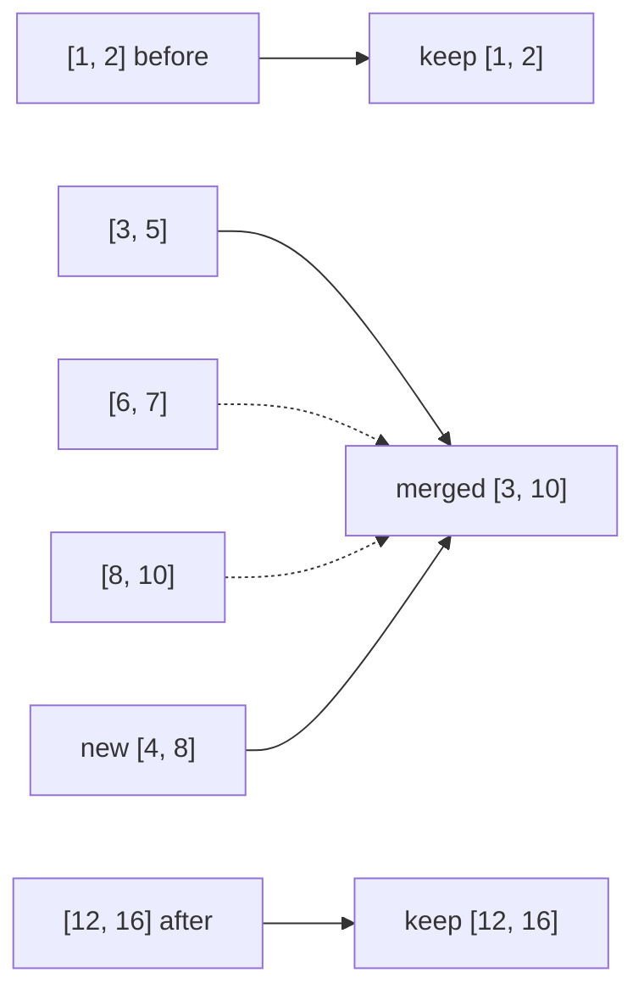

# 57. Insert Interval

## Problem in my own words

You already have a list of intervals sorted by start time, and no two of them overlap. A new interval arrives and may collide with a stretch of the existing ones. Return a new list that contains the newcomer, still sorted and still non-overlapping, with every collision folded into one interval. The input list itself is not required to stay unchanged.

## Easy analogy

A day planner is already tidy: appointments never pile up. Someone hands you a new appointment written on a sticky note. You leave every appointment that finishes before the sticky note starts, glue the sticky note onto every appointment it actually touches, and then copy the appointments that begin only after the glue has dried.

## Diagram

`[4, 8]` is inserted into a sorted list. The dotted interval is consumed by the merge and does not appear on its own in the output.



## Intuition

Because the input is sorted and disjoint, the intervals that interact with `newInterval` form one contiguous block.

1. Append every interval that ends strictly before the new one starts (`end < newStart`). Those cannot touch it.
2. While the next interval starts at or before the new one ends (`start <= newEnd`), it overlaps or touches. Expand `newStart` to the min start and `newEnd` to the max end, and do not append that interval separately.
3. Append the expanded new interval once.
4. Append the untouched tail.

No full sort is required. A single pass is enough.

## Tiny walkthrough

Input `[[1,2],[3,5],[6,7],[8,10],[12,16]]`, insert `[4,8]`.

- `[1,2]` ends at 2, which is before 4, so it is copied.
- `[3,5]` starts at 3, which is `<= 8`, so the new interval grows to `[3,8]`.
- `[6,7]` starts at 6 `<= 8`, grows to `[3,8]`.
- `[8,10]` starts at 8 `<= 8`, grows to `[3,10]`.
- `[12,16]` starts after 10, so the loop stops.
- Emit `[3,10]`, then `[12,16]`.

Result: `[[1,2],[3,10],[12,16]]`.

## Java

```java
import java.util.ArrayList;
import java.util.List;

class Solution {
    public int[][] insert(int[][] intervals, int[] newInterval) {
        List<int[]> result = new ArrayList<>();
        int i = 0;
        int n = intervals.length;

        while (i < n && intervals[i][1] < newInterval[0]) {
            result.add(intervals[i]);
            i++;
        }

        while (i < n && intervals[i][0] <= newInterval[1]) {
            newInterval[0] = Math.min(newInterval[0], intervals[i][0]);
            newInterval[1] = Math.max(newInterval[1], intervals[i][1]);
            i++;
        }
        result.add(newInterval);

        while (i < n) {
            result.add(intervals[i]);
            i++;
        }
        return result.toArray(new int[result.size()][]);
    }
}
```

## Python

```python
def insert(intervals: list[list[int]], newInterval: list[int]) -> list[list[int]]:
    result = []
    i = 0
    n = len(intervals)

    while i < n and intervals[i][1] < newInterval[0]:
        result.append(intervals[i])
        i += 1

    while i < n and intervals[i][0] <= newInterval[1]:
        newInterval[0] = min(newInterval[0], intervals[i][0])
        newInterval[1] = max(newInterval[1], intervals[i][1])
        i += 1
    result.append(newInterval)

    while i < n:
        result.append(intervals[i])
        i += 1
    return result
```

## Complexity

`O(n)` time and `O(n)` extra memory for the output list. The input is already sorted, so you do not pay for a sort. If the caller needs the original `newInterval` contents preserved, copy it before the min/max updates; the algorithm above writes into that pair.

## Pitfalls

- Using `end <= newStart` in the first loop. An interval that ends exactly when the new one starts must merge (`[1,4]` with `[4,6]`). The skip condition is strict: `end < newStart`.
- Using `start < newEnd` in the second loop. Touching at the end (`[1,5]` with a new interval that has grown to end at 5, next starts at 5) must still merge. The condition is `start <= newEnd`.
- Appending the new interval inside the merge loop, once per overlapping input. Append it once, after the loop.
- Sorting from scratch. It is correct but hides the fact that the list was already ordered, and it is easy to forget the input may be empty.

## Interview script

“The list is sorted and disjoint, so I scan once. I copy intervals that end before the new one starts, then fold every interval that starts at or before the new end into a single expanded interval, then copy the tail. Shared endpoints merge. Empty input just returns the new interval. Linear time, and the output list is the extra memory.”
