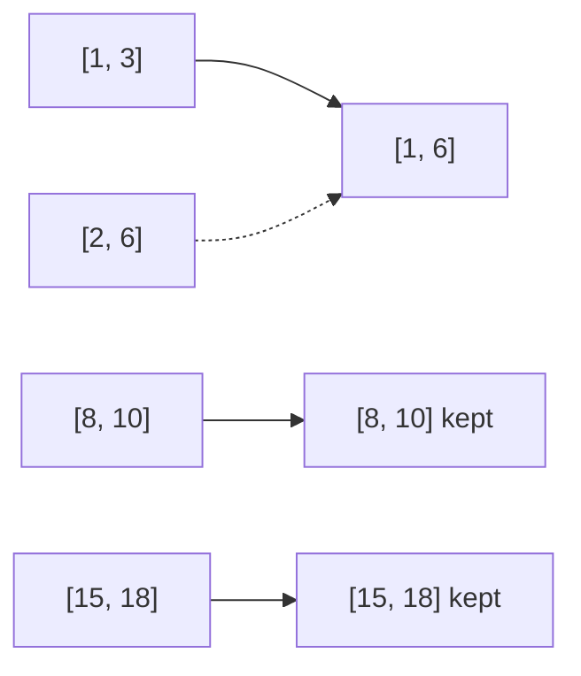

# 56. Merge Intervals

## Problem in my own words

You are given a list of intervals, not necessarily ordered, and they may overlap or touch. Produce a new list that covers exactly the same points on the line, but with no overlaps left: whenever two intervals share any point, including a shared endpoint, they become one interval from the earlier start to the later end. Intervals that only have a gap between them stay separate.

## Easy analogy

Several people mark busy hours on the same ruler with marker pens. You sort the marks by when they begin, then drag a finger along the ruler. While the next mark starts before your finger lifts, you extend the stroke. When there is a real gap, you lift the pen and start a new stroke.

## Diagram

`[1,3]` and `[2,6]` fuse. `[8,10]` is separate. The dotted edge is the original `[2,6]`, which is not emitted on its own.



## Intuition

Sort by start time. Then a single left-to-right pass is enough, because any interval that could overlap the one you are building must start no later than the ones you have already considered.

Keep a `last` interval, the one at the end of the output. For the next interval:

- If `next.start <= last.end`, they overlap or touch. Set `last.end = max(last.end, next.end)`. The start does not move left, because of the sort.
- Otherwise there is a gap. Append a new interval. Copy the pair so later `end` updates do not rewrite an earlier input row you already stored... actually if you append a fresh array and only update that output row, the input stays intact.

The first interval seeds the output. Remember the max when extending: an interval that starts later can still end earlier, and you must not shrink `last.end`.

## Tiny walkthrough

`[[1,3],[2,6],[8,10],[15,18]]` is already sorted by start.

- Seed `[1,3]`.
- `2 <= 3`, so end becomes `max(3, 6) = 6`. Output so far `[[1,6]]`.
- `8 > 6`, append `[8,10]`.
- `15 > 10`, append `[15,18]`.

`[[1,4],[4,5]]` merges because `4 <= 4`, producing `[[1,5]]`.

## Java

```java
import java.util.ArrayList;
import java.util.Arrays;
import java.util.List;

class Solution {
    public int[][] merge(int[][] intervals) {
        if (intervals.length == 0) {
            return new int[0][];
        }
        Arrays.sort(intervals, (a, b) -> Integer.compare(a[0], b[0]));
        List<int[]> merged = new ArrayList<>();
        for (int[] current : intervals) {
            if (merged.isEmpty() || merged.get(merged.size() - 1)[1] < current[0]) {
                merged.add(new int[]{current[0], current[1]});
            } else {
                int[] last = merged.get(merged.size() - 1);
                last[1] = Math.max(last[1], current[1]);
            }
        }
        return merged.toArray(new int[merged.size()][]);
    }
}
```

## Python

```python
def merge(intervals: list[list[int]]) -> list[list[int]]:
    if not intervals:
        return []
    intervals.sort(key=lambda iv: iv[0])
    merged = []
    for start, end in intervals:
        if not merged or merged[-1][1] < start:
            merged.append([start, end])
        else:
            merged[-1][1] = max(merged[-1][1], end)
    return merged
```

## Complexity

`O(n log n)` time for the sort, then `O(n)` for the scan. Extra memory is `O(n)` for the output, plus whatever the sort needs. If the interviewer promises the intervals arrive sorted, the scan alone is linear.

## Pitfalls

- Testing overlap with `<` only on the end (`last.end < start` means a gap). The merge branch must run when `start <= last.end`, including equality. The code above uses the complementary test `last.end < start` to start a new interval, so equality falls into the merge branch. That is the correct split.
- Replacing `last.end` with `current.end` without `max`. A later, shorter interval would chop the union.
- Sorting by end time. `[1,10]` then `[2,3]` is easy to mishandle if you assumed starts were ordered, and you can no longer claim the start of the union is the start you already stored.
- Appending the input array reference and then writing into `last[1]`. If that reference is the original row, you mutate the caller’s data and, worse, if you appended the same row twice you corrupt history. Append `new int[]{start, end}` / `[start, end]`.

## Interview script

“I sort by start, then walk left to right. If the next interval starts after the last merged end, I open a new one. If it starts at or before that end, I extend the end to the max of the two ends. Touching endpoints merge. The sort makes this one comparison enough. Time is `O(n log n)`, space is the output list.”
