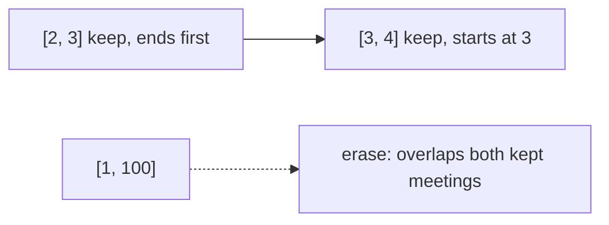

# 435. Non-overlapping Intervals

## Problem in my own words

You are given intervals that may overlap. Delete as few of them as possible so that the ones you keep do not overlap. Return how many you deleted, not the intervals themselves. Two intervals that only touch at an endpoint, such as `[1,2]` and `[2,3]`, are allowed to stay together; they are not treated as overlapping. A full containment is an overlap, and at least one of those two must go if they are the only pair.

## Easy analogy

You are booking a single conference room and you want to honor as many requests as you can. Always accept the request that frees the room earliest. Any request that would have started while that meeting is still going is the one you decline. Counting declines is the answer.

## Diagram

Sorted by finishing time. The long interval is the one the greedy pass discards. The dotted edge is that deletion.



## Intuition

This is interval scheduling for the maximum number of compatible intervals. Sort by end time. Walk left to right and keep an interval when its start is at least the end of the last interval you kept. Otherwise erase it, which means you simply do not update the kept end.

Why the earliest finish: if an optimal keep-set’s first interval ends later than this one, swap this one in. It ends sooner, so every later interval that was compatible is still compatible, and the set stays the same size. Repeating that swap produces the greedy set.

The return value is `n - kept`, the number erased. Sorting by start and dropping “the one that ends later” of each conflicting pair also works if you implement that comparison carefully, but the end-time sort is the short proof and the short code. Do not sort by start and then blindly drop the current interval.

## Tiny walkthrough

`[[1,2],[2,3],[3,4],[1,3]]`.

Sort by end: `[1,2]`, `[2,3]`, `[1,3]`, `[3,4]` (the two that end at 3 may swap; either order works).

- Keep `[1,2]`, `end = 2`, `kept = 1`.
- `[2,3]` starts at 2, which is `>= 2`, keep it, `end = 3`, `kept = 2`.
- `[1,3]` starts at 1 `< 3`, skip.
- `[3,4]` starts at 3 `>= 3`, keep it, `kept = 3`.

Erase `4 - 3 = 1`.

`[[1,2],[1,2],[1,2]]` keeps the first and skips the other two. Answer 2.

## Java

```java
import java.util.Arrays;

class Solution {
    public int eraseOverlapIntervals(int[][] intervals) {
        if (intervals.length == 0) {
            return 0;
        }
        Arrays.sort(intervals, (a, b) -> Integer.compare(a[1], b[1]));
        int end = intervals[0][1];
        int kept = 1;
        for (int i = 1; i < intervals.length; i++) {
            if (intervals[i][0] >= end) {
                kept++;
                end = intervals[i][1];
            }
        }
        return intervals.length - kept;
    }
}
```

## Python

```python
def eraseOverlapIntervals(intervals: list[list[int]]) -> int:
    if not intervals:
        return 0
    intervals.sort(key=lambda iv: iv[1])
    end = intervals[0][1]
    kept = 1
    for start, finish in intervals[1:]:
        if start >= end:
            kept += 1
            end = finish
    return len(intervals) - kept
```

## Complexity

`O(n log n)` time for the sort by end, then `O(n)` for the scan. Extra memory is `O(1)` besides the sort’s workspace: two integers, `end` and `kept`. You do not need an output list because the problem asks for a count.

## Pitfalls

- Sorting by start. On `[[1,100],[2,3],[3,4]]` a naive “keep the first, drop anything that overlaps it” keeps the long interval and deletes two. The optimal deletion count is 1.
- Using `start > end` as the keep test. `[1,2]` and `[2,3]` would be treated as a conflict and you would over-delete. The problem allows a shared endpoint, so keep when `start >= end`.
- Returning `kept` instead of `n - kept`. Read the question: it wants the number removed.
- Merging the intervals first. The merged list no longer tells you how many originals you discarded.
- Updating `end` when you skip. The skipped interval must not push the free time later; only a kept interval may.

## Interview script

“I want to keep as many as possible, which is the same as deleting as few as possible. I sort by end time and always keep the next interval that starts at or after the last kept end. That is safe because swapping in the earliest-finishing option never blocks a later meeting that the old choice allowed. Touching endpoints are compatible. I return `n` minus how many I kept. Sort plus a scan, `O(n log n)`.”
