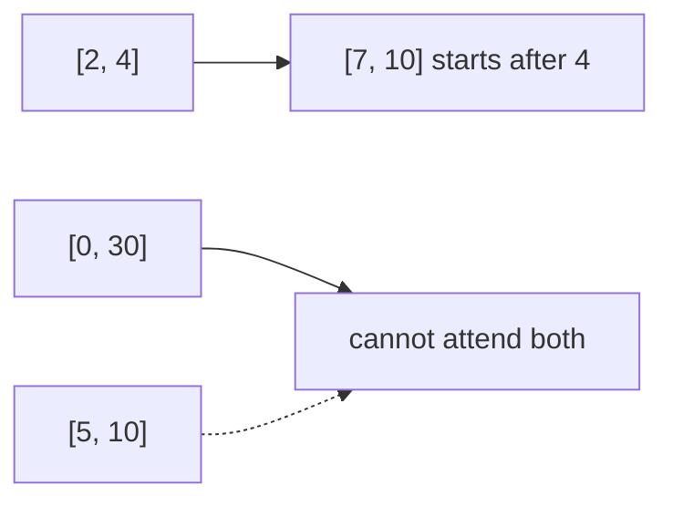

# 252. Meeting Rooms

## Problem in my own words

Each meeting is an interval `[start, end)`. In the usual statement the ranges are closed in the input arrays, but a person can attend a meeting that starts at the exact time another ends. Decide whether one person can attend every meeting. That is true exactly when no two meetings overlap on a positive-length stretch of time. Return a boolean, not a schedule.

## Easy analogy

One person, one chair, a stack of calendar invites. Sort them by when they begin. If the next invite starts while you are still sitting in the previous meeting, you have to decline the day. If each meeting has already ended before the next one starts, you can sit through the whole list.

## Diagram

`[7,10]` and `[2,4]` are compatible after sorting. The dotted edge is a different day where `[5,10]` starts during `[0,30]` and is rejected.



## Intuition

Sort by start time. Then it is enough to compare each meeting with the one immediately before it. If meeting `i` starts before meeting `i-1` ends (`start < previousEnd`), they overlap and the answer is false. If every consecutive pair passes, the answer is true.

Why non-consecutive pairs cannot be the only conflict: if meeting `k` overlaps meeting `i` for `k > i+1`, then meeting `i+1`, which starts in between, also reaches back into meeting `i` or forward into meeting `k`. After a start-time sort, a conflict always shows up between some consecutive pair.

Shared endpoints are allowed. `[1,5]` and `[5,8]` satisfy `5 < 5` being false, so both are attendable. This is the opposite comparison from merge-intervals, where a shared endpoint fuses the two ranges.

## Tiny walkthrough

`[[0,30],[5,10],[15,20]]`. Sorted by start, the order is unchanged. Compare `[5,10]` with `[0,30]`: `5 < 30`, return false.

`[[7,10],[2,4]]`. Sorted: `[2,4]`, then `[7,10]`. `7 < 4` is false, return true.

`[[1,5],[5,8],[8,9]]` is true. `[[1,5],[4,8]]` is false.

## Java

```java
import java.util.Arrays;

class Solution {
    public boolean canAttendMeetings(int[][] intervals) {
        Arrays.sort(intervals, (a, b) -> Integer.compare(a[0], b[0]));
        for (int i = 1; i < intervals.length; i++) {
            if (intervals[i][0] < intervals[i - 1][1]) {
                return false;
            }
        }
        return true;
    }
}
```

## Python

```python
def canAttendMeetings(intervals: list[list[int]]) -> bool:
    intervals.sort(key=lambda iv: iv[0])
    for i in range(1, len(intervals)):
        if intervals[i][0] < intervals[i - 1][1]:
            return False
    return True
```

## Complexity

`O(n log n)` time for the sort and `O(1)` extra memory if you ignore the sort’s workspace and stop at the first conflict. An empty schedule and a single meeting are both true and do not enter the loop.

## Pitfalls

- Using `<=` and rejecting two meetings that only touch. `[1,2]` and `[2,3]` are attendable; the test is strict `<`.
- Comparing each meeting against all earlier ones after you already know a consecutive check is sufficient. It is correct but it is the `O(n^2)` solution.
- Sorting by end time and using the same consecutive test. `[1,5]`, `[4,6]`, `[2,3]` sorted by end is `[2,3]`, `[1,5]`, `[4,6]`. Consecutive pairs might be misread depending on the check; the simple “only look at the previous interval” proof needs start order. Sort by start.
- Forgetting that this problem returns a boolean. Minimum rooms is the next problem.

## Interview script

“One person can attend everything only if no two intervals strictly overlap. I sort by start and check consecutive pairs: if the next start is before the previous end, I return false. Touching at an endpoint is fine, so the comparison is strict. The sort gives me `O(n log n)`. Empty and singleton inputs are true.”
