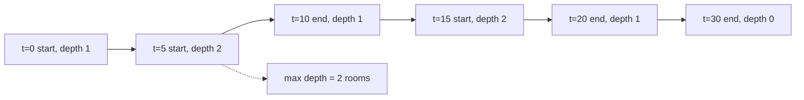

# 253. Meeting Rooms II

## Problem in my own words

You are given meeting intervals. Every meeting must happen; you may not drop one. Each meeting needs a room for its whole duration, and a room frees up at the meeting’s end time so another meeting may start then. Return the smallest number of rooms that lets all of the meetings run. Two meetings that only touch at an endpoint can share one room in sequence.

## Easy analogy

A building manager watches the front door with a counter. Each time a meeting starts, the counter goes up; each time one ends, it goes down. If a meeting ends at noon and another starts at noon, the manager records the departure first so the same room is reused. The highest value the counter reaches is how many rooms the building needed.

## Diagram

Sweep of `[[0,30],[5,10],[15,20]]`. Solid events change the depth. The dotted edge is the end at time 10, which must be applied before any start at that same instant (none here) and which drops the depth from 2 to 1.



## Intuition

The answer is the maximum number of meetings that are open at the same time. Two correct ways:

**Sweep line (coded below).** Turn each meeting into two events: `(start, +1)` and `(end, -1)`. Sort by time. When times tie, process the end first, because the room is free for a meeting that starts at that exact time. A running sum is the number of rooms in use after each event. Track the maximum of that sum.

Tie-break is the whole correctness issue. If you process `+1` before `-1` at time `t`, `[[1,5],[5,10]]` peaks at 2 even though one room is enough.

Sorting pairs `(time, delta)` with `delta = -1` for an end does this tie-break for free: at the same time, `-1` sorts before `+1`.

**Min-heap of end times (also correct, explained and coded).** Sort meetings by start. A min-heap stores the end times of rooms currently assigned. For the next meeting, if the earliest end is `<=` this start, that room is free: pop it. Then push this meeting’s end. The heap’s size at the end is the number of rooms, because a room is removed from the heap only when it is reused, and every meeting is pushed exactly once. The size never shrinks after a reuse-and-push, so the final size is the maximum size.

Both are `O(n log n)`. The sweep makes the “maximum depth” idea obvious. The heap makes the “reuse the room that frees first” idea obvious. Prefer whichever you can finish cleanly.

## Tiny walkthrough

Sweep on `[[0,30],[5,10],[15,20]]`:

| event | depth | max |
|-------|-------|-----|
| 0 start | 1 | 1 |
| 5 start | 2 | 2 |
| 10 end | 1 | 2 |
| 15 start | 2 | 2 |
| 20 end | 1 | 2 |
| 30 end | 0 | 2 |

Answer 2.

`[[7,10],[2,4]]` never has two starts in a row without an end. Answer 1.

`[[1,5],[5,10]]`: events `(1,+1), (5,-1), (5,+1), (10,-1)` if ends sort first. Depth goes 1, 0, 1, 0. Answer 1. If the start at 5 were processed first, depth would hit 2 and the answer would be wrong.

Heap on the first example: push 30, then 5 < 30 so push 10 (size 2), then 15 is after 10 so pop 10 and push 20 (size 2), 30 remains. Size 2.

## Java

Sweep line:

```java
import java.util.Arrays;

class Solution {
    public int minMeetingRooms(int[][] intervals) {
        int n = intervals.length;
        int[][] events = new int[2 * n][2];
        for (int i = 0; i < n; i++) {
            events[2 * i] = new int[]{intervals[i][0], 1};
            events[2 * i + 1] = new int[]{intervals[i][1], -1};
        }
        Arrays.sort(events, (a, b) -> {
            if (a[0] != b[0]) {
                return Integer.compare(a[0], b[0]);
            }
            return Integer.compare(a[1], b[1]);
        });
        int inUse = 0;
        int rooms = 0;
        for (int[] event : events) {
            inUse += event[1];
            rooms = Math.max(rooms, inUse);
        }
        return rooms;
    }
}
```

Heap, same contract:

```java
import java.util.Arrays;
import java.util.PriorityQueue;

class SolutionHeap {
    public int minMeetingRooms(int[][] intervals) {
        if (intervals.length == 0) {
            return 0;
        }
        Arrays.sort(intervals, (a, b) -> Integer.compare(a[0], b[0]));
        PriorityQueue<Integer> earliestEnd = new PriorityQueue<>();
        for (int[] meeting : intervals) {
            if (!earliestEnd.isEmpty() && earliestEnd.peek() <= meeting[0]) {
                earliestEnd.poll();
            }
            earliestEnd.offer(meeting[1]);
        }
        return earliestEnd.size();
    }
}
```

## Python

Sweep line:

```python
def minMeetingRooms(intervals: list[list[int]]) -> int:
    events = []
    for start, end in intervals:
        events.append((start, 1))
        events.append((end, -1))
    events.sort()
    in_use = 0
    rooms = 0
    for _, delta in events:
        in_use += delta
        rooms = max(rooms, in_use)
    return rooms
```

Heap:

```python
import heapq


def minMeetingRoomsHeap(intervals: list[list[int]]) -> int:
    if not intervals:
        return 0
    intervals = sorted(intervals, key=lambda iv: iv[0])
    earliest_end: list[int] = []
    for start, end in intervals:
        if earliest_end and earliest_end[0] <= start:
            heapq.heappop(earliest_end)
        heapq.heappush(earliest_end, end)
    return len(earliest_end)
```

## Complexity

Sweep: `O(n log n)` time to sort `2n` events, `O(n)` memory for the event list. Heap: `O(n log n)` time to sort and to push/pop, `O(n)` memory for the heap in the worst case when every meeting overlaps. Both handle the empty list as 0.

## Pitfalls

- Processing a start before an end at the same timestamp. `[[1,5],[5,10]]` then needs two rooms in the buggy sweep and one room in the real problem. Put `-1` before `+1` in the sort key.
- Using `<` instead of `<=` in the heap reuse test. A room that frees at time `t` can host a meeting that starts at `t`. `earliestEnd <= start` is the reuse condition.
- Forgetting a meeting that starts at the same moment another starts. Two starts with no end between them must increase depth by two. The sweep does that naturally; do not unique the timestamps before you apply both deltas.
- Returning the count of overlaps (pairs) instead of the max depth. Three mutually overlapping meetings need three rooms, not three pairs.
- Sorting only by start and counting how many times neighbors overlap. That is the Meeting Rooms I boolean. Depth can grow across non-adjacent meetings.

## Interview script

“I need the maximum number of meetings open at once. I’ll emit a +1 at every start and a −1 at every end, sort by time, and when the time ties I’ll apply the end first so a room is released before it is reused. The max running sum is the room count. The heap version sorts by start and reuses a room when the soonest end is at or before the next start; the heap size is the same number. Both are `O(n log n)`. I’ll code the sweep.”
