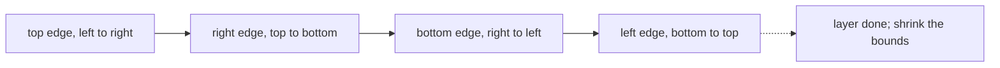

# Matrix Patterns

## Pattern in my own words

Square and rectangular grids in this set are edited by walking their borders, not by allocating a second matrix. A 90-degree rotation cycles four cells on each layer. A spiral read walks the current top row, right column, bottom row, and left column, then shrinks the rectangle. Marking rows and columns, as in set-matrix-zeroes, borrows the first row and the first column as flags so the extra memory stays constant, with one extra boolean for the corner those two borders share.

## Easy analogy

The matrix is a picture frame around a smaller picture frame. You work the outer frame completely, then step inward to the next frame. For rotation you swap the four corners of the frame in a cycle. For a spiral you read the frame clockwise and cross it off. For zeroes you do not build a new frame; you pin a note on the top edge and the left edge of any row or column that must later be wiped.

## Diagram

One clockwise layer. The dotted arrow returns to a cell that has already moved, so the inner loop stops before it rotates that cell a second time.



## Intuition

- **Layers.** An `n × n` board has `n // 2` rings. Ring `layer` runs from index `layer` to `n - 1 - layer`. The center cell of an odd board is never moved.
- **Four-cycle.** Save the top cell, then write left-side into top, bottom into left, right into bottom, and the saved value into right. That is one 90-degree clockwise step. The offset along the edge is `i - first`, and the opposite index is `last - offset`.
- **Boundaries for a spiral.** Maintain `top`, `bottom`, `left`, `right`. After the top row, increment `top`. After the right column, decrement `right`. Only then walk the bottom row if `top <= bottom`, and the left column if `left <= right`. Those two checks stop a single leftover row or column from being written twice.
- **Constant-space markers.** If `matrix[i][j]` is zero, set `matrix[i][0]` and `matrix[0][j]` to zero. Those flags live inside the matrix. Because `matrix[0][0]` would have to mean both “row 0” and “column 0,” record two booleans before you overwrite anything: whether the original first row contained a zero, and whether the original first column contained a zero. Zero the interior using the markers, then zero the first row and first column from the booleans.

Transpose-then-reverse-each-row is a correct alternative for rotation. The layer cycle matches the “walk the border” idea and does not need a second pass over the whole matrix.

## Tiny walkthrough

Clockwise layer on

```
1 2 3
4 5 6
7 8 9
```

The outer ring’s first cycle sends `1 → position of 3`, `3 → position of 9`, `9 → position of 7`, `7 → position of 1`. The next offset along the same ring sends `2 → 6 → 8 → 4 → 2`. The center `5` stays. Result:

```
7 4 1
8 5 2
9 6 3
```

Spiral of the original reads top `1 2 3`, right `6 9`, bottom `8 7`, left `4`, then the shrunk bounds are the single cell `5`.

## Java

```java
public final class MatrixPatterns {
    /** 90 degrees clockwise, in place, one layer at a time. */
    public static void rotate(int[][] matrix) {
        int n = matrix.length;
        for (int layer = 0; layer < n / 2; layer++) {
            int first = layer;
            int last = n - 1 - layer;
            for (int i = first; i < last; i++) {
                int offset = i - first;
                int top = matrix[first][i];
                matrix[first][i] = matrix[last - offset][first];
                matrix[last - offset][first] = matrix[last][last - offset];
                matrix[last][last - offset] = matrix[i][last];
                matrix[i][last] = top;
            }
        }
    }
}
```

## Python

```python
def rotate(matrix: list[list[int]]) -> None:
    n = len(matrix)
    for layer in range(n // 2):
        first = layer
        last = n - 1 - layer
        for i in range(first, last):
            offset = i - first
            top = matrix[first][i]
            matrix[first][i] = matrix[last - offset][first]
            matrix[last - offset][first] = matrix[last][last - offset]
            matrix[last][last - offset] = matrix[i][last]
            matrix[i][last] = top
```

## Complexity

Rotation touches each cell once: `O(n^2)` time and `O(1)` extra memory. Spiral is the same bound, `O(m * n)` time to emit every entry and `O(1)` extra memory besides the output list. Set-matrix-zeroes is `O(m * n)` time and `O(1)` extra memory when the first row, first column, and two booleans are the only markers. Allocating a full boolean row and column is `O(m + n)` and is the right stepping stone if the constant-space version is getting messy.

## Pitfalls

- Rotating a cell and then rotating the cell you just wrote, because the inner loop ran all the way to `last` inclusive. Stop at `i < last`.
- Walking the bottom row and the left column of a spiral after the bounds have already crossed. A 1×n matrix has no bottom row left once the top row is consumed.
- Using `matrix[0][0]` as both the first-row marker and the first-column marker with no extra boolean. A zero in column 0 then wipes row 0, or the reverse.
- Zeroing the marker row and column before you have used them to zero the interior.
- Building a rotated copy when the problem says in place. The cycle (or transpose plus reverse) uses a handful of scalars.

## Interview script

“I treat the matrix as nested frames. For a clockwise rotation I cycle four cells per position on each frame and stop before I wrap onto the cell I started from. For a spiral I peel the four sides and shrink `top`, `bottom`, `left`, and `right`, and I re-check the bounds before the bottom and left walks so a last row or column is not duplicated. For zeroes I store markers in the first row and first column, with two booleans covering the overlap at the corner, and I apply those markers only after the scan. All three are linear in the number of cells and constant extra memory.”
