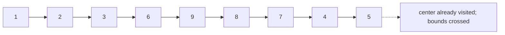

# 54. Spiral Matrix

## Problem in my own words

You are given an `m` by `n` matrix. Return a flat list of every entry, read in clockwise spiral order: left to right across the top row, top to bottom down the right column, right to left across the bottom row, and bottom to top up the left column, then the same pattern on the rectangle that remains. Every entry appears once. A single row, a single column, and a single cell are all legal inputs.

## Easy analogy

You are peeling an onion clockwise. Eat the outer skin in one loop, then the next skin, until nothing is left. If the onion is a single strip, you only get one side of the peel and you stop before you go around and eat that strip again.

## Diagram

A 3×3 spiral. Solid arrows are the walk. The dotted arrow marks the center once it has already been emitted, so the bounds stop instead of looping.



## Intuition

Keep the inclusive bounds of the rectangle you have not yet emitted: `top`, `bottom`, `left`, `right`.

While the rectangle is non-empty (`top <= bottom` and `left <= right`):

1. Emit row `top` from `left` to `right`, then `top++`.
2. Emit column `right` from `top` to `bottom`, then `right--`.
3. If `top <= bottom` still holds, emit row `bottom` from `right` down to `left`, then `bottom--`.
4. If `left <= right` still holds, emit column `left` from `bottom` down to `top`, then `left++`.

Steps 3 and 4 are the ones that duplicate a row or a column if you skip the checks. After step 1 a one-row matrix has `top > bottom`. After step 2 a one-column matrix has `right < left`. The checks notice that and refuse to walk back over the same cells.

Direction arrays `(0,1),(1,0),(0,-1),(-1,0)` plus a visited matrix also work. They use `O(mn)` extra memory and more index arithmetic. The bound shrink is the constant-extra-memory version and matches the layer pattern.

## Tiny walkthrough

`[[1,2,3,4],[5,6,7,8],[9,10,11,12]]`.

- Top: `1 2 3 4`, `top` becomes 1.
- Right: `8 12`, `right` becomes 2.
- Bottom, since `top <= bottom`: `11 10 9`, `bottom` becomes 0.
- Left, since `left <= right`: `5`, `left` becomes 1.
- Next loop, bounds are row 1, columns 1..2: top emits `6 7`, `top` becomes 2.
- Right column is now empty (`top > bottom`).
- Both guards fail.

Result: `[1,2,3,4,8,12,11,10,9,5,6,7]`.

A column `[[1],[2],[3]]` emits `1` on the top pass, then `2 3` on the right pass, then both guards fail because `right` has moved from 0 to -1. Result `[1,2,3]`, with no duplicated `1`.

## Java

```java
import java.util.ArrayList;
import java.util.List;

class Solution {
    public List<Integer> spiralOrder(int[][] matrix) {
        List<Integer> order = new ArrayList<>();
        if (matrix.length == 0 || matrix[0].length == 0) {
            return order;
        }
        int top = 0;
        int bottom = matrix.length - 1;
        int left = 0;
        int right = matrix[0].length - 1;
        while (top <= bottom && left <= right) {
            for (int col = left; col <= right; col++) {
                order.add(matrix[top][col]);
            }
            top++;
            for (int row = top; row <= bottom; row++) {
                order.add(matrix[row][right]);
            }
            right--;
            if (top <= bottom) {
                for (int col = right; col >= left; col--) {
                    order.add(matrix[bottom][col]);
                }
                bottom--;
            }
            if (left <= right) {
                for (int row = bottom; row >= top; row--) {
                    order.add(matrix[row][left]);
                }
                left++;
            }
        }
        return order;
    }
}
```

## Python

```python
def spiralOrder(matrix: list[list[int]]) -> list[int]:
    if not matrix or not matrix[0]:
        return []
    order = []
    top, bottom = 0, len(matrix) - 1
    left, right = 0, len(matrix[0]) - 1
    while top <= bottom and left <= right:
        for col in range(left, right + 1):
            order.append(matrix[top][col])
        top += 1
        for row in range(top, bottom + 1):
            order.append(matrix[row][right])
        right -= 1
        if top <= bottom:
            for col in range(right, left - 1, -1):
                order.append(matrix[bottom][col])
            bottom -= 1
        if left <= right:
            for row in range(bottom, top - 1, -1):
                order.append(matrix[row][left])
            left += 1
    return order
```

## Complexity

Every cell is appended once, so time is `O(m * n)` and the output holds `m * n` integers. Extra memory beyond the output is `O(1)`: four bounds. The visited-matrix version is `O(m * n)` extra memory and the same time.

## Pitfalls

- Omitting `if top <= bottom` before the bottom walk. A single row is emitted left to right and then right to left.
- Omitting `if left <= right` before the left walk. A single column is emitted top to bottom and then bottom to top.
- Shrinking a bound in the wrong place, for example decrementing `bottom` even when you skipped the bottom walk. The next loop’s while-condition then disagrees with the cells you have actually emitted.
- Using `range(right, left, -1)` in Python, which excludes `left`. The bottom walk must include column `left`. The end of that range is `left - 1`.
- Assuming the matrix is square. The same four bounds work for any rectangle, including 1×n and m×1.

## Interview script

“I keep the unread rectangle as four bounds. I walk the top row, then the right column, then the bottom row only if a row remains, then the left column only if a column remains, shrinking the bound I just finished. The two checks are what keep a final strip from being walked twice. Each cell is emitted once, so time is linear in the number of cells and I only store the output plus four integers.”
