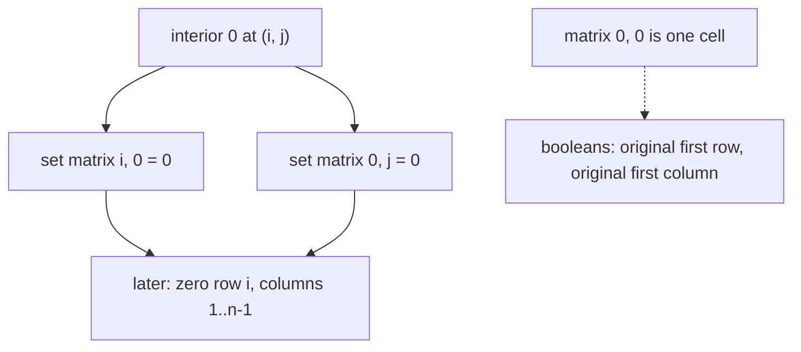

# 73. Set Matrix Zeroes

## Problem in my own words

You are given an `m` by `n` matrix of numbers. Whenever a cell is zero, the entire row of that cell and the entire column of that cell must become zero. Do this using the original zeros only — a zero you write during the process must not be treated as a new reason to clear some other row. The follow-up constraint is constant extra memory: you may not allocate a list of rows and a list of columns. The matrix is modified in place.

## Easy analogy

A spreadsheet has a few broken cells. Before you erase anything, you tick the left margin of each broken row and the top margin of each broken column. The top-left corner is one physical cell, so it cannot hold two different ticks; you write those two facts on a sticky note instead. Then you erase the interior using the ticks, and only afterward do you erase a margin if its sticky note says so.

## Diagram

An interior zero writes markers. The dotted arrow is the shared corner, which is not used as both flags; the original first row and first column are remembered beside the matrix.



## Intuition

A first, easy solution uses `O(m + n)` memory: two boolean arrays, “this row must die” and “this column must die,” filled from the original zeros, then applied. Constant extra memory reuses the matrix as those arrays.

Use column 0 as the row-marker array and row 0 as the column-marker array:

- If `matrix[i][j] == 0` for `i > 0` and `j > 0`, set `matrix[i][0] = 0` and `matrix[0][j] = 0`.

`matrix[0][0]` sits in both marker strips. Do not ask it to mean two things. Before any write, scan the original first row into `firstRowZero` and the original first column into `firstColZero`.

Then zero the interior, rows `1..m-1` and columns `1..n-1`: if `matrix[i][0] == 0` or `matrix[0][j] == 0`, set `matrix[i][j] = 0`.

Finally, if `firstRowZero`, fill row 0 with zeros. If `firstColZero`, fill column 0 with zeros. Doing this last matters. If you wipe row 0 before the interior pass, you destroy the column markers.

A zero you write into the interior is never re-read as a “reason” to mark another row, because the marker pass is finished before the fill pass.

## Tiny walkthrough

```
1 1 1
1 0 1
1 1 1
```

`firstRowZero` and `firstColZero` are false. The interior zero at `(1,1)` sets `matrix[1][0]` and `matrix[0][1]`.

Interior fill: row 1 is marked, so `(1,1)` and `(1,2)` become 0. Column 1 is marked, so `(2,1)` becomes 0. `(2,2)` stays 1.

Flags are false, so the first row and first column are not wiped except for the marker `matrix[1][0]`, which is a real row marker and must stay 0 because row 1 contained a zero.

```
1 0 1
0 0 0
1 0 1
```

Second example, where the corner itself is an original zero:

```
0 1 2
3 4 0
5 6 7
```

`firstRowZero` is true because `matrix[0][0]` is 0, and `firstColZero` is true for the same cell. The interior zero at `(1,2)` also marks `matrix[1][0]` and `matrix[0][2]`.

Interior fill zeros all of row 1, and column 2 of row 2. Then the booleans wipe row 0 and column 0:

```
0 0 0
0 0 0
0 6 0
```

## Java

```java
class Solution {
    public void setZeroes(int[][] matrix) {
        int m = matrix.length;
        int n = matrix[0].length;
        boolean firstRowZero = false;
        boolean firstColZero = false;

        for (int j = 0; j < n; j++) {
            if (matrix[0][j] == 0) {
                firstRowZero = true;
                break;
            }
        }
        for (int i = 0; i < m; i++) {
            if (matrix[i][0] == 0) {
                firstColZero = true;
                break;
            }
        }

        for (int i = 1; i < m; i++) {
            for (int j = 1; j < n; j++) {
                if (matrix[i][j] == 0) {
                    matrix[i][0] = 0;
                    matrix[0][j] = 0;
                }
            }
        }

        for (int i = 1; i < m; i++) {
            for (int j = 1; j < n; j++) {
                if (matrix[i][0] == 0 || matrix[0][j] == 0) {
                    matrix[i][j] = 0;
                }
            }
        }

        if (firstRowZero) {
            for (int j = 0; j < n; j++) {
                matrix[0][j] = 0;
            }
        }
        if (firstColZero) {
            for (int i = 0; i < m; i++) {
                matrix[i][0] = 0;
            }
        }
    }
}
```

## Python

```python
def setZeroes(matrix: list[list[int]]) -> None:
    m, n = len(matrix), len(matrix[0])
    first_row_zero = any(matrix[0][j] == 0 for j in range(n))
    first_col_zero = any(matrix[i][0] == 0 for i in range(m))

    for i in range(1, m):
        for j in range(1, n):
            if matrix[i][j] == 0:
                matrix[i][0] = 0
                matrix[0][j] = 0

    for i in range(1, m):
        for j in range(1, n):
            if matrix[i][0] == 0 or matrix[0][j] == 0:
                matrix[i][j] = 0

    if first_row_zero:
        for j in range(n):
            matrix[0][j] = 0
    if first_col_zero:
        for i in range(m):
            matrix[i][0] = 0
```

## Complexity

Time is `O(m * n)`: a constant number of passes over the matrix. Extra memory is `O(1)`: two booleans. The marker arrays of the easier solution are `O(m + n)`. You still touch every cell, so you cannot be asymptotically faster in the worst case.

## Pitfalls

- Letting `matrix[0][0]` stand for both “clear row 0” and “clear column 0.” A zero only in row 0 then clears column 0, or a zero only in column 0 clears row 0.
- Zeroing row 0 or column 0 before the interior pass. The interior pass reads those cells as markers.
- Marking from zeros that you yourself wrote. Keep a marker pass and a fill pass separate. Do not clear a cell and then, later in the same nested loop, treat that new zero as another seed.
- Forgetting that an original zero in the interior of row `i` must also clear `matrix[i][0]`. The row marker is not optional just because you also stored a column marker.
- On a 1×n or m×1 matrix the interior loops do not run. The two booleans alone still clear the single row or single column, which is the whole matrix when any cell in it is zero.

## Interview script

“I’ll record whether the first row and the first column originally contain a zero, because the corner can’t store both facts. Then every other zero writes a marker into `matrix[i][0]` and `matrix[0][j]`. I zero the interior from those markers, and only then zero the first row and first column from the two booleans. That is constant extra memory and a linear number of cell visits. The bug to avoid is clearing the marker row before I’ve used it.”
