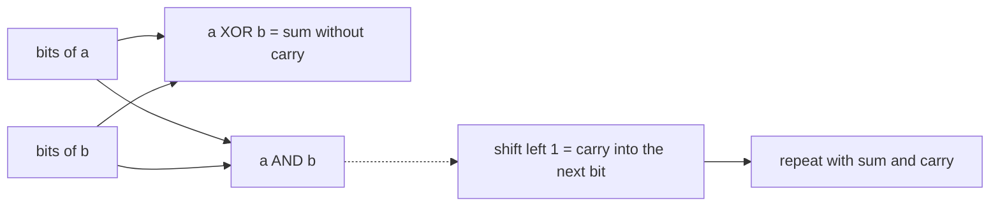

# Bit Manipulation

## Pattern in my own words

Integers are fixed-width patterns of bits, and the useful operations are XOR, AND, OR, and shifts. XOR is addition of bits without carry, and it is its own inverse: `x ^ x = 0` and `x ^ 0 = x`. AND isolates the bits two numbers share; shifting that left by one is a carry. A mask such as `1`, `n - 1`, or `0xFFFFFFFF` keeps or clears a known set of positions. In Java an `int` is already 32 bits and overflow wraps in two’s complement. In Python integers are unbounded, so any algorithm that depends on a 32-bit wrap must AND with `0xFFFFFFFF` on every step that would have overflowed, then convert a sign bit back into a negative Python int at the end.

## Easy analogy

Each bit is a light switch in a row of 32 switches. XOR flips a switch when exactly one of the two inputs is on. AND tells you where both switches are on, which is exactly where an add would produce a carry into the next switch. A mask is a piece of cardboard that hides the switches you are not allowed to touch. Python’s integer is a row of switches that grows whenever a carry walks off the left end, so you have to cut the row back to 32 after every step.

## Diagram

Adding with XOR and a carry. The dotted edge is the carry bit moving one position left, the path that must fall off the end of a 32-bit word instead of growing forever.



## Intuition

- **Lowest set bit.** `n & -n` isolates it in two’s complement, because `-n` is `~n + 1`. `n & (n - 1)` clears it. Count those clears to get the Hamming weight. The loop runs once per set bit, not once per width, and it ends at 0 even when the high bit is set.
- **Parity of a population.** `dp[i] = dp[i >> 1] + (i & 1)`. Dropping the last bit leaves `i >> 1`, whose answer you already stored, and `i & 1` puts the dropped bit back.
- **Fixed width.** Reversing bits means 32 trips of “shift result left, copy in the next low bit of `n`.” Always loop 32 times. Stopping when `n` becomes 0 drops the high zero bits that the reversed word is required to contain.
- **Missing number.** XOR every index with every value and with `n`. Pairs cancel. The missing one remains. Gauss `n*(n+1)/2 - sum` also works; watch the multiplication overflow in Java.
- **Add without `+`.** `sum = a ^ b`, `carry = (a & b) << 1`, repeat until the carry is 0. Java’s `int` shift throws away bit 32. Python must mask `sum` and `carry` with `0xFFFFFFFF`, and if bit 31 of the finished pattern is set, the mathematical value is negative: `value - 2^32`, which is `~(pattern ^ 0xFFFFFFFF)`.

Two’s complement is why this matches numeric addition, including negatives. The bit pattern of `-1` is all ones. Adding one flips them all to zero and carries off the end, leaving 0. A language that refuses to drop that carry will loop forever.

## Tiny walkthrough

`a = 5` (`101`), `b = 3` (`011`).

- XOR `110` = 6, AND `001`, carry `010` = 2.
- XOR `110 ^ 010` = `100` = 4, AND `010`, carry `100` = 4.
- XOR `000`, carry `1000` which is bit 3.
- Next step XOR is 8, carry is 0.

Result 8, and `5 + 3 = 8`. The dotted carry walked left until nothing was shared.

Missing number on `[3,0,1]`, length 3: start from 3, XOR index and value at each position. `3 ^ 0 ^ 3 ^ 1 ^ 0 ^ 2 ^ 1 = 2`, the hole.

## Java

```java
public final class BitPatterns {
    /** Add without using + or -. Java int wraps at 32 bits. */
    public static int getSum(int a, int b) {
        while (b != 0) {
            int carry = (a & b) << 1;
            a = a ^ b;
            b = carry;
        }
        return a;
    }

    /** The missing value in 0..n. */
    public static int missingNumber(int[] nums) {
        int x = nums.length;
        for (int i = 0; i < nums.length; i++) {
            x ^= i ^ nums[i];
        }
        return x;
    }
}
```

## Python

```python
def get_sum(a: int, b: int) -> int:
    mask = 0xFFFFFFFF
    while b & mask:
        carry = ((a & b) << 1) & mask
        a = (a ^ b) & mask
        b = carry
    if a > 0x7FFFFFFF:
        a = ~(a ^ mask)
    return a


def missing_number(nums: list[int]) -> int:
    x = len(nums)
    for i, value in enumerate(nums):
        x ^= i ^ value
    return x
```

## Complexity

Hamming weight is `O(k)` in the number of set bits, or `O(1)` on a 32-bit word if you prefer a fixed loop. Counting bits from `0` to `n` is `O(n)` time and `O(n)` space for the output. Reversing 32 bits is `O(1)` time. Missing-number XOR is `O(n)` time and `O(1)` extra memory. Add-without-plus is `O(1)` on a 32-bit word: the carry moves left at least one position per iteration, so the loop is at most 32 steps. In Python that bound is true only because of the mask. Without it, a negative input carries forever.

## Pitfalls

- Using Python’s unlimited `<<` inside the adder. `-1 + 1` never finishes, because the carry always finds another 1 to the left.
- Treating a finished Python bit pattern with bit 31 set as a positive integer. `0xFFFFFFFF` must come back as `-1`, not as 4294967295.
- Looping `while n != 0` to reverse bits. You must emit the high zeros. Loop 32 times, and in Java use `>>>` if you shift the input, so the sign bit does not refill with ones... with a counted 32-step loop, `>>>` is the clear choice.
- `n & (n - 1)` on a signed Java `int` is still correct for the Hamming weight, including `Integer.MIN_VALUE`, because it clears one set bit per pass and reaches 0.
- Gauss in Java: `n * (n + 1) / 2` can overflow `int` before the subtraction. XOR does not have that problem.

## Interview script

“I’ll treat the integer as 32 bits in two’s complement. XOR cancels duplicates and is the add-without-carry; AND shifted left is the carry. Java wraps the shift off bit 31 by itself. In Python I mask to `0xFFFFFFFF` every iteration and, if the high bit is set at the end, I convert that pattern back to a negative int. For population counts I either clear the lowest set bit or reuse `i >> 1` plus the last bit. I always state the width, because ‘until it becomes zero’ is wrong when the width itself is the answer.”
