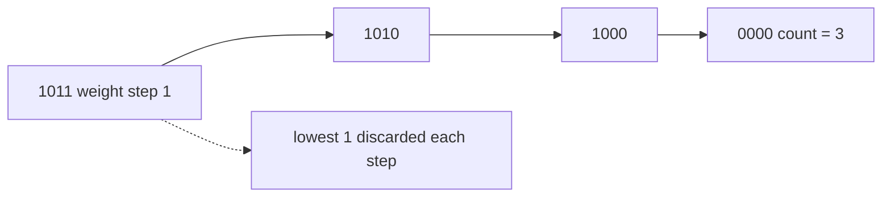

# 191. Number of 1 Bits

## Problem in my own words

You are given a 32-bit word, which the problem treats as unsigned even when the language’s integer type is signed. Count how many of those bits are 1. That count is the Hamming weight. You do not flip the bits or return the positions, only the total. A word of all zeros has weight 0, and a word whose only 1 is the high bit still counts as 1.

## Easy analogy

A row of 32 light switches is frozen in some pattern. You walk the row and tally the switches that are on. A faster walk: each time, turn off the lowest switch that is currently on, and add one to the tally. When the row goes dark, the tally is the answer. You never visit a switch that was already off.

## Diagram

`n & (n - 1)` clears one 1. The dotted edge is that cleared bit; it is not visited again.



## Intuition

Subtracting 1 from `n` flips every trailing 0 to 1 and flips the lowest 1 to 0. AND-ing that with the original `n` leaves all the higher 1s untouched and turns that lowest 1 off. So

`n = n & (n - 1)`

removes exactly one set bit. Repeat until `n` is 0 and count the removals.

This is better than testing all 32 positions when the word is sparse, and it is still correct when bit 31 is set. In Java, `Integer.MIN_VALUE` is a single high bit; `n - 1` wraps, the AND clears that bit, and the loop ends. You do not need a special unsigned type if you write the loop as `while (n != 0)` rather than `while (n > 0)`. A signed `n > 0` test would skip every negative pattern, including the high bit.

`n & 1` plus an unsigned shift also works and is easier to explain. The Kernighan clear is the one to know because the loop count equals the answer.

## Tiny walkthrough

`n = 11`, binary `1011`.

- `11 & 10 = 10`, count 1
- `10 & 9 = 8`, count 2
- `8 & 7 = 0`, count 3

`1011` has three ones. `n = 0` returns 0 immediately. A single high bit takes one iteration.

## Java

```java
class Solution {
    public int hammingWeight(int n) {
        int count = 0;
        while (n != 0) {
            n &= n - 1;
            count++;
        }
        return count;
    }
}
```

## Python

```python
def hammingWeight(n: int) -> int:
    count = 0
    while n:
        n &= n - 1
        count += 1
    return count
```

## Complexity

Time is `O(k)` where `k` is the number of 1 bits, which is `O(1)` on a 32-bit word because `k <= 32`. Extra memory is `O(1)`. The shift-every-bit version is a flat 32 iterations, also `O(1)`.

## Pitfalls

- `while (n > 0)` in Java. Any word with bit 31 set is negative, the loop never runs, and you return 0 for a nonzero weight.
- Assuming Python needs a mask here. The LeetCode input is a non-negative 32-bit value, and `n &= n - 1` reaches 0 without growing. A mask does not hurt (`n &= 0xFFFFFFFF` once up front) if you want to be defensive.
- Counting bits of `n - 1` instead of `n & (n - 1)`. Subtracting alone flips a whole suffix and is not a population count.
- Calling `Integer.bitCount` without being able to explain it. Fine as a library note after you have written the loop.

## Interview script

“I’ll clear the lowest set bit with `n &= n - 1` and count how many times I can do that before the word is zero. Each step removes exactly one 1, so the count is the Hamming weight. The loop condition is `n != 0`, not `n > 0`, because a Java int with the high bit set is negative and still has a weight. On a 32-bit word this is constant time.”
