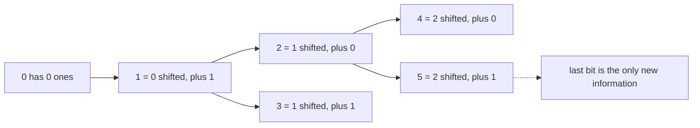

# 338. Counting Bits

## Problem in my own words

Given a non-negative integer `n`, return an array `ans` of length `n + 1` where `ans[i]` is the number of 1 bits in the binary form of `i`. You need the whole table, from 0 through `n`, not a single Hamming weight. `ans[0]` is 0. The follow-up is to do it in linear time and without calling a popcount instruction as a black box.

## Easy analogy

Every number is the number half its size, plus a last bit that is either a tail of 0 or a tail of 1. The “half” (a right shift) was already counted earlier in the table. You only have to look that answer up and add 1 if the number is odd.

## Diagram

`i >> 1` is the parent. The dotted edge is the last bit, which is added when it is 1 and adds nothing when it is 0.



## Intuition

For `i > 0`, dropping the least significant bit gives `i >> 1`, which is strictly smaller, so `ans[i >> 1]` is already filled if you scan upward.

`ans[i] = ans[i >> 1] + (i & 1)`.

`i & 1` is 1 exactly when `i` is odd. Even numbers add a zero bit on the right and keep the same weight as `i / 2`.

Another correct recurrence is `ans[i] = ans[i & (i - 1)] + 1`, because `i & (i - 1)` is `i` with its lowest 1 removed, and that index is smaller. The shift form is the one this note codes: it makes the “last bit” obvious and needs no extra bit trick in the interview.

`ans[0] = 0` is the base. The loop starts at 1.

## Tiny walkthrough

`n = 5`.

| i | binary | i >> 1 | last bit | ans[i] |
|---|--------|--------|----------|--------|
| 0 | 0 | — | — | 0 |
| 1 | 1 | 0 | 1 | 1 |
| 2 | 10 | 1 | 0 | 1 |
| 3 | 11 | 1 | 1 | 2 |
| 4 | 100 | 2 | 0 | 1 |
| 5 | 101 | 2 | 1 | 2 |

Result `[0,1,1,2,1,2]`.

## Java

```java
class Solution {
    public int[] countBits(int n) {
        int[] ans = new int[n + 1];
        for (int i = 1; i <= n; i++) {
            ans[i] = ans[i >> 1] + (i & 1);
        }
        return ans;
    }
}
```

## Python

```python
def countBits(n: int) -> list[int]:
    ans = [0] * (n + 1)
    for i in range(1, n + 1):
        ans[i] = ans[i >> 1] + (i & 1)
    return ans
```

## Complexity

One pass from 1 to `n`, each step `O(1)`, so `O(n)` time. The output array is `O(n)` memory, and there is no extra table beyond it. That matches the follow-up. Calling a full Hamming-weight loop per `i` is also `O(n)` on 32-bit words but does more work inside the constant and hides the recurrence.

## Pitfalls

- Sizing the array to `n` instead of `n + 1`, then either dropping `n` or throwing on the last write. The problem includes both endpoints.
- Filling from `n` downward. `ans[i >> 1]` would still be 0. The parent is smaller, so the loop increases.
- Writing `ans[i] = ans[i >> 1] + 1` for every `i`. Even numbers must add 0. The added term is `i & 1`, not a constant.
- Using `i / 2` in Java integer division. It matches `>> 1` for these non-negative values, but the shift says “drop a bit” and is the form to defend.
- Forgetting `ans[0]`. It is 0 from allocation in both languages above. If you build the list by appending, append 0 first.

## Interview script

“The bit count of `i` is the bit count of `i` shifted right by one, plus `i`’s last bit. The shifted index is smaller, so I fill an array from 1 to `n` and look up the parent. Index 0 is 0. Each step is constant work, so the whole table is linear time and the only memory is the answer array.”
