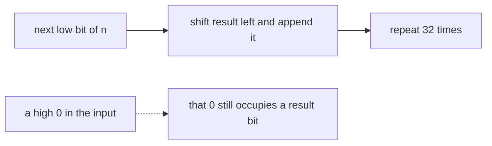

# 190. Reverse Bits

## Problem in my own words

You are given a 32-bit unsigned integer. Reverse the order of its bits and return that 32-bit pattern as an integer. The bit that was in position 0 becomes the bit in position 31, position 1 moves to position 30, and so on. Leading zeros in the input are part of the 32-bit word: they become trailing zeros of the numeric value, and trailing zeros of the input become the high bits of the result. Do all 32 positions, not only the bits up to the highest 1.

## Easy analogy

A 32-car train is sitting on a track. You build a new train by repeatedly taking the rear car of the old train and attaching it as the new rear car of the train you are building. After exactly 32 cars, the order is reversed. Empty cars count. If you stop when you think the train “looks empty,” you drop the empty cars that still had reserved positions.

## Diagram

Each step shifts the result left and brings in `n`’s low bit. The dotted edge is a 0 bit that still has to travel into the high half of the result; skipping it would shorten the word.



## Intuition

Start with `result = 0`. Thirty-two times:

1. Shift `result` left by one to open a zero in the low bit.
2. Copy `n`’s current low bit in with `result |= n & 1`.
3. Shift `n` right by one, bringing zeros in from the left.

After 32 steps the first bit you copied has been shifted 31 times and sits in bit 31, and the last bit you copied sits in bit 0.

In Java, shift `n` with `>>>` so the sign bit is replaced by zero. The loop is counted, so you do not depend on `n` becoming 0. `result` is shifted with `<<`. The final value is a normal signed `int`: if the original low bit was 1, the reversed word has bit 31 set and the returned `int` is negative. That is the correct bit pattern.

In Python, integers do not overflow. Building the result with 32 iterations from 0 produces a value in `0 .. 2^32-1`, which is what this problem wants (the judge treats it as an unsigned 32-bit quantity). Mask the input with `0xFFFFFFFF` first so a wider integer cannot leak extra ones, and mask nothing else is strictly required if you really stop at 32. The code below masks the input and the accumulator so the width is obvious.

## Tiny walkthrough

Take the low 8 bits of a byte, same algorithm, width 8, input `0000 1101` which is 13.

| step | bit taken | result |
|------|-----------|--------|
| 1 | 1 | 1 |
| 2 | 0 | 10 |
| 3 | 1 | 101 |
| 4 | 1 | 1011 |
| 5 | 0 | 10110 |
| 6 | 0 | 101100 |
| 7 | 0 | 1011000 |
| 8 | 0 | 10110000 |

That is `1011 0000`, the reverse of `0000 1101`. The same 32-step loop is this table with 32 rows. The classic 32-bit sample `43261596` reverses to `964176192`.

## Java

```java
class Solution {
    public int reverseBits(int n) {
        int result = 0;
        for (int i = 0; i < 32; i++) {
            result = (result << 1) | (n & 1);
            n >>>= 1;
        }
        return result;
    }
}
```

## Python

```python
def reverseBits(n: int) -> int:
    n &= 0xFFFFFFFF
    result = 0
    for _ in range(32):
        result = ((result << 1) | (n & 1)) & 0xFFFFFFFF
        n >>= 1
    return result
```

## Complexity

Exactly 32 iterations, so `O(1)` time and `O(1)` extra memory. A byte-wise lookup table is also `O(1)` and is a follow-up, not the first answer. Swapping bit `i` with bit `31 - i` for `i` in `0..15` is the same bound and the same idea.

## Pitfalls

- Looping `while (n != 0)`. Input `1` would return `1` shifted to wherever you stopped, instead of `1 << 31`. The zeros on the left of the input are real bits.
- Using Java’s arithmetic `>>` on `n`. Once bit 31 is set, `>>` fills ones forever. Inside a 32-step loop you would copy those fake ones into `result`. `>>>` fills zeros.
- Treating a negative Java return as a bug. If the input was odd, the reversed sign bit is 1 and the `int` is negative. The bits are still correct.
- In Python, forgetting the width and shifting until `n` is 0. Same bug as the `while` loop. Also, if you accidentally loop more than 32 times, mask the result back to 32 bits or the value grows past the unsigned word.
- Reversing only 8 or 16 bits because the sample “looks small.” The contract is 32.

## Interview script

“I’ll build the answer from zero, 32 times: shift it left, OR in the low bit of `n`, then unsigned-shift `n` right. Counting to 32 keeps the leading zeros. In Java I use `>>>` so the sign bit doesn’t smear ones. In Python I mask to 32 bits because the int would otherwise be happy to grow, and an odd input correctly ends with the high bit set. Constant time.”
