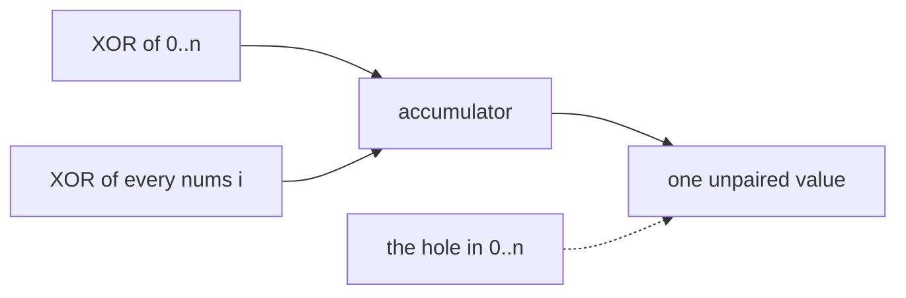

# 268. Missing Number

## Problem in my own words

You are given `n` distinct integers, and every value lies in the range `0` through `n` inclusive. That range has `n + 1` possible numbers, so exactly one of them is absent from the array. Return the absent one. The array is not sorted, and it may start with any of the present values. You need a linear pass and constant extra memory; sorting or a hash set solves the problem more slowly or with more memory.

## Easy analogy

Everyone in a room is supposed to be wearing a jersey numbered `0` through `n`, and one jersey is still on the bench. You XOR together every jersey you see and every number that should exist. Identical numbers cancel in pairs, like two gloves of the same hand, and the glove that never found its pair is the missing jersey.

## Diagram

Each present number cancels its index partner. The dotted edge is the missing value, which has no partner and survives in the accumulator. The length `n` is included so the full set `0..n` is in the XOR.



## Intuition

XOR is commutative and associative, `x ^ x = 0`, and `x ^ 0 = x`. XOR the entire set `{0, 1, ..., n}` together with every element of `nums`. Every number that appears in both sets cancels. The missing number appears once, in the ideal set, and remains.

The array length is `n`, and the values are a permutation of `0..n` with one hole. So the ideal set is “every index `0..n-1`, plus the extra number `n`.” One loop does both:

```
x = n
for i in 0..n-1:
    x ^= i ^ nums[i]
```

Gauss’s formula is the other constant-space answer: `n*(n+1)/2 - sum(nums)`. It is correct mathematically. In Java the product can overflow a 32-bit `int` before you divide, so you either compute it in a 64-bit integer or you use XOR. This note codes XOR, which has no overflow.

## Tiny walkthrough

`nums = [3, 0, 1]`, so `n = 3` and the range is `0,1,2,3`. The hole is 2.

- Start `x = 3`.
- `i = 0`: `x = 3 ^ 0 ^ 3 = 0`.
- `i = 1`: `x = 0 ^ 1 ^ 0 = 1`.
- `i = 2`: `x = 1 ^ 2 ^ 1 = 2`.

Return 2.

`[0, 1]` has length 2, missing 2. `x = 2 ^ 0 ^ 0 ^ 1 ^ 1 = 2`.

`[1]` has length 1, missing 0. `x = 1 ^ 0 ^ 1 = 0`.

## Java

```java
class Solution {
    public int missingNumber(int[] nums) {
        int x = nums.length;
        for (int i = 0; i < nums.length; i++) {
            x ^= i ^ nums[i];
        }
        return x;
    }
}
```

## Python

```python
def missingNumber(nums: list[int]) -> int:
    x = len(nums)
    for i, value in enumerate(nums):
        x ^= i ^ value
    return x
```

## Complexity

One pass, `O(n)` time, `O(1)` extra memory. Sorting a copy is `O(n log n)` time and either mutates the input or costs `O(n)` memory. A boolean array of size `n + 1` is `O(n)` memory. XOR matches the follow-up bound. Gauss is the same bound if the sum uses a wide enough integer.

## Pitfalls

- XORing only the array, or only `0..n-1`, and forgetting `n`. The missing number might be `n` itself, and `n` is not an index you visit.
- XORing `i` from 1 to `n` and skipping 0. Zero does not change a XOR, but skipping it in the index range while the array contains 0 will cancel the wrong partner. Use every index exactly once, and seed with `n`.
- In Java, writing `return n * (n + 1) / 2 - sum` with `int` arithmetic. For large `n` the product overflows and the formula lies. XOR does not.
- Using `^` in a language where it means exponent. In Java and Python `^` is XOR. Exponent would be nonsense here.
- Assuming the array is a permutation of `1..n`. The range includes 0 and excludes exactly one value, which may be 0 or `n`.

## Interview script

“The array is `0..n` with one hole. I’ll XOR `n` together with every index and every value. Matching numbers cancel because `x ^ x` is 0, and the missing number is the only one left. That’s one pass and a single integer of memory. The sum formula is the same complexity if I use a 64-bit accumulator; XOR can’t overflow, so that’s what I’ll code.”
