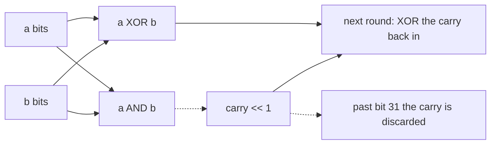

# 371. Sum of Two Integers

## Problem in my own words

Add two integers and return their sum, without using the `+` or `-` operators anywhere in the arithmetic. Bit operations are allowed. The sum has to be correct for negatives as well as positives, which means the algorithm is really adding 32-bit two’s-complement patterns, not just unsigned magnitudes. In Java an `int` already has that width and wraps on its own. In Python an integer is unbounded, so you have to force a 32-bit width yourself or a negative input never finishes.

## Easy analogy

Grade-school addition, one column at a time, except every column is a bit and you do all the columns at once. XOR writes down the column sums while pretending there is no carry. AND finds the columns where you would have carried, and a left shift moves each carry into the next column. You repeat with “what I wrote down” and “the carries” until a round produces no carries. A 32-column notebook throws away a carry that slides off the left edge. An infinite notebook never throws it away, so you draw a line after column 32.

## Diagram

The solid nodes are the sum-without-carry. The dotted edge is the carry moving one bit left, including the carry that must fall off a 32-bit word.



## Intuition

On one bit, the sum is `(a XOR b)` and the carry out is `(a AND b)`. Across the whole word:

- `a ^ b` is the addition if no column carries.
- `(a & b) << 1` is every carry, already moved into the column it affects.

Replace `a` with the XOR and `b` with the carry, and repeat. When `b` is 0 there is nothing left to carry, and `a` is the sum.

Two’s complement is why negatives fall out correctly. The pattern for `-1` is all ones. Adding `1` produces a carry in every column and a 0 in every column of the word; the last carry walks off bit 31. That discarded carry is the difference between “32-bit −1 + 1 = 0” and “infinite ones plus one.”

**Java.** `int` is 32 bits. `(a & b) << 1` drops bit 32 automatically. The loop condition is `b != 0`. Negative values are already two’s-complement patterns, so no mask and no final conversion are required. Mention that out loud so it does not look like an accident.

**Python.** Mask every intermediate value with `0xFFFFFFFF`:

```
carry = ((a & b) << 1) & MASK
a = (a ^ b) & MASK
```

Loop while `b & MASK` is nonzero. When you finish, `a` is a pattern in `0 .. 2^32-1`, not a signed Python int. If bit 31 is set (`a > 0x7FFFFFFF`), convert to the negative value:

`~(a ^ 0xFFFFFFFF)`

which equals `a - 2^32`. Check the identities: all-ones becomes `-1`, and `0x80000000` becomes `-2147483648`. If bit 31 is clear, return `a` unchanged. A Python negative input is fine at the start, because `a & b` and `a ^ b` still see the low 32 bits once you mask.

## Tiny walkthrough

`1 + 2`.

- `1 ^ 2 = 3`, `1 & 2 = 0`, carry 0. Done. Result 3.

`-1 + 1` in a 4-bit picture, same rule as 32-bit:

- patterns `1111` and `0001`
- XOR `1110`, AND `0001`, carry `0010`
- XOR `1100`, carry `0100`
- XOR `1000`, carry `1000`
- XOR `0000`, carry `0000` (the last carry fell off the 4-bit word)

Result `0000`. Without the width limit the carry would keep walking left through the infinite ones of Python’s `-1`.

`-2 + 3` should be 1. The masked loop produces pattern `0x00000001`.

## Java

```java
class Solution {
    public int getSum(int a, int b) {
        while (b != 0) {
            int carry = (a & b) << 1;
            a = a ^ b;
            b = carry;
        }
        return a;
    }
}
```

## Python

```python
def getSum(a: int, b: int) -> int:
    mask = 0xFFFFFFFF
    while b & mask:
        carry = ((a & b) << 1) & mask
        a = (a ^ b) & mask
        b = carry
    # Bit 31 set means the 32-bit pattern is negative in two's complement.
    if a > 0x7FFFFFFF:
        a = ~(a ^ mask)
    return a
```

## Complexity

The carry moves at least one position left every iteration and dies by bit 32, so the loop runs at most 32 times. Time is `O(1)` on a 32-bit word, extra memory is `O(1)`. In Python that bound is true only with the mask. Without the mask the loop is not guaranteed to end.

## Pitfalls

- Writing the Python loop exactly like the Java loop. `-1 + 1` never hits a zero carry, and the function hangs.
- Forgetting the signed conversion. `-1 + 0` would return `4294967295` instead of `-1` if you masked and then returned the raw pattern. `-2 + 0` must stay `-2`, which never enters the loop; the conversion must not run on an already-negative Python `a` that never got masked. The code above only converts when `a > 0x7FFFFFFF`, so an untouched negative `a` (the `b == 0` case) is returned as itself. After the loop has run, `a` is non-negative and in range `0 .. 2^32-1`.
- Using `~a` alone to sign-extend. `~0xFFFFFFFF` is not `-1` in the way you want once high bits of a Python int are considered; `~(a ^ mask)` on a 32-bit pattern is the identity to memorize, along with “subtract `2^32`.”
- Updating `a` before you compute the carry from the old `a` and `b`. Compute `carry` first, then XOR. In a one-liner, evaluate both from the old values.
- Sneaking in `+` inside the carry, for example `a + b` “just for the test.” The operator ban includes the carry step. `<< 1` is the allowed way to move it.
- Java: the loop condition `b > 0` stops early when a carry sets bit 31 and `b` looks negative. Use `b != 0`.

## Interview script

“Addition is XOR plus a carry. XOR is the sum if nothing carries, and `(a & b) << 1` is the carry. I repeat until the carry is zero. That’s two’s complement, so negatives work: the bit pattern of −1 is all ones, and a carry off the top of the word is what makes −1 + 1 become 0. Java drops that bit on its own. Python’s ints grow, so I mask with `0xFFFFFFFF` every step and, if bit 31 is set at the end, I convert the pattern back to a negative number. At most 32 iterations.”
